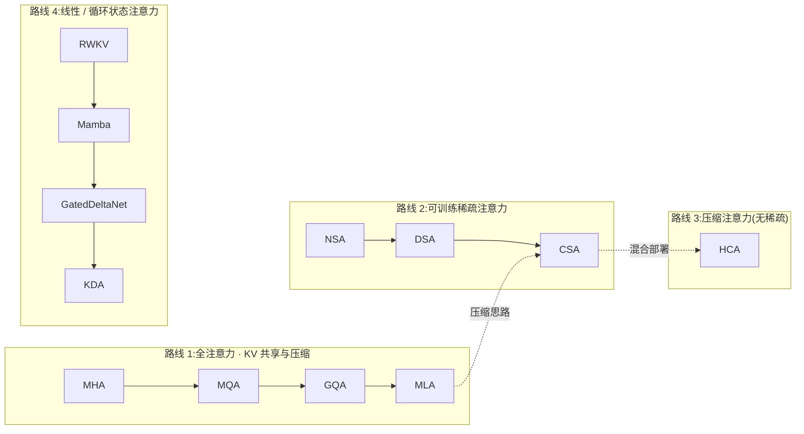

# Attention 架构演进综述

Transformer 的注意力机制在 2017 年提出后,一路演进的驱动力非常集中:**训练/推理复杂度与 KV cache 规模**。原生 softmax 注意力对序列长度 $n$ 是 $O(n^2)$ 的计算复杂度,而推理时 KV cache 随上下文线性增长,长上下文场景下内存带宽逐渐成为瓶颈。本文按四条路线整理主流架构的演进。

## 演进驱动力

- **计算复杂度**:注意力矩阵是 $n \times n$,长序列下 $O(n^2)$ 不可承受 → 稀疏化、压缩、状态化。
- **KV cache**:MHA 每 token 每层缓存 $2d$ 个浮点数,百万 token 上下文下 GB 级 → 共享 KV(GQA)、低秩压缩(MLA)、KV 压缩(CSA/HCA)、常值状态(线性注意力)。
- **解码吞吐**:生成阶段是 memory-bound,KV cache 越小,单 token 解码越快。
- **训练成本**:MLA 的 query 低秩压缩还顺带降低了训练时的激活内存。

## 四条演进路线



### 路线 1:全注意力 · KV 共享与低秩压缩

仍然保留精确 softmax 注意力(训练 $O(n^2)$),但不断压缩"每 token 要缓存什么":

1. **MHA**:每头独立 Q/K/V,缓存 $2d$。
2. **MQA**:所有 query 头共享一份 KV,缓存 $2d_h$。
3. **GQA**:折中方案,$n_{kv}$ 个 KV 头被 $n_h$ 个 query 头分组共享,缓存 $2d \cdot n_{kv}/n_h$。Llama 2/3、Mistral 等主流模型均使用。
4. **MLA**:把 KV 联合压缩进一个低秩潜在向量 $c_t^{KV} \in \mathbb{R}^{d_c}$,推理缓存只需 $d_c + d_h^R$(DeepSeek-V2 中 $512 + 64 = 576$ vs MHA 的 $2 \times 5120$)。DeepSeek-V3 系列、Kimi K2 均采用。

#### "共享"的原理:MQA / GQA 的一份 KV 给多个 query 头用

以 $n_h = 4$ 个 query 头为例。MHA 中每个 query 头配自己的 K/V:

```
MHA(4 个 KV 头)
  query 头:  Q0   Q1   Q2   Q3
  KV 头:     K0   K1   K2   K3    ← 每个 query 头各用各的 K/V
```

MQA 把 KV 头数压到 1,**所有 query 头在打分时读同一份 $k_j, v_j$**,只是各自的 $q_{t,i}$ 不同:

```
MQA(1 个 KV 头)
  query 头:  Q0   Q1   Q2   Q3
  KV 头:     K0   K0   K0   K0    ← 4 个 query 头共用同一份 K/V
```

$$o_{t,i} = \sum_{j=1}^{t} \mathrm{Softmax}_j\!\left(\frac{q_{t,i}^\top k_j}{\sqrt{d_h}}\right) v_j$$

GQA 是中间态:有 $n_{kv}$ 个 KV 头,每 $\frac{n_h}{n_{kv}}$ 个**连续的** query 头共享一个:

```
GQA(4 个 query 头,2 个 KV 头)
  query 头:  Q0   Q1  | Q2   Q3
  KV 头:     K0   K0  | K1   K1    ← 组 0 共享 K0/V0,组 1 共享 K1/V1
```

第 $i$ 个 query 头归属第 $g(i) = \lfloor i \cdot n_{kv} / n_h \rfloor$ 组:

$$o_{t,i} = \sum_{j=1}^{t} \mathrm{Softmax}_j\!\left(\frac{q_{t,i}^\top k_{j,g(i)}}{\sqrt{d_h}}\right) v_{j,g(i)}$$

**实现要点**:投影时只生成 $n_{kv}$ 份 K/V,送入注意力前把每个 KV 头复制/索引给组内所有 query 头。教学代码里是 `k.repeat_interleave(n_h // n_kv, dim=1)`;推理引擎(vLLM 等)不真正复制,而是按组索引读取同一份 KV cache——省下的就是这份内存与带宽。$n_{kv}=1$ 退化为 MQA,$n_{kv}=n_h$ 退化为 MHA。

KV cache 大小(每层、每 token,K 和 V 各占 $d_h$):

| 架构 | KV 头数 | 缓存大小 | 相对 MHA |
|---|---|---|---|
| MHA | $n_h$ | $2 n_h d_h = 2d$ | $1\times$ |
| GQA | $n_{kv}$ | $2 n_{kv} d_h = 2d \cdot n_{kv}/n_h$ | $n_{kv}/n_h$ |
| MQA | 1 | $2 d_h$ | $1/n_h$ |

DeepSeek-V2 论文用一张图直观对比了四种架构的差异(MHA / GQA / MQA / MLA):

![[mla-fig3.png|DeepSeek-V2 Figure 3:MHA / GQA / MQA / MLA 对比|640]]

完整的推导与可运行实现见 [[mha-gqa]]。

### 路线 2:可训练稀疏注意力

放弃"每个 query 都看所有 key",用可训练的检索器选出少量重要 token:

1. **NSA**(DeepSeek-NSA):压缩 + 块级 top-n 选择 + 滑动窗口三路并行,门控融合。
2. **DSA**(DeepSeek-V3.2-Exp / V3.2):Lightning Indexer 打分,粒度细到 **token 级 top-k**,核心注意力为 MLA 的 MQA 模式。
3. **CSA**(DeepSeek-V4):先对 KV 做双流重叠压缩,再在压缩条目上做 DSA 式 top-k 稀疏选择,进一步把 KV cache 和注意力 FLOPs 同时降下来。

### 路线 3:压缩注意力(无稀疏)

- **HCA**(DeepSeek-V4):与 CSA 同族的"重度压缩"分支,压缩率 $1/m'$($m' \gg m$)但**不做稀疏选择**,核心注意力在全部压缩条目上进行 MQA。DeepSeek-V4 系列在层间混合 CSA 与 HCA。

### 路线 4:线性 / 循环状态注意力

把注意力改写为固定大小的循环状态,训练 $O(n)$、推理状态 $O(1)$:

1. **RWKV**:token 级指数衰减的 WKV 注意力,衰减向量逐通道可学习。
2. **Mamba / SSM**:连续系统离散化,选择性 SSM(Mamba-2 的 SSD 已被证明与一种特殊的线性注意力等价)。
3. **Gated DeltaNet**:线性注意力 + delta rule 联想记忆 + 标量遗忘门。
4. **KDA**(Kimi Linear):把 Gated DeltaNet 的标量衰减升级为**逐通道对角衰减**,表达能力更强。

## 总览对比

| 架构 | 路线 | 注意力类型 | 训练复杂度(每层) | 推理 KV/状态 | 代表模型 |
|---|---|---|---|---|---|
| MHA | 1 | 精确 softmax | $O(n^2 d_h)$ | $2d$ / token | GPT-2、BERT |
| MQA | 1 | 精确 softmax | $O(n^2 d_h)$ | $2d_h$ / token | PaLM-2、Falcon |
| GQA | 1 | 精确 softmax | $O(n^2 d_h)$ | $2d \cdot n_{kv}/n_h$ / token | Llama 2/3、Mistral、Qwen |
| MLA | 1 | 精确 softmax | $O(n^2 d_h)$(激活更省) | $d_c + d_h^R$ / token | DeepSeek-V2/V3、Kimi K2 |
| NSA | 2 | 块级稀疏 + 窗口 | ~$O(n \cdot n/m)$ | MLA 级 / token | DeepSeek-NSA |
| DSA | 2 | token 级 top-k 稀疏 | ~$O(n k)$ + 索引器 | MLA 级 / token | DeepSeek-V3.2 |
| CSA | 2+3 | 压缩 + top-k 稀疏 | ~$O(n^2/m + n k)$ | $(c/m)$ / token + 窗口 | DeepSeek-V4 |
| HCA | 3 | 压缩全注意力 | ~$O(n^2/m')$ | $(c/m')$ / token + 窗口 | DeepSeek-V4 |
| RWKV | 4 | 线性(指数衰减) | $O(n d^2)$ | 常数($\sim 4d$) | RWKV-4/5/6 |
| Mamba | 4 | 线性(选择性 SSM) | $O(n d N)$ | 常数($d \times N$) | Mamba-1/2、Jamba |
| KDA | 4 | 线性(delta rule) | $O(n d_k d_v)$ | 常数($d_k \times d_v$) | Kimi Linear |

> 表中 $n$ 为序列长度,$d$ 为模型宽度,$d_h$ 为头维度,$n_{kv}$ 为 GQA 的 KV 头数,$m, m'$ 为压缩块大小,$k$ 为稀疏选择数,$N$ 为 SSM 状态维度。

## 演进中的共享设计语言

- **低秩潜变量**:MLA 的 $c_t^{KV}$、CSA/HCA 的 $c_t^Q$,都是"先压到 $d_c$ 再上投影"。
- **MQA 化核心**:DSA、CSA、HCA 的核心注意力都让所有 query 头共享同一份 KV(与 MLA 的 MQA 模式一致)。
- **门控融合**:NSA 的三路门控、KDA 的输出门控、RWKV 的 $\sigma(r_t)$ 门控,都是让网络自己决定各信息通路的重要性。
- **归一化进注意力**:V4 对 query 与 KV 条目直接做 RMSNorm,替代 QK-Clip,稳定长上下文训练。
- **RoPE 的折中**:MLA 用解耦 RoPE(只对低维向量旋转);V4 只对最后 64 维旋转并对输出反向旋转。

## 阅读顺序建议

1. [[mha-gqa]] — 基础与 KV 共享
2. [[mla]] — 低秩压缩,理解"KV cache 可以多小"
3. [[nsa-dsa]] — 稀疏检索,理解"注意力可以不看全部"
4. [[csa-hca]] — 压缩 + 稀疏的集大成(DeepSeek-V4)
5. [[linear-attention-rwkv-mamba]] — 线性注意力与状态机视角
6. [[kda]] — 最强线性注意力之一(Kimi Linear)

每条路线的笔记都包含:背景动机 → 数学原理 → 可运行的 PyTorch 教学实现 → 对比总结。
