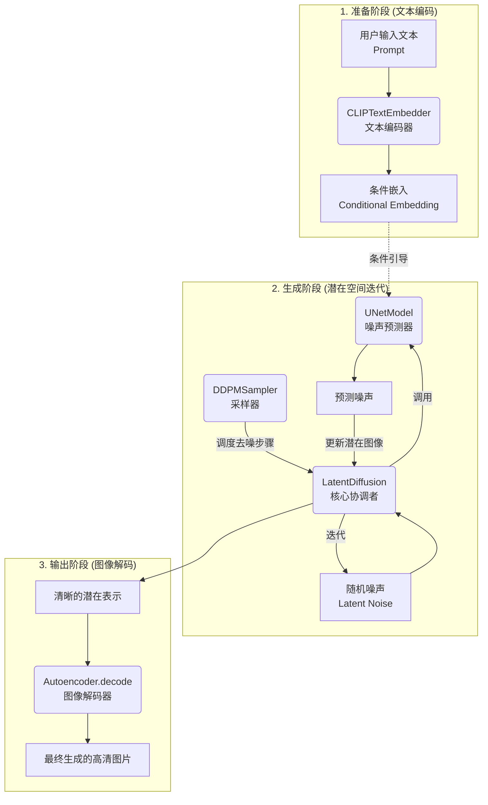
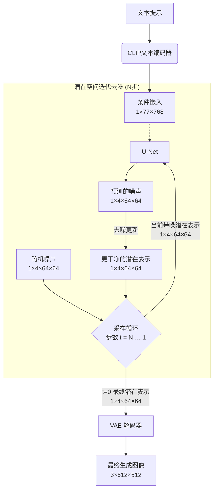
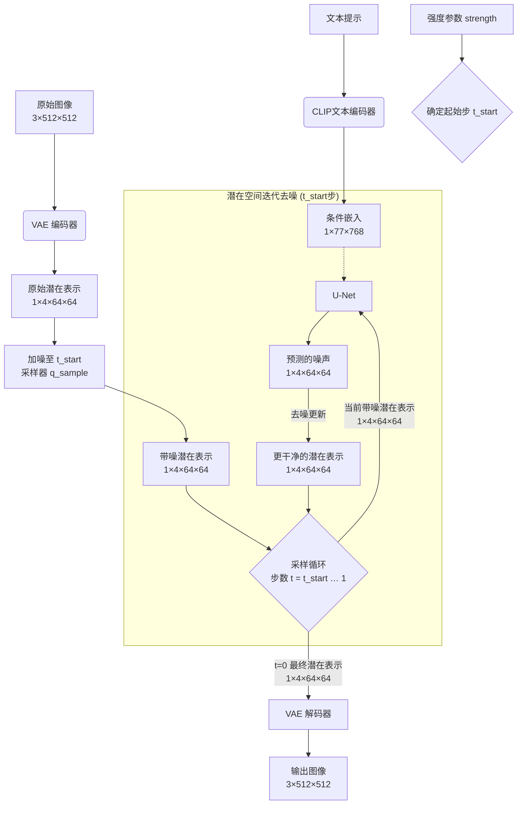
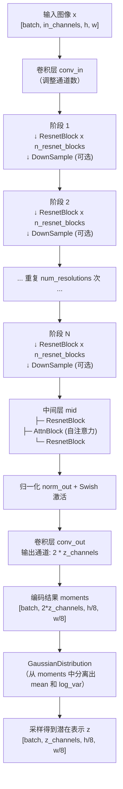
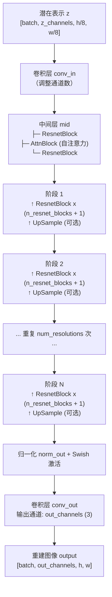

# StableDiffution

<https://nn.labml.ai/diffusion/stable_diffusion/index.html>
<https://nn.labml.ai/diffusion/stable_diffusion/latent_diffusion.html>
<https://nn.labml.ai/diffusion/stable_diffusion/model/autoencoder.html>
<https://nn.labml.ai/diffusion/stable_diffusion/model/unet.html>
<https://nn.labml.ai/diffusion/stable_diffusion/model/clip_embedder.html>
<https://nn.labml.ai/diffusion/stable_diffusion/sampler/index.html>
<https://nn.labml.ai/diffusion/stable_diffusion/sampler/ddpm.html>

这些模块像一条精密的生产线：先从文字提取指令，再在压缩空间里反复“雕琢”图像，最后展开成最终画面。

它们的核心工作流程和各模块功能如下：

## 🔄 端到端生成流程

### **1. 准备阶段**

* **用户输入**：一句文本描述（"Prompt"）。
* **`CLIPTextEmbedder` (文本编码器)**：将输入的文本提示（Prompt）转化为模型能理解的数值表示（即**条件嵌入 (Conditional Embedding)**）。

### **2. 生成阶段 (在潜在空间循环)**

* **初始化**：在压缩后的潜在空间中，生成一个纯随机噪声张量，作为生成过程的起点。
* **`DDPMSampler` (采样器)**：它像一个“指挥官”，负责调度去噪流程，控制每一步的迭代。
* **`LatentDiffusion` (核心协调者)**：这个模块是系统的“大脑”，它接收并协调所有模块。它的主要任务是**调用 `UNetModel`** 进行噪声预测。
* **`UNetModel` (噪声预测器)**：这个深度神经网络是模型的“工匠”。它接收带噪的潜在图像、当前的时间步，以及从文本生成的**条件嵌入**，来精准预测图像中的噪声。
* **迭代去噪**：**采样器**根据预测出的噪声，计算出去掉部分噪声后的新图像，这个过程会重复多次（通常是几十到上百步），直到生成一个足够清晰的潜在图像。

### **3. 输出阶段**

* **`Autoencoder` (图像解码器)**：当潜在空间中的图像足够清晰后，它的 `decode` 方法会将其从压缩的潜在空间**解码回像素空间**，最终得到我们能看到的高清图片。

---

## 🔍 各模块在代码中的具体角色

* **`LatentDiffusion` 类 (`latent_diffusion.html`)**：这是整个生成流程的总控制器，在初始化时整合了U-Net、自编码器和CLIP嵌入器，所有模块都需经过它才能协同工作。
* **`CLIPTextEmbedder` 类 (`clip_embedder.html`)**：作为**条件生成**的核心，将输入的自然语言文本转换为U-Net能够理解和使用的条件嵌入向量。
* **`Autoencoder` 类 (`model/autoencoder.html`)**：包含 `encode` 和 `decode` 方法，是连接像素空间与潜在空间的桥梁。
* **`UNetModel` 类 (`model/unet.html`)**：一个带有注意力机制的U型网络，接收潜在图像、时间步和条件嵌入，并输出对噪声的预测。
* **`DDPMSampler` 类 (`sampler/ddpm.html`)**：继承自 `DiffusionSampler`，**实现了具体的迭代去噪算法**，它控制着从随机噪声到清晰图像的去噪节奏。

---

## 📊 模块交互与数据流图



## 💎 总结

这个架构的精妙之处在于**分层与解耦**：

* **分层**：将复杂的生成任务分解到压缩的潜在空间中进行，极大降低了计算成本。
* **解耦**：每个模块各司其职（文本理解、噪声预测、过程调度、空间转换），并通过清晰的接口交互，使得整个系统既能高效运行，也便于理解和改进。

当然，下面就来详细拆解一下这两个核心模块的内部结构和数据流转。

---

### 🔧 变分自编码器 (Autoencoder)：像素空间与潜在空间的“转换器”

这个模块的本质是一个**有损压缩编解码器**，负责在计算昂贵的像素空间和计算高效的潜在空间之间建立桥梁。

#### 1. 结构解析

* **顶层类 `Autoencoder`**：这是一个封装类，将编码器、解码器和中间的两个关键卷积层组织在一起。
  * **`encoder`**：负责将输入的图像压缩成特征。
  * **`quant_conv`**：一个1x1卷积，将编码器输出的特征映射转换为一个高斯分布的**均值和方差**。这使得模型成为一个变分自编码器。
  * **`post_quant_conv`**：另一个1x1卷积，在解码前，将采样得到的潜在张量映射回解码器所需的特征空间。
  * **`decoder`**：负责将潜在表示重建为图像。

* **编码器 (`Encoder` 类)**：一个逐步下采样的深度卷积网络。
  * 它由多个下采样阶段（`self.down`）组成，每个阶段包含多个残差块（`ResnetBlock`）和一个下采样层（`DownSample`）。
  * 在网络的中间层（`self.mid`），还加入了**自注意力块（`AttnBlock`）**，用于捕捉长距离依赖关系，这对于重建全局一致的图像很重要。
  * 最后，通过归一化和卷积，将特征图映射到潜在分布空间（输出通道数为 `2 * z_channels`，用于表示均值和方差）。

* **解码器 (`Decoder` 类)**：一个与编码器结构对称的上采样网络。
  * 其输入是经过采样得到的潜在张量。
  * 同样，它先经过一个中间的自注意力块。
  * 然后通过多个上采样阶段（`self.up`）逐步恢复图像尺寸，每个阶段也包含多个残差块和一个上采样层（`UpSample`）。
  * 最后，将特征图映射回原始的RGB像素空间。

#### 2. 输入与输出

`Autoencoder` 类主要提供两个核心方法，分别对应压缩和解压过程：

* **`encode` 方法**
  * **输入**: `img`，形状为 `[batch_size, img_channels, img_height, img_width]` 的图像张量。
  * **输出**: 一个 `GaussianDistribution` 对象。这个对象包含了对潜在表示的**均值（mean）和对数方差（log_var）**。采样时，可通过调用其 `sample()` 方法得到具体的潜在张量。

* **`decode` 方法**
  * **输入**: `z`，一个形状为 `[batch_size, emb_channels, z_height, z_height]` 的潜在张量。注意，这里的 `emb_channels` 通常指的是嵌入空间的通道数（例如4），远小于原始图像的通道数（例如3）。
  * **输出**: `img`，形状为 `[batch_size, channels, height, width]` 的重建图像。

---

### 🧠 U-Net (UNetModel)：潜在空间中的“噪声预测器”

这是扩散模型的核心，一个条件化的U型网络，负责在每一步迭代中，从加噪的潜在图像中预测出噪声。

#### 1. UNet结构解析

* **时间步嵌入 (`time_embed`)**：将代表当前扩散步数的标量时间步 `t`，编码成一个高维的条件向量，注入到网络的每一层，使模型知道当前处于去噪的哪个阶段。
* **下采样路径（编码器）**：通过一系列阶段逐步降低空间分辨率，提取深层抽象特征。每个阶段由残差块（`ResBlock`）和可能的空间变换器（`SpatialTransformer`）构成，并包含下采样操作。
* **中间层（瓶颈）**：在最深层进行进一步的特征处理和条件交互。
* **上采样路径（解码器）**：与下采样路径对称，通过一系列阶段逐步恢复空间分辨率。此处的关键设计是**跳跃连接**，它将下采样路径中对应层的输出拼接到上采样层的输入上，帮助保留图像的细节信息。
* **注意力机制**：该U-Net在多个分辨率层级上集成了两种注意力模块:
  * **自注意力 (Self-Attention)**：让模型关注图像内部不同部分的关系。
  * **交叉注意力 (Cross-Attention)**：这是实现文本条件生成的关键。它将从CLIP文本编码器生成的**条件嵌入 (Conditional Embedding)** 注入到U-Net中，引导模型朝与文本描述相关的方向去噪。

#### 2. Unet输入与输出

`UNetModel` 的 `forward` 方法接收以下输入：

* **输入**:
    1. `x` (`torch.Tensor`): 当前时间步的**带噪潜在图像**，形状为 `[batch_size, in_channels, height, width]`。 `in_channels` 通常是4，与自编码器的潜在空间通道数一致。
    2. `time_steps` (`torch.Tensor`): 一个标量张量，表示当前的**时间步**。
    3. `cond` (`torch.Tensor`): 可选的**条件嵌入**（例如，来自CLIP文本编码器的嵌入），用于引导生成过程。
* **输出**:
  * `torch.Tensor`: 形状为 `[batch_size, out_channels, height, width]` 的**预测噪声**。 `out_channels` 通常与 `in_channels` 相同（也是4），因为预测的是与输入同尺寸的噪声张量。

---

### 💡 两者的核心差异与协作

| 特性 | 变分自编码器 (Autoencoder) | U-Net (UNetModel) |
| :--- | :--- | :--- |
| **核心功能** | 图像压缩与重建 (空间转换) | 噪声预测 (去噪核心) |
| **输入** | 像素空间的图像 / 潜在空间的向量 | 带噪潜在图像 + 时间步 + 条件嵌入 |
| **输出** | 潜在分布的统计参数 / 像素空间的图像 | 预测的噪声 (与输入潜在图像同尺寸) |
| **主要结构** | 对称的编码器-解码器，无跳跃连接 | U型编码器-解码器，有跳跃连接，带注意力 |
| **关键组件** | `ResnetBlock`, `AttnBlock` | `ResBlock`, `SpatialTransformer` |
| **是否可训练** | 预训练后通常冻结 | 是扩散模型的主要训练部分 |

**简单来说：**

* **Autoencoder** 是空间搬运工，负责在高效计算的潜在空间和我们能看到的像素世界之间来回搬运。
* **U-Net** 是核心工匠，在潜在空间里潜心工作，每一步都仔细琢磨如何去掉图像中的噪声，而文本条件则像是一张设计蓝图，告诉它最终要雕琢成什么样子。

很好的问题！VAE 的**解码器（Decoder）** 之所以能“认识”并正确重建这个由去噪过程得到的干净潜在表示，根本原因在于**训练时构建的“共享潜在空间”**。

简单说：**解码器在训练阶段已经见过无数个“类似的”潜在表示，并学会了它们与对应图像之间的映射关系。**

### 🧠 核心原理：训练时的“对齐”

在 Stable Diffusion 的训练过程中，VAE 和扩散模型（U-Net）是分开训练的，但潜在空间是共享的。

1. **VAE 训练阶段**：
   * 输入：一张真实图像 `x`（例如 `3x512x512`）。
   * 编码器 `E` 将 `x` 压缩成一个潜在分布 `q(z|x)`（通常假设为高斯分布），然后采样得到一个具体的潜在表示 `z`（例如 `4x64x64`）。
   * 解码器 `D` 将这个 `z` 重建回图像 `x'`。
   * 训练目标：让 `x'` 尽可能接近 `x`（重建损失），同时让 `q(z|x)` 接近标准正态分布（KL 散度）。

   **结果**：解码器 `D` 学到了一个映射：**“任何来自这个潜在分布 `q(z|x)` 的 `z`，都应该解码成看起来像真实图像的东西。”**

2. **扩散模型训练阶段**：
   * VAE 的编码器和解码器被**冻结**（不再更新参数）。
   * 扩散模型（U-Net）在 VAE 的潜在空间内训练。它学习的是：如何从纯噪声潜在表示 `z_T` 逐步去噪，最终得到能通过解码器生成真实图像的干净潜在表示 `z_0`。
   * 训练时，U-Net 看到的干净潜在表示 `z_0` 正是由 VAE 编码器从真实图像中产生的。

   **结果**：U-Net 学习生成的 `z_0` 的分布，与 VAE 编码器产生的 `z` 的分布**保持一致**。

### 🔄 推理阶段（去噪后）发生了什么？

当你用 U-Net 和采样器迭代去噪，最终得到一个干净潜在表示 `z_clean` 时：

* 这个 `z_clean` 虽然是由随机噪声一步步“雕刻”出来的，但**它的统计特性（分布）与训练时 VAE 编码器产生的 `z` 非常接近**。
* 因为扩散模型的训练目标就是让生成的 `z_clean` 落入真实 `z` 所在的流形中。
* 而 VAE 的解码器 `D` 已经学会：**对于任何属于该流形的 `z`，都能重建出一个合理的图像**。

所以，解码器并不需要“认识”具体的数值，它只是执行一个训练好的确定性函数：`image = D(z_clean)`。只要 `z_clean` 符合它训练时见过的模式，输出就是合理的图像。

### 💡 一个直观类比

想象一下：

* **VAE 解码器**：就像一个经验丰富的画家，他只看过“潜在指令”（如坐标点）与“真实画作”的配对训练。训练后，他学会了一件事：**“当给你一个在某个区域内的坐标点时，你就知道该画猫；在另一个区域，该画狗。”**
* **去噪过程**：就像有人从一个随机坐标点开始，一步一步移动，最终落入了“猫区域”的中心。
* **画家接到这个最终坐标**：虽然他没见过这个确切的点，但因为它落在“猫区域”，画家就按照训练时的模式画出了一只猫。

### ✅ 总结

| 问题 | 答案 |
|------|------|
| VAE 如何认识去噪后的潜在表示？ | 它不需要“认识”个体，它只是学习了一个从潜在空间到像素空间的通用映射。 |
| 为什么映射有效？ | 因为扩散模型生成的潜在表示与 VAE 编码器产生的潜在表示**处于同一分布**。 |
| 需要额外训练吗？ | 不需要。推理时 VAE 解码器是冻结的，直接使用。 |

因此，整个流程是**无缝衔接**的：**扩散模型负责在潜在空间中找到好的坐标点，VAE 解码器负责将这个坐标点渲染成图像**。两者通过共享同一个潜在空间的定义而协同工作。

## Applications

### Text2Image



### Image with prompts to Image



## VAE

根据网站代码，我为你绘制了 `Encoder` 和 `Decoder` 的结构图。它们整体呈对称结构，主要由多个下采样/上采样阶段、中间层和关键的 `ResnetBlock` 与 `AttnBlock` 组成。

---

### 📥 编码器 (Encoder) 结构

**功能**：接收原始图像（如 `3x512x512`），通过逐步下采样，将其压缩成一个**高斯分布**（由均值和方差表示）。



**关键要点**：

* **下采样因子**：每经过一个 `DownSample` 模块，空间分辨率减半（默认总因子为 8）。
* **残差块数量**：每个分辨率级别包含 `n_resnet_blocks` 个残差块。
* **注意力机制**：仅在**最深层**（`mid` 模块）使用一次 `AttnBlock`，帮助捕捉全局依赖。
* **输出形式**：编码器输出的是潜在分布的**统计参数**（均值和方差），而不是直接的潜在向量。

---

### 📤 解码器 (Decoder) 结构

**功能**：接收采样得到的潜在表示（如 `4x64x64`），通过逐步上采样，将其重建为像素空间的图像（如 `3x512x512`）。



**关键要点**：

* **上采样因子**：每经过一个 `UpSample` 模块，空间分辨率翻倍。
* **残差块数量**：解码器比编码器多一个残差块（`n_resnet_blocks + 1`），以增强重建能力。
* **对称性**：与编码器对称，也在最深层（`mid` 模块）使用一次 `AttnBlock`。
* **输入处理**：解码器接收的是**采样后**的确定性潜在表示，而非分布参数。

---

### 🧩 核心构建模块

编码器和解码器都共享以下基础组件：

#### 1. `ResnetBlock`（残差块）

* 由两个卷积层组成，每个卷积前都进行归一化和 Swish 激活。
* 如果输入输出通道数不一致，会使用 `1x1` 卷积进行快捷连接。
* 是构建深层网络的基础单元。

#### 2. `AttnBlock`（自注意力块）

* 使用 `1x1` 卷积生成 Query、Key、Value。

* 通过注意力机制捕捉全局特征关系。
* 仅在网络的**最深层**使用，平衡计算与效果。

#### 3. `DownSample`（下采样）

* 使用**步长为 2** 的 `3x3` 卷积实现。

* 将空间分辨率减半，通道数保持不变。

#### 4. `UpSample`（上采样）

* 先使用**最近邻插值**将分辨率翻倍。

* 再通过一个 `3x3` 卷积调整特征。

---

### 📊 结构总览

整个 VAE 的完整数据流可以概括为：

```text
图像 ──▶ 编码器 ──▶ 高斯分布 ──(采样)──▶ 潜在表示 ──▶ 解码器 ──▶ 重建图像
```

这种“编码-采样-解码”的设计，使得模型既能高效压缩图像，又能学习到连续、平滑的潜在空间，为后续的扩散模型提供了理想的工作环境。

## UNet
