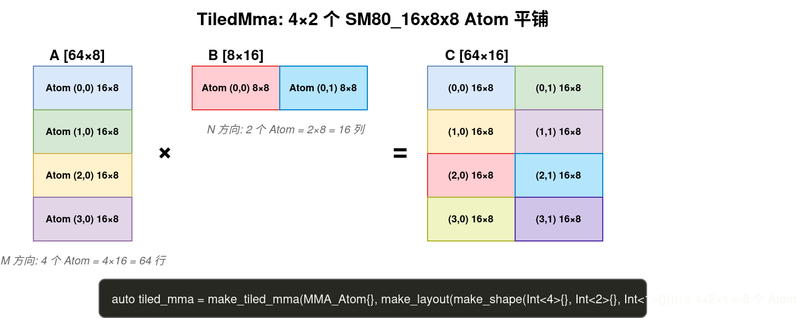

# TiledMma：Tensor Core 矩阵乘法

## 1. 什么是 Tensor Core？

Tensor Core 是 NVIDIA GPU 中专门做 **矩阵乘法** 的硬件单元。一条指令就能算一个小矩阵乘法：

```
普通 CUDA Core:  1 个线程算 1 次乘加 → 要 N² 次才能算完一个 N×N 矩阵乘
Tensor Core:    一个 warp (32 线程) 协作算一个 16×8×8 的矩阵乘 → 一条指令搞定
```

> [!tip] Tensor Core 的关键特性
> - **一条指令，一个 warp 协作完成一个小矩阵乘**
> - 不是每个线程独立算，而是 32 个线程分工合作
> - 输入必须在 **寄存器** 中，且按特定 **fragment 布局** 排列

## 2. MMA Atom：最小矩阵乘法单元

MMA Atom 描述了"一次 Tensor Core 指令算多大的矩阵乘"：

```cpp
// Ampere 架构的 MMA Atom：16×8×8 的矩阵乘
// D[16×8] = A[16×8] × B[8×8] + C[16×8]
using MMA_Atom = MMA_Atom<SM80_16x8x8_F32BF16BF16F32_TN>;
//                        ↑架构  ↑M N K  ↑精度    ↑布局
//
// TN = A 是行主序(T=Transposed), B 是列主序(N=Normal)
```

不同架构的 MMA Atom：

| 架构 | MMA Atom | M×N×K | 说明 |
|---|---|---|---|
| Ampere | `SM80_16x8x8_*` | 16×8×8 | `mma.sync` 指令 |
| Hopper | `SM90_64x8x16_*` | 64×8×16 | `wgmma` 指令，更大 |
| Blackwell | `SM100_128x8x16_*` | 128×8×16 | `tcgen05.mma` 指令 |

### 2.1 Fragment：每个线程持有什么数据？

MMA 不是"每个线程算一个元素"，而是"32 个线程分工协作"。每个线程持有一小部分输入/输出，叫做 **fragment**。

以 `SM80_16x8x8` 为例：
```
A 矩阵 [16×8] = 128 个元素，32 个线程 → 每线程 4 个元素
B 矩阵 [8×8]  = 64 个元素，  32 个线程 → 每线程 2 个元素
C 矩阵 [16×8] = 128 个元素，32 个线程 → 每线程 4 个元素
```

> [!important] Fragment 布局是固定的
> 每个线程的 4 个 A 元素不是任意的 4 个，而是硬件规定的特定位置。这就是为什么从 SMEM 加载到寄存器时需要 `ldmatrix` 指令（它按 fragment 布局搬运数据）。

## 3. TiledMma：扩展到更大的 Tile

一个 MMA Atom 只算 16×8，但 GEMM 的 tile 通常是 128×128。TiledMma 就是把多个 MMA Atom **平铺** 成一个更大的矩阵乘：

```cpp
// 用 MMA_Atom 构建 TiledMma
auto tiled_mma = make_tiled_mma(
    MMA_Atom<SM80_16x8x8_F32BF16BF16F32_TN>{},
    make_layout(make_shape(Int<4>{}, Int<2>{}, Int<1>{})));  // 4×2×1 = 8 个 Atom
//           ↑ M 方向 4 个 Atom = 4×16 = 64 行
//               ↑ N 方向 2 个 Atom = 2×8 = 16 列
//                   ↑ K 方向 1 个 Atom = 1×8 = 8 深度

// 总共算的是 64×16×8 的矩阵乘
```

### 3.1 图解



## 4. MMA 的数据布局要求

Tensor Core 对输入数据有严格的布局要求。以 Ampere `mma.m16n8k8.row.col` 为例：

```
A 矩阵 [16×8]，行主序：
  线程 0  持有 A[0][0], A[0][1], A[8][0], A[8][1]
  线程 1  持有 A[0][2], A[0][3], A[8][2], A[8][3]
  ...
  线程 31 持有 A[7][6], A[7][7], A[15][6], A[15][7]

每个线程持有 4 个元素，但位置是硬件规定的，不是连续的
```

> [!warning] 不能直接把连续内存喂给 Tensor Core
> 你不能简单地把 A 矩阵的前 4 个元素给线程 0。Fragment 的分布是硬件规定的，必须用 `ldmatrix` 指令（或 CuTe 的 TiledCopy）从 SMEM 加载到寄存器。

## 5. TV-Layout：Thread-Value 布局

CuTe 用 TV-Layout 来描述"每个线程的每个值对应矩阵的哪个位置"：

```cpp
// TV-Layout: (Thread, Value) → (M, K)
// 告诉你：线程 t 的第 v 个值对应矩阵的 (m, k) 位置
auto tv_layout = make_layout(
    make_shape(make_shape(4, 8), make_shape(2, 2)),  // (T0, T1), (V0, V1)
    make_stride(make_stride(32, 1), make_stride(16, 8)));

// TV(0, 0) = 0*32 + 0*1 + 0*16 + 0*8 = 0  → A[0][0]
// TV(0, 1) = 0*32 + 0*1 + 1*16 + 0*8 = 16 → A[8][0]
// TV(1, 0) = 0*32 + 1*1 + 0*16 + 0*8 = 1  → A[0][1]
```

> [!note] TV-Layout 的逆 = Fragment Layout
> - TV-Layout: (Thread, Value) → (M, K)  → "线程 t 的第 v 个值在哪里"
> - Fragment Layout (逆): (M, K) → (Thread, Value)  → "矩阵位置 (m,k) 由哪个线程的哪个值持有"
>
> 两者互为逆映射。CuTe 自动处理这个转换。

## 6. gemm() 函数

CuTe 提供了 `gemm()` 函数来执行 MMA 计算：

```cpp
// 前提：rA, rB, rC 是已经加载好数据的寄存器 tensor
// rA 的 shape 必须匹配 TiledMma 的 A fragment 布局

auto tiled_mma = make_tiled_mma(MMA_Atom<SM80_16x8x8_F32BF16BF16F32_TN>{}, ...);

// 分配寄存器
auto rA = partition_fragment_A(tiled_mma, ...);  // 自动按 fragment 布局分配
auto rB = partition_fragment_B(tiled_mma, ...);
auto rC = partition_fragment_C(tiled_mma, ...);
clear(rC);  // 初始化为 0

// 执行矩阵乘法
cute::gemm(tiled_mma, rA, rB, rC);
// rC += rA × rB  （累加到 rC）
```

> [!tip] gemm() 是累加
> `gemm()` 执行的是 `C += A × B`，不是 `C = A × B`。所以需要先 `clear(rC)`。

## 7. 完整示例：单 tile MMA

```cpp
__global__ void single_tile_mma(const half* A, const half* B, float* C) {
  // 1. 定义 MMA
  auto tiled_mma = make_tiled_mma(
      MMA_Atom<SM80_16x8x8_F32BF16BF16F32_TN>{},
      make_layout(make_shape(Int<4>{}, Int<2>{}, Int<1>{})));

  // 2. 创建寄存器 tensor（按 fragment 布局）
  auto rA = partition_fragment_A(tiled_mma, make_shape(Int<BM>{}, Int<BK>{}));
  auto rB = partition_fragment_B(tiled_mma, make_shape(Int<BN>{}, Int<BK>{}));
  auto rC = partition_fragment_C(tiled_mma, make_shape(Int<BM>{}, Int<BN>{}));
  clear(rC);

  // 3. 从 SMEM 加载到寄存器
  auto copy_s2r_A = make_tiled_copy_A(Copy_Atom<SM80_16x8_LDSM_T, half>{}, tiled_mma);
  auto thr_copy = copy_s2r_A.get_slice(threadIdx.x);
  copy(copy_s2r_A, thr_copy.partition_S(sA), thr_copy.partition_D(rA));

  // 4. 执行 MMA
  cute::gemm(tiled_mma, rA, rB, rC);

  // 5. 写回结果
  // ...
}
```

## 8. Ampere vs Hopper vs Blackwell 的 MMA 差异

```
Ampere (mma.sync):
  A: RF → Tensor Core  (需要 ldmatrix 从 SMEM 加载到 RF)
  B: RF → Tensor Core
  每个 warp 独立执行

Hopper (wgmma):
  A: RF 或 SMEM → Tensor Core  (可以直接从 SMEM 读！)
  B: SMEM → Tensor Core
  4 个 warp 组成一个 warp group 协作执行

Blackwell (tcgen05.mma):
  A: SMEM 或 TMEM → Tensor Core
  B: SMEM → Tensor Core
  更大的 tile (128×8×16)
```

> [!important] Hopper 的革命性变化
> Hopper 的 `wgmma` 指令可以直接从 SMEM 读取 A 和 B，不需要先加载到寄存器。这意味着：
> - 减少了寄存器压力
> - 减少了 SMEM → RF 的拷贝指令
> - 但对 SMEM 布局有更严格的要求（需要 swizzle）
