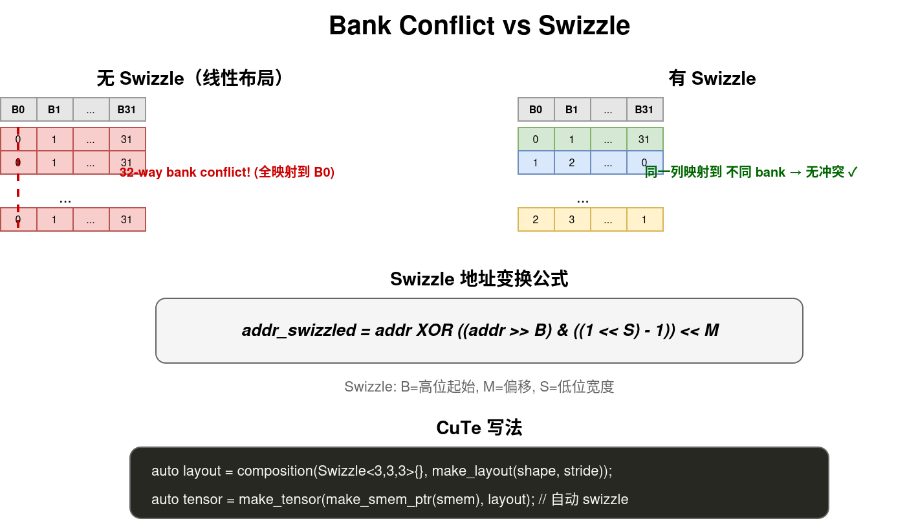

# Swizzle：消除 Bank Conflict

## 1. 什么是 Bank Conflict？

Shared Memory 被分成 **32 个 bank**（每个 bank 4 字节宽）。如果一个 warp 的 32 个线程同时访问 **同一个 bank** 的不同地址，就会发生 **bank conflict** — 访问被串行化，速度变成 1/32。

```
Shared Memory 的 32 个 bank：
Bank 0: [0, 4)  bytes
Bank 1: [4, 8)  bytes
Bank 2: [8, 12) bytes
...
Bank 31: [124, 128) bytes

地址 → bank 的映射：bank = (addr / 4) % 32
```

### 1.1 为什么会冲突？

```cpp
// 一个 warp 的 32 个线程访问同一列的不同行
__shared__ float tile[32][128];  // 每行 128 float = 512 bytes

// 线程 i 访问 tile[i][0]
// tile[i][0] 的地址 = base + i * 128 * 4
// bank = (i * 128 * 4 / 4) % 32 = (i * 128) % 32 = 0  ← 全部映射到 bank 0！
// → 32-way bank conflict
```

> [!warning] Bank Conflict 的性能影响
> - 无冲突：1 个 cycle 完成 32 个访问
> - 2-way 冲突：2 个 cycle（2 倍慢）
> - 32-way 冲突：32 个 cycle（32 倍慢！）

## 2. Swizzle 是什么？

Swizzle 是一种 **地址变换**，让原本映射到同一个 bank 的数据分散到不同 bank。它的本质是 **对地址的某些 bit 做 XOR**。

```
原始地址:   addr
Swizzle 后: addr XOR ((addr >> B) & mask) << M

其中 B, M, S 是 Swizzle 的参数
```

### 2.1 Swizzle<B, M, S> 参数含义

```
Swizzle<B, M, S>:
  B = 高位 bit 的起始位置（被 XOR 的目标）
  M = 中间 bit 的偏移
  S = 低位 bit 的宽度（用于 XOR 的源）

Swizzle<3, 3, 3> 的含义：
  取地址的 bit[5:3] 和 bit[8:6] 做 XOR
  → 让相邻行的同一列映射到不同 bank
```

### 2.2 图解 Swizzle 效果



## 3. CuTe 中的 Swizzle

### 3.1 创建 Swizzle Layout

```cpp
// 创建一个 Swizzle 函数
auto swizzle_func = Swizzle<3, 3, 3>{};

// 把 Swizzle 作用到普通 Layout 上
auto swizzled_layout = composition(
    swizzle_func,
    make_layout(make_shape(8, 64), make_stride(64, 1)));

// swizzled_layout 和原来的 layout 形状一样，但地址映射不同
```

> [!tip] composition = Swizzle ∘ Layout
> `composition(swizzle, layout)` 的意思是：先用 layout 算出线性地址，再用 swizzle 变换地址。
> 效果：同样的逻辑坐标 (i, j)，但映射到不同的物理 bank。

### 3.2 完整示例

```cpp
// 普通 layout：有 bank conflict
auto layout = make_layout(make_shape(8, 32), make_stride(32, 1));

// Swizzle 后的 layout：无 bank conflict
auto swizzled = composition(Swizzle<3, 3, 3>{},
    make_layout(make_shape(8, 32), make_stride(32, 1)));

__shared__ float smem[8 * 32];

auto sA = make_tensor(make_smem_ptr(smem), swizzled);

// 访问 sA(i, j) 时，地址自动经过 swizzle 变换
// 同一列的不同行映射到不同 bank → 无冲突
```

## 4. Swizzle 的原子 (Swizzle Atom)

Swizzle 不是对整个 SMEM 做变换，而是对一个 **Swizzle Atom** 做变换。Atom 是 swizzle 的最小单位。

### 4.1 K-Major Swizzle Atom

当 GMEM 数据是 K-主序（行主序）时使用：

```
K-Major Swizzle None (atom = 8×16B):
  ┌────────────────────────────────────────┐
  │ chunk 0 │ chunk 1 │ ... │ chunk 7      │  ← 8 个 16B chunk
  │ 16B     │ 16B     │     │ 16B          │
  └────────────────────────────────────────┘
  128B 总共，对应 SMEM 的 32 bank × 4B

K-Major Swizzle 32B (atom = 8×32B):
  ┌────────────────────────────────────────────────────────────┐
  │ chunk 0 │ chunk 1 │ chunk 2 │ ... │ chunk 15              │  ← 16 个 16B chunk
  └────────────────────────────────────────────────────────────┘
  256B 总共，chunk 排列经过 swizzle

K-Major Swizzle 64B (atom = 8×64B):
  32 个 16B chunk，512B 总共

K-Major Swizzle 128B (atom = 8×128B):
  64 个 16B chunk，1024B 总共 ← 最常用
```

> [!important] Swizzle 不改变主序
> 如果 GMEM 是 K-主序，SMEM 也保持 K-主序。Swizzle 只是在 K-主序的基础上重新排列 16B chunk 的顺序，不改变整体的主序方向。

### 4.2 MN-Major Swizzle Atom

当 GMEM 数据是 M/N-主序（列主序）时使用：

```
MN-Major Swizzle None (atom = 16B×8):
  每个 chunk 是 16B×1（一列的 8 个元素）

MN-Major Swizzle 32B (atom = 32B×8):
  16B chunk 沿 M 方向排列，swizzle 后无冲突

MN-Major Swizzle 128B (atom = 128B×8):
  最常用
```

## 5. 为什么 Swizzle 能消除 Bank Conflict？

核心原因：**Swizzle 让同一个 8×16B subtile 的 8 个 chunk 分布在不同的 bank 上**。

```
无 Swizzle，8×16B 的 subtile：
  chunk 0 → bank 0-3
  chunk 1 → bank 4-7
  chunk 2 → bank 8-11
  chunk 3 → bank 12-15
  chunk 4 → bank 16-19
  chunk 5 → bank 20-23
  chunk 6 → bank 24-27
  chunk 7 → bank 28-31
  → 每个 chunk 占 4 个 bank，8 个 chunk 覆盖全部 32 个 bank → 无冲突 ✓

但如果 tile 更大（比如 8×64B），无 Swizzle 时：
  chunk 0-7:   bank 0-31
  chunk 8-15:  bank 0-31  ← 和 chunk 0-7 冲突！
  chunk 16-23: bank 0-31
  chunk 24-31: bank 0-31

Swizzle 64B 后：
  chunk 0,8,16,24 被 swizzle 到不同 bank → 无冲突
```

## 6. 选择哪个 Swizzle Atom？

**规则：选能装下的最大的 Swizzle Atom。**

```
Tile 的 K 维度    推荐 Swizzle       GMEM 读请求
K = 16B          Swizzle None       16B（太小，效率低）
K = 32B          Swizzle 32B        32B
K = 64B          Swizzle 64B        64B
K ≥ 128B         Swizzle 128B       128B（最佳，匹配 cache line）
```

> [!tip] 为什么越大越好？
> GPU 的 cache line 是 128B。Swizzle Atom 越大，一次 GMEM 读请求能搬运的数据越多，带宽利用率越高。

## 7. Swizzle vs Padding

两种消除 bank conflict 的方法对比：

```
Padding（加一行空隙）：
  __shared__ float tile[32][128 + 1];  // +1 padding
  简单，但浪费 SMEM 空间

Swizzle（地址变换）：
  auto layout = composition(Swizzle<3,3,3>{}, make_layout(...));
  零空间浪费，但地址计算更复杂
```

> [!note] CuTe 中用 Swizzle
> CuTe 推荐用 Swizzle 而不是 Padding，因为：
> 1. 不浪费宝贵的 SMEM 空间
> 2. Swizzle 的地址计算由 CuTe 自动处理，用户不需要手写
> 3. 和 TMA 兼容（Hopper 的 TMA 硬件支持 swizzle 搬运）

## 8. Swizzle 在 MMA 中的作用

Tensor Core 的 `ldmatrix` 指令从 SMEM 加载数据到寄存器。它每次加载一个 8×16B 的 subtile。如果 SMEM 用 Swizzle 布局，这个加载就不会有 bank conflict。

```
ldmatrix.m8n8 加载一个 8×16B subtile：
  → 8 个 chunk，每个 16B
  → 如果用 Swizzle None：8 个 chunk 恰好占满 32 个 bank → 无冲突
  → 如果 tile > 8×16B：需要更大的 Swizzle Atom 来避免冲突

关键：Swizzle 的 Atom 大小要和 ldmatrix 的加载粒度匹配
```

> [!important] Swizzle 是 MMA 的前提
> 在 CUTLASS/CuTe 中，SMEM 布局几乎总是 swizzle 的。这是 Tensor Core 高效工作的前提条件。不 swizzle 的 SMEM 布局会导致 bank conflict，Tensor Core 性能大幅下降。
