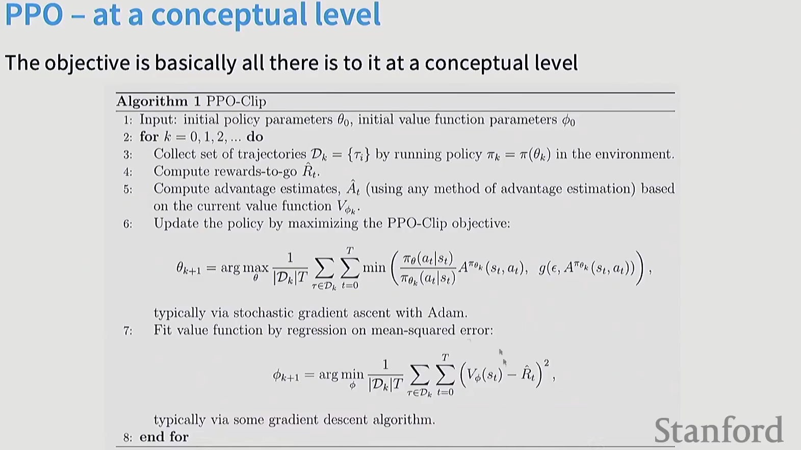

# LargelanguageRL

## 1. Core algorithms

### PPO

Attempt 1:Policy gradients(variances are too high)

$$
\nabla_\theta E_{p_\theta} [R(\tau)] = E_{p_\theta} [\nabla_\theta \log p_\theta(\tau) R(\tau)]
$$

Attempt 2: TRPO (linearize the problem around the current policy)

$$
\begin{aligned}
\max_\theta & \hat{\mathbb E}[\frac{\pi_\theta(a_t|s_t)}{\pi_{\theta_{old}}(a_t|s_t)}\hat{A_t}] \\
subject\ to & \hat{\mathbb E}[KL[\pi_{\theta_{old}}(\cdot|s_t), \pi_\theta(\cdot|s_t)]] \leq \delta
\end{aligned}
$$

$\hat{A}$是优势函数的估计，其代表了在状态s下采取动作a相对于平均水平的好处。TRPO通过限制新旧策略之间的KL散度来确保更新的稳定性，但它需要复杂的二阶优化方法。

Attempt 3: PPO(Clip the ratios at some eps)
$$
L(s,a,\theta_k,\theta) = min(\frac{\pi_\theta(a|s)}{\pi_{\theta_k}(a|s)}A^{\pi_{\theta_k}}(s,a), clip(\frac{\pi_\theta(a|s)}{\pi_{\theta_k}(a|s)}, 1-\epsilon, 1+\epsilon)A^{\pi_\theta}(s,a))
$$

Policy 是一个以模型参数 $\theta$ 为载体的条件概率分布函数：$\pi_\theta(a|s)$

- $s$ (状态 State)：到目前为止已经生成的所有上文（System Prompt + 用户提问 + 已生成的词）。
- $a$ (动作 Action)：下一个要生成的 Token。

Instead of reward, we use advantages
$$
\hat{A_t^{GAE(\gamma, \lambda)}} = \sum_{l=0}^\infty (\gamma \lambda)^l \delta_{t+l}^V
$$
where
$$
\delta_t^V = r_t + \gamma V(s_{t+1}) - V(s_t)
$$

## Why do we need yet another RL algorithm

### Why not PPO

- In practice, complicated implementation
- Value model (memory hungry, involves additional tuning for training)

### Why not DPO

- Data not inherently pairwise(or in the form of Bradley-Terry comparisons)
- Offline(though could be made online by iterating)

## GRPO

### What's GRPO(Group Relative Polcy Optimization)

- Start with PPO(many parts ar similar)
- Remove the value function / advantage computation
- Calculate the advantage as "z-score within group"

For each question $q$, GRPO samples a group of outputs $\{o_1, o_2, ..., o_k\}$ from the old policy $\pi_{\theta_{old}}$ and the optimizes the policy model $\pi_\theta$ by maximizing the following objective: policy $\pi_{\theta_old}$ and the optimizes the policy model $\pi_\theta$ by maximizing the following objective:
$$
\begin{aligned}
\mathcal J_{GRPO}(\theta) &= \mathbb E[q \sim P(Q), {o_i}^G_{i=1}\sim\pi_{\theta_old(O|q)}] \\
&=\frac{1}{G}\sum_{i=1}^G(min(\frac{\pi_\theta(o_i|q)}{\pi_{\theta_{old}}(o_i|q)}A_i, clip(\frac{\pi_\theta(o_i|q)}{\pi_{\theta_{old}}(o_i|q)}, 1-\epsilon, 1+\epsilon)A_i)-\beta \mathbb D_{KL}(\pi_\theta ||\pi_{ref}))\\
&\mathbb D_{KL}(\pi_\theta ||\pi_{ref}) = \frac{\pi_{ref}(o_i|q)}{\pi_\theta(o_i|q)}-\log \frac{\pi_{ref}(o_i|q)}{\pi_\theta(o_i|q)}-1
\end{aligned}
$$
where $\epsilon$ and $\beta$ are hyper-parameters, and $A_i$ is the advantage, computed using a group of rewards ${r_1,r_2,\cdots, r_G}$ corresponding to the outputs within each group:
$$
A_i = \frac{r_i - mean({r_1,r_2,\cdots, r_G})}{std({r_1,r_2,\cdots, r_G})}
$$

这是一份基于我们全部对话内容整理的**结构化笔记摘要**，你可以直接复制到笔记软件中，根据需要再进行格式调整或内容扩充。

---

## 大模型后训练（Post-Training）核心概念与对比

### 1. 监督微调 (SFT)

- **定义**：在预训练基座模型上，使用高质量的 **（指令，回答）** 对话对进行有监督学习。
- **数据格式**：通常包含 System Prompt 和特殊标记（如 `<|im_start|>`），构造为长文本序列。
- **损失计算**：**关键机制**——只计算“Assistant回答部分”的交叉熵损失，将“User提问部分”的损失掩码置零（Loss Mask）。
- **作用**：让模型从“续写文本”转变为“按照指令格式回答问题”。

### 2. 强化学习与人类反馈对齐 (RLHF)

#### 2.1 核心问题

- 大模型需要对齐人类偏好（有用性、安全性），但人类偏好本身**不可微**，无法直接反向传播。

#### 2.2 PPO 流程 (InstructGPT / ChatGPT 经典范式)

1. **SFT 打底**：模仿人类回答格式。
2. **训练奖励模型 (Reward Model)**：使用人类偏好对比数据（胜者 $y_w$、败者 $y_l$），通过 Bradley-Terry 模型训练一个可微分的打分网络。
3. **PPO 微调**：最大化奖励模型打分，同时加入 **KL 散度惩罚项** 防止模型偏离 SFT 分布太远。

#### 2.3 PPO 目标函数简化理解

$$
\text{Objective} = \mathbb{E} \left[ r_\theta(x,y) - \beta \cdot \log \frac{\pi^{RL}(y|x)}{\pi^{SFT}(y|x)} \right]
$$

### 3. 从策略梯度到 PPO 的数学直觉

- **策略梯度定理**：
  $$ \nabla_\theta \mathbb{E}[R] = \mathbb{E} [ R \cdot \nabla_\theta \log \pi_\theta ] $$
  直观解释：高奖励的动作被“放大”概率，低奖励的动作被“压制”概率。
- **PPO 截断机制**：
  $$ L^{CLIP} = \min \left( r(\theta) \hat{A}, \; \text{clip}(r(\theta), 1-\epsilon, 1+\epsilon) \hat{A} \right) $$
  其中 $r(\theta) = \frac{\pi_\theta(a|s)}{\pi_{\theta_{old}}(a|s)}$ 是概率比率，$\hat{A}$ 是优势函数。**PPO 通过截断概率比防止策略更新一步迈太大。**

### 4. DPO (Direct Preference Optimization)

- **核心思想**：**砍掉显式的奖励模型和 PPO 采样过程**。
- **数学推导关键**：
  1. 利用 RLHF 目标函数的闭式解，解出隐含奖励：$r(x,y) = \beta \log \frac{\pi^*(y|x)}{\pi_{\text{ref}}(y|x)} + \beta \log Z(x)$。
  2. 代入 Bradley-Terry 偏好概率：$P(y_w \succ y_l) = \sigma(r(y_w) - r(y_l))$。
  3. **配分函数 $Z(x)$ 相减抵消**。
- **DPO 最终损失**：
  $$ \mathcal{L}_{DPO} = - \log \sigma \left( \beta \log \frac{\pi_\theta(y_w|x)}{\pi_{\text{ref}}(y_w|x)} - \beta \log \frac{\pi_\theta(y_l|x)}{\pi_{\text{ref}}(y_l|x)} \right) $$
- **本质**：将强化学习问题转化为了一个**二分类交叉熵损失**。

### 5. GRPO (Group Relative Policy Optimization)

- **特点**：
  - **不需要 Reward Model**：使用外部**可验证的奖励函数**（如数学题答案匹配、代码单元测试）。
  - **不需要 Reference Model**：通过**组内相对比较**计算优势。
- **优势计算**：
  $$ A_i = \frac{R_i - \text{mean}(R_{group})}{\text{std}(R_{group})} $$
- **GRPO 更新公式**：
  $$ \mathcal{L} = - \hat{A} \cdot \log \pi_\theta(y|x) $$
  - 奖励函数是不可微的（只输出 0 或 1），但在 Loss 中 $\hat{A}$ 作为**标量常数**乘在可微的对数概率上，从而控制梯度的缩放和方向。

### 6. 强化学习 vs 监督学习的本质差异

| 维度 | 监督学习 (SFT) | 强化学习 (RLHF/GRPO) |
| :--- | :--- | :--- |
| **目标** | 模仿固定标签分布 | 最大化动态反馈的期望奖励 |
| **梯度形式** | $\nabla \log P(y_{label}\|x)$ | $\hat{A} \cdot \nabla \log P(y_{sample}\|x)$ |
| **信号来源** | 静态数据集（标签） | 动态采样 + 人类偏好/规则函数 |
| **Scale 系数** | 恒为 1 | 可正可负、大小变化的 **优势** |

### 7. 思维链 (CoT) 能力的训练阶段

| 阶段 | 角色 | 具体贡献 |
| :--- | :--- | :--- |
| **预训练** | 土壤 | 提供基础语言理解和知识储备，CoT 能力作为**涌现能力**潜伏其中。 |
| **SFT** | 教科书 | 使用“问题—推理过程—答案”三元组，教会模型**显式输出思考步骤**。 |
| **RL (GRPO/PPO)** | 教练 | 通过奖惩最终答案正确性，倒逼模型**优化内部推理逻辑**，激发自我反思与纠错。 |

---

### 附录：公式符号速查表

| 符号 | 含义 |
| :--- | :--- |
| $\pi_\theta$ | 当前策略（即语言模型本身） |
| $\pi_{\text{ref}}$ / $\pi^{SFT}$ | 参考策略（冻结的 SFT 模型） |
| $r_\theta(x,y)$ | 奖励模型打出的分数 |
| $r(\theta)$ | PPO 中的概率比率 $\frac{\pi_\theta}{\pi_{old}}$ |
| $\hat{A}$ | 优势函数（比预期好多少） |
| $\beta$ | KL 散度惩罚系数 |
| $\sigma$ | Sigmoid 函数 |

---

**笔记结尾建议**：
> 后训练的核心演进脉络：从 **模仿固定答案 (SFT)**，到 **奖励模型驱动的在线学习 (PPO)**，再到 **隐式奖励分类 (DPO)**，最后发展为 **规则驱动的组内相对优化 (GRPO)**。这一系列变化始终围绕一个目标——**如何以最低的计算成本和工程复杂度，将人类不可微的偏好转化为模型可学习的梯度信号。**

你的理解完全正确，**把错误回答的奖励设为 -1 确实可以产生“推离”效果**。但在 GRPO 的实际实现中，即使奖励是 0 或 1，经过**组内优势归一化**后，错误回答的**优势会变成负数**，这已经起到了“推离”的作用。

我们来拆解一下 GRPO 的奖励设计逻辑，以及为什么 0/1 就足够，不一定需要显式设为 -1。

### 1. GRPO 中的“推离”是靠“相对劣势”实现的

假设模型针对一道数学题生成了 4 个回答，奖励函数只给了 0（错）或 1（对）：

- 回答 A：**1**（正确）
- 回答 B：**0**（错误）
- 回答 C：**0**（错误）
- 回答 D：**1**（正确）

计算组内均值和标准差：

- 均值 = (1 + 0 + 0 + 1) / 4 = **0.5**
- 标准差 ≈ **0.5**

**优势计算** $A = (R - \text{mean}) / \text{std}$：

- 回答 A 优势 = (1 - 0.5)/0.5 = **+1.0** （拉近）
- 回答 B 优势 = (0 - 0.5)/0.5 = **-1.0** （推离）
- 回答 C 优势 = **-1.0** （推离）
- 回答 D 优势 = **+1.0** （拉近）

**结论**：即使原始奖励只有 0，只要它**低于组内平均分**，它的优势就是负数。这个负数乘在梯度上，就是反向更新（推离）。

### 2. 为什么常见设计是 0/1 而不是 -1/+1？

| 奖励设置 | 优势计算结果 | 是否产生推离 | 潜在问题 |
| :--- | :--- | :--- | :--- |
| **正确=1, 错误=0** | 错误回答优势为负 | ✅ **有** | 无 |
| **正确=1, 错误=-1** | 错误回答优势更负（绝对值更大） | ✅ **有，且更强** | 可能导致**梯度过大**，模型训练不稳定 |

**核心考量**：

- **0/1 设计的优势**：在组内归一化后，正负优势的绝对值差异通常落在合理范围内（例如 ±1 左右），这天然符合 PPO 系算法希望优势保持在一定尺度内的需求，不需要额外做梯度裁剪。
- **-1 设计的风险**：如果奖励跨度过大（比如 +1 和 -1 差距为 2），在组内方差较小时，计算出的优势可能达到 **±10** 甚至更高。这会引发策略更新的剧烈震荡（一步就把模型改坏）。

### 3. 什么时候会显式用负奖励？

在 GRPO 的高级变体中，确实会引入**分段奖励函数**来精细控制行为。
在这种情况下：

- **格式错误**会被赋予负奖励（-0.5），这比单纯给 0 更明确地告诉模型：“这种输出连被当作正常候选的资格都没有，直接压制”。
- **答案错误但格式正确**给 0，让模型自己去体会相对劣势。

### 4. 总结：GRPO 推离机制的本质

> **GRPO 的“推离”不依赖于奖励的绝对值是否为负，而依赖于奖励值是否低于组内平均水平。**

你提到的“给 -1 可以推离”在数学上是成立的，但在工程实践中，**0/1 + 组内归一化**已经自动产生了等效的负向优势，且数值稳定性更好。如果确实需要更强烈的惩罚信号（比如针对格式错误），显式设计负奖励是常用技巧，但需配合梯度裁剪或降低学习率使用。
