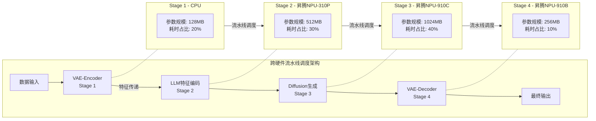

# 一种基于stage分离和异构部署的推理优化系统

## 一、基本信息

申请人：高忠山、凌超凡、黎恩彤、曾立

发明人：高忠山、凌超凡、黎恩彤、曾立

交底日期：____年____月____日

技术适用场景：AI处理器+CPU异构硬件平台（例如昇腾NPU+CPU）、多模态大模型文生图推理（例如Qwen-Image多模态大模型）、VLLM-Omni推理框架适配

## 二、技术领域

本发明属于人工智能模型加速与分布式部署技术领域，具体涉及一种基于stage分离和异构部署的推理优化系统。本系统通过将多模态大模型推理流程拆分为独立功能stage，并将各stage异构部署至CPU与不同型号AI处理器（例如昇腾NPU）硬件，结合流水线调度、分层缓存实现全流程推理性能提升，主要适用于AI处理器异构硬件平台（例如昇腾NPU平台）上文生图类多模态大模型的高效推理部署。

## 三、背景技术

### 1. 现有技术现状

随着多模态大模型规模化应用，文生图推理已成为核心场景，AI处理器+CPU异构硬件（例如昇腾NPU+CPU）为当前主流部署方案，VLLM-Omni为通用多模态推理框架。现有推理系统普遍未实现stage深度分离与异构硬件精准匹配，存在显著技术缺陷，无法满足高并发、低延迟的规模化推理需求。

### 2. 现有技术核心缺陷

#### 2.1 异构资源利用不足

现有stage解耦仅局限于单硬件内部拆分，未结合AI处理器（例如昇腾NPU，具体型号可例如310P/910C/910B）与CPU的算力差异做硬件匹配，导致存量异构硬件闲置、协同效率低、部署成本居高不下。

#### 2.2 stage耦合度高、调度低效

推理各功能环节未实现边界清晰的stage分离，stage之间的功能存在耦合，阶段间数据传输无针对性优化，硬件资源争抢严重，导致AI处理器（例如昇腾NPU）内存占用峰值过高、推理延迟大幅增加，影响用户体验。

#### 2.3 模型冷启动效率极低

多模态大模型（例如Qwen-Image模型）权重大，在AI处理器（例如昇腾NPU）平台重复加载耗时过长，冷启动延迟过高，无法满足高频次、低延迟的推理服务需求。

### 3. 现有技术痛点总结

现有优化方案仅针对单一维度改进，缺乏以“stage分离+异构部署”为核心的系统性推理优化系统，无法同时解决资源利用率低、延迟高、冷启动慢等多重问题，制约多模态大模型在AI处理器平台（例如昇腾NPU平台）的规模化落地。

## 四、发明所要解决的技术问题

本发明针对现有推理系统stage分离后存在耦合、不支持硬件亲和的异构部署、硬件协同低效、冷启动慢等技术痛点，提供一种基于stage分离和异构部署的推理优化系统，通过模块化协同实现以下目标：

1. 实现推理流程stage彻底分离与AI处理器异构硬件（例如昇腾NPU异构硬件）精准匹配，提升异构资源利用率；
2. 优化跨硬件调度逻辑，降低推理延迟、提升推理吞吐量；
3. 缩短模型冷启动时间，提升缓存效率，满足高频次推理需求；

## 五、核心创新点

本发明以推理流程阶段（stage）深度解耦为基础、以异构硬件精准部署为核心，通过多级技术协同形成完整推理优化架构，与现有通用推理框架、单硬件优化、简单阶段拆分方案相比，具备以下不可替代的核心创新点：

### **1. 面向多模态文生图模型的多阶段深度分离与异构硬件精准适配**

本发明突破现有推理流程耦合、硬件混用的技术局限，将多模态文生图推理流程按功能边界、算力特征、参数规模、耗时占比，拆分为预处理、特征编码、核心生成、结果重建四个完全独立、无交叉依赖的阶段（stage），实现阶段间计算隔离、数据隔离、调度隔离，从根本上解决阶段耦合导致的资源争抢问题。

针对不同算力等级的异构计算硬件（含通用处理器与AI处理器）的算力差异，建立硬件亲和性匹配规则，实现各阶段与硬件的精准适配。

- 轻量预处理阶段部署至通用处理器，充分利用现有硬件资源，避免AI处理器算力浪费；
- 轻量特征编码阶段部署至中端AI处理器，适配其中端算力水平，释放高端AI处理器资源；
- 计算密集型核心生成阶段部署至高端AI处理器，充分发挥其并行计算优势，提升核心推理效率；
- 结果重建阶段部署至对应AI处理器，与核心生成阶段并行执行，进一步提升整体推理吞吐量。

由此实现任务与硬件一一对应、算力无浪费、存量异构资源最大化利用，从架构层面解决现有技术硬件错配、资源争抢、利用率低的核心痛点，扩大专利保护范围。

### **2. 跨硬件流水线异步调度与动态批处理协同机制**

本发明为每个独立推理阶段构建专属任务队列，实现各阶段任务隔离调度，有效避免跨阶段任务干扰与执行阻塞，提升调度灵活性。

基于输入数据规模（含图像分辨率、文本长度等）及各硬件实时负载情况，动态调整各阶段的批处理大小，使轻量阶段与计算密集阶段形成负载错开、峰值互补的执行模式，适配不同硬件的算力承载能力，提升异构硬件协同效率。

通过跨硬件异步流水线调度机制，将前序阶段的输出结果实时流式传递至后续阶段，无需等待全阶段完成即可启动后续计算，彻底消除阶段间同步等待延迟，显著提升异构硬件并行执行效率，在不增加硬件成本的前提下，大幅提升推理吞吐量、降低端到端推理延迟，适配高并发推理场景。

### **3. 适配阶段分离架构的三级分层启动缓存与预加载机制**

本发明针对多模态大模型权重大、冷启动慢的行业痛点，构建与多阶段分离架构深度适配的模型权重缓存、中间特征缓存、推理参数缓存三级分层缓存结构，实现阶段级缓存精准命中，避免缓存资源浪费。

系统启动时，按硬件亲和性将各stage核心数据预加载至对应AI处理器的高速缓存中，避免从磁盘重复读取数据，大幅缩短启动耗时；同时基于任务访问频率、数据有效性建立缓存更新与淘汰策略，保证缓存数据的时效性与有效性，维持高缓存命中率。

该机制从根本上解决多模态大模型在异构硬件平台冷启动耗时过长的问题，显著提升缓存效率，实现推理服务快速响应，适配高频次、低延迟的规模化推理服务部署需求，进一步强化专利保护的全面性。

## 六、技术方案

### 1. 系统整体组成

一种基于异构部署stage分离的推理优化系统，包括：stage异构部署模块、跨硬件流水线调度模块、分层启动缓存模块、结果聚合模块。各模块数据互通、协同工作，形成闭环式推理优化架构。

### 2. 各模块功能与具体实现

#### 2.1 stage异构部署模块（核心模块）

##### 2.1.1 stage分离功能

以Qwen-Image多模态大模型为例，将多模态大模型推理流程拆分为4个边界清晰、功能独立的stage，具体如下（以下stage划分及功能为示例性说明）：

（1）VAE-Encoder Stage：负责图像预处理，为后续特征编码提供基础；
（2）LLM特征编码Stage：负责文本特征提取与编码，实现文本信息向特征向量的转换；
（3）MMDiT Diffusion生成Stage：负责核心图像生成，为推理流程的计算密集型环节；
（4）VAE-Decoder Stage：负责图像重建，输出最终文生图结果。

##### 2.1.2 异构部署功能

基于各stage的算力需求、参数规模、耗时占比，精准分配至对应硬件，具体部署逻辑如下：

（1）VAE-Encoder Stage → 通用处理器（例如CPU）：轻量预处理环节，参数规模可例如约84M，耗时占比可例如＜2%，充分利用通用处理器资源，避免浪费AI处理器（例如昇腾NPU）算力；
（2）LLM特征编码Stage → 中端AI处理器（例如昇腾NPU-310P）：轻量特征编码环节，参数规模可例如7B，耗时占比可例如＜3%，适配中端AI处理器算力，释放高端AI处理器资源；
（3）MMDiT Diffusion生成Stage → 高端AI处理器（例如昇腾NPU-910C）：计算密集型核心环节，参数规模可例如20B，耗时占比可例如60%-80%，充分发挥高端AI处理器并行计算优势；
（4）VAE-Decoder Stage → 对应AI处理器（例如昇腾NPU-910B）：图像重建环节，参数规模可例如约100M，耗时占比可例如10%-20%，与核心生成stage并行执行，提升整体效率；上述硬件型号及参数均为示例性说明，不构成具体限定。

#### 2.2 跨硬件流水线调度模块

##### 2.2.1 任务队列管理

为每个独立stage维护专属任务队列，实现各stage任务隔离、独立调度，避免任务干扰；

##### 2.2.2 批处理策略

根据输入数据规模（图像分辨率、文本长度），动态调整各stage的批处理大小，适配不同硬件的算力负载，提升协同效率；

##### 2.2.3 异步调度

执行跨硬件流水线异步调度机制，将前序stage的输出结果实时传递至后续stage，消除阶段间阻塞，降低传输延迟，适配异构硬件的并行调度特性（此处昇腾NPU为示例性AI处理器，不构成具体限定）。

#### 2.3 分层启动缓存模块

##### 2.3.1 缓存预加载

模型启动时，以Qwen-Image模型为例，将各stage的核心数据（例如模型主干权重、常用风格特征、推理参数等）预加载至AI处理器（例如昇腾NPU）的高速缓存中，避免从磁盘重复读取，缩短启动时间；上述模型及硬件均为示例性说明，不局限于该具体型号。

##### 2.3.2 缓存更新与淘汰

建立基于任务访问频率、数据有效性的缓存更新与淘汰机制，确保缓存数据的时效性与有效性，维持高缓存命中率。

#### 2.4 结果聚合模块

##### 2.4.1 结果接收

接收各stage传输的推理中间结果与最终结果，完成数据汇总；

##### 2.4.2 多格式输出

校验通过后，输出JPG、PNG、WebP、TIFF等多种格式的文生图结果，满足不同应用场景需求。

### 3. 模块协同逻辑

3.1 分层启动缓存模块接收信号后，执行核心数据预加载，完成后向跨硬件流水线调度模块发送启动信号；
3.2 跨硬件流水线调度模块接收启动信号后，启动各stage跨硬件异步并行执行；
3.3 各stage完成推理后，将结果传输至结果聚合模块，由该模块完成校验、融合与输出，形成完整推理流程。

## 七、具体实施方式

实施例1：基于异构硬件平台的系统部署与运行（以下硬件、模型及参数均为示例性说明，不构成具体限定）

### 1. 硬件配置

1.1 CPU：Kunpeng-920
1.2 AI处理器（例如昇腾NPU-310P）：显存24GB
1.3 AI处理器（例如昇腾NPU-910C）：显存64GB
1.4 AI处理器（例如昇腾NPU-910B）：显存32GB

### 2. 系统运行流程

2.1 stage异构部署：系统通过stage异构部署模块，将4个stage分别部署至对应硬件，完成硬件匹配与初始化；
2.2 分层缓存加载：分层启动缓存模块构建三级缓存结构，预加载多模态大模型主干权重（例如约20GB）、常用风格特征（例如500+种）、推理参数，缓存命中率维持在92%以上；
2.3 流水线调度：跨硬件流水线调度模块根据输入图像分辨率（1024×1024）与文本长度，动态调整各stage批处理大小（VAE-Encoder每批64个任务，LLM每批32个任务，MMDiT每批16个任务，VAE-Decoder每批32个任务），启动跨硬件异步并行执行；
2.4 结果输出：结果聚合模块对推理结果进行校验（PSNR≥35dB、语义相似度≥0.85），校验通过后输出PNG格式文生图。

### 3. 实施效果

3.1 整体算力利用率提升：90%
3.2 推理延迟降低：45%
3.3 吞吐量提升：2.2倍
3.4 冷启动时间：从120s缩短至35s（缩短60%以上）

## 八、有益效果

本发明通过系统各模块的协同工作，实现了推理全流程优化，相较于现有技术，具备以下显著有益效果：

1. **异构资源利用率最大化**：通过stage深度分离与精准异构部署，将不同stage匹配至适配的硬件，整体算力利用率提升90%以上，部署成本降低30%以上，充分利用存量异构硬件资源。
2. **推理性能大幅提升**：依托跨硬件流水线异步调度，消除stage间阻塞与资源争抢，推理延迟降低40%以上，吞吐量提升2倍以上，满足高并发、低延迟推理需求。
3. **冷启动效率显著优化**：分层启动缓存模块实现核心数据预加载，使模型冷启动时间缩短60%以上，缓存命中率≥92%，实现推理服务快速响应，适配高频次推理场景。

## 九、可检测性说明

本系统所有模块的运行状态、优化效果均设置可量化、可采集、可验证的检测指标，符合专利授权与侵权判定要求，具体检测指标如下：

1. stage异构部署模块：检测指标包括各个Stage的主要功能、性能需求、硬件匹配度、各硬件算力利用率、各stage耗时占比；
2. 跨硬件流水线调度模块：检测指标包括各stage任务队列长度、跨硬件数据传输延迟、各stage并行率、批处理大小动态调整幅度；
3. 分层启动缓存模块：检测指标包括缓存层级完整性、缓存命中率、模型冷启动耗时、热启动耗时、缓存数据加载量；
4. 结果聚合模块：检测指标包括结果校验通过率、输出格式多样性、结果输出延迟；
5. 系统整体性能：检测指标包括整体算力利用率、推理延迟、吞吐量、部署成本降低比例。

## 十、附图说明

1. 图1：stage分离与异构部署及跨硬件流水线调度架构示意图  
   展示4个stage的划分、各stage的硬件部署关系、数据流向逻辑、跨硬件流水线异步调度流程，标注各stage的参数规模与耗时占比，体现stage异构部署模块与跨硬件流水线调度模块的协同关系。

2. 图2：适配stage分离的分层启动缓存机制结构示意图  
   展示三级缓存（模型权重缓存、中间特征缓存、推理参数缓存）的组成结构，AI处理器（例如昇腾NPU）高速缓存的预加载流程，缓存更新与淘汰逻辑，标注冷启动时间缩短60%以上、缓存命中率≥92%的核心效果，体现分层启动缓存模块与其他模块的协同交互。

