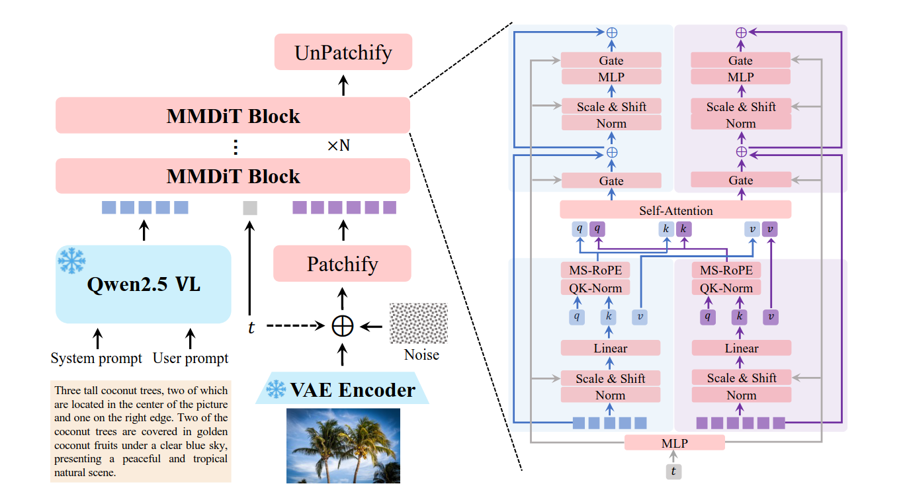
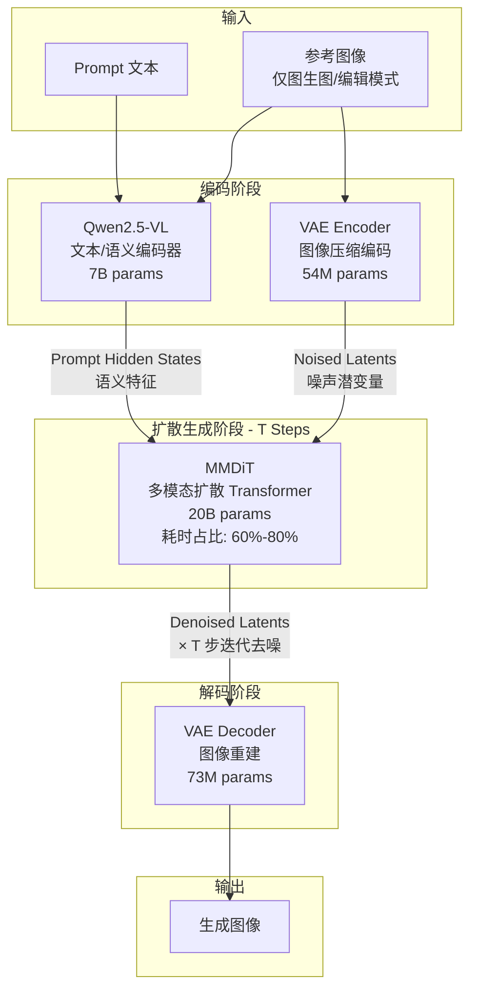

# QWen-Image

文生图模型，基于 MMDiT（Multimodal Diffusion Transformer）架构。

## 推理数据流

> Prompt 编码（VLM）与 Image 编码（VAE Encoder）可并行执行，两者结果可各自独立缓存。

## 模型参数

| 组件 | 参数量 | 类型 | 说明 |
|------|--------|------|------|
| Qwen2.5-VL | 7B | Dense | 文本与图像语义编码，理解复杂提示词 |
| VAE Encoder | 54M | Dense | 图像压缩编码，生成重建表示 |
| VAE Decoder | 73M | Dense | 图像重建解码，输出最终图像 |
| MMDiT | 20B | Dense | 多模态扩散 Transformer，核心去噪网络 |

## 推理阶段耗时分布

| 阶段 | 耗时占比 | 计算特征 |
|------|---------|---------|
| VAE 编码 | <2% | 轻量，适合 CPU 或中端加速器 |
| VLM 文本编码 | <3% | 轻量-中等，适合中端加速器 |
| MMDiT 迭代去噪 | 60%-80% | 计算密集型，需高端加速器 |
| VAE 解码 | 10%-20% | 中等，可与生成阶段并行 |
