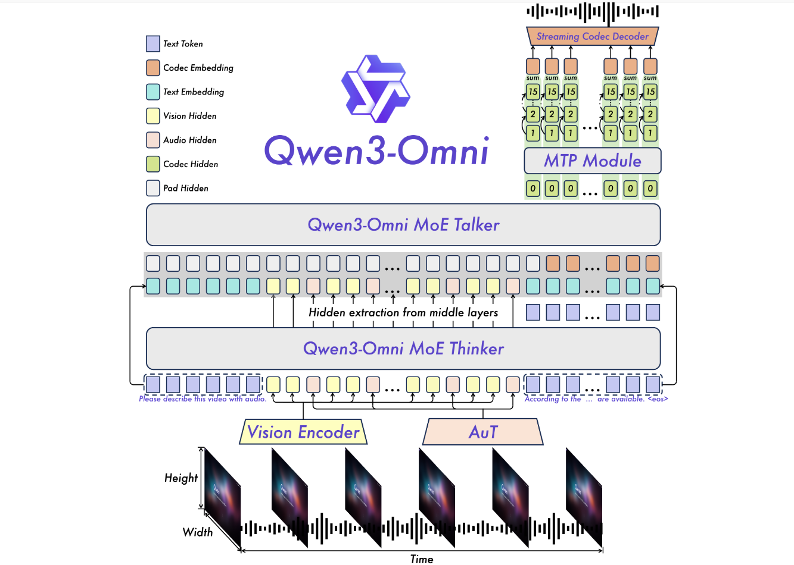
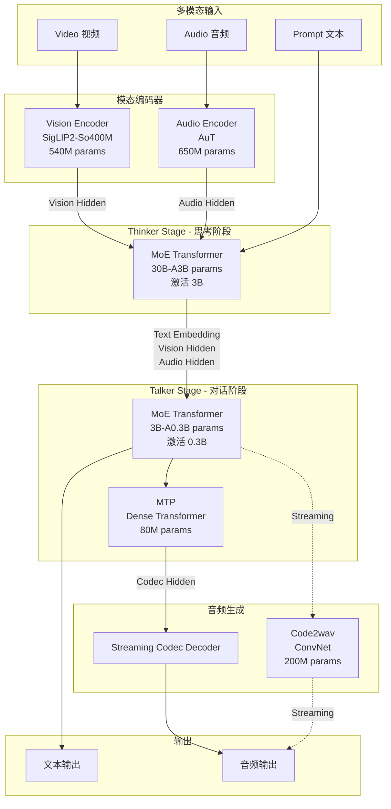

# QWen3-Omni

全模态模型，采用 Thinker-Talker 流水线架构，支持文本、图像、视频、音频输入与文本、音频输出。

## 推理数据流

> Thinker 与 Talker 为流水线架构，Thinker 完成推理后以 streaming 方式传递给 Talker，Talker 生成文本和音频码流。

## 模型参数

| 组件 | 参数量 | 类型 | 说明 |
|------|--------|------|------|
| Audio Encoder (AuT) | 650M | — | 音频编码，将音频信号转换为 hidden states |
| Vision Encoder (SigLIP2-So400M) | 540M | — | 视觉编码，将图像/视频帧转换为 hidden states |
| Thinker | 30B-A3B | MoE (激活 3B) | 核心思考模块，融合多模态输入，生成中间表示 |
| Talker | 3B-A0.3B | MoE (激活 0.3B) | 对话生成模块，输出文本和音频码流 |
| MTP | 80M | Dense | Multi-Token Prediction，辅助 Talker 加速生成 |
| Code2wav | 200M | ConvNet | 音频码流到波形的转换 |

## Stage 分离（vLLM-Omni 支持）

| Stage | 组件 | 功能 | vLLM-Omni 是否分离 |
|-------|------|------|-------------------|
| Stage 0: Thinker (Prefill) | Thinker (is_prefill_only) | 处理 Prompt，生成 KV Cache | ✅ 支持分离 |
| Stage 1: Thinker (Decode) | Thinker (is_decode_only) | 从远程 KV Cache 恢复，逐 token 生成 | ✅ 支持分离 |
| Stage 2: Talker | Talker | 接收 Thinker 输出，生成文本 | ✅ 支持分离 |
| Stage 3: Code2wav | Code2wav | 音频码流解码为波形 | ✅ 支持分离 |

> vLLM-Omni 对此模型已支持完整的 prefill-decode- talker-code2wav 四级 disaggregation，stage 间通过 MooncakeConnector 传输 KV Cache。
