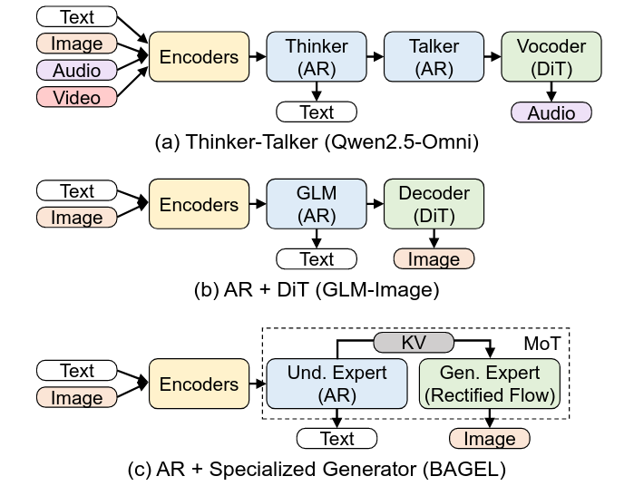
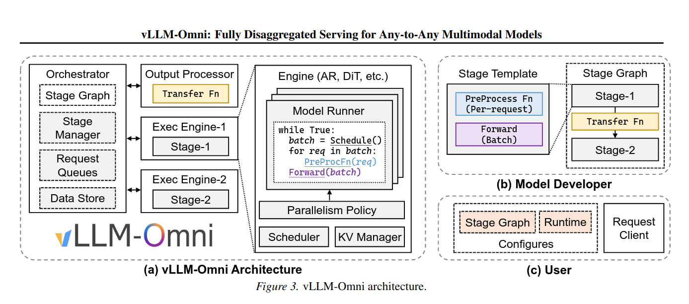
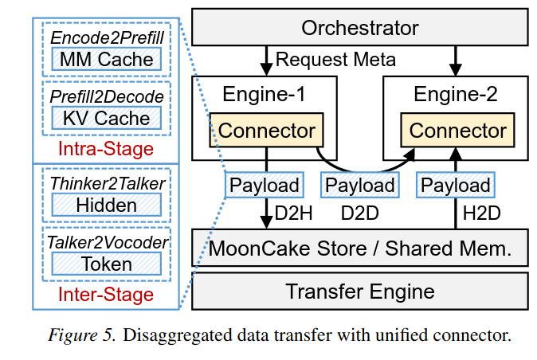

# vLLM-omni

通过对于阶段(stage)的抽象，我们可以将一个多模态模型拆分为多个阶段，并且定义一个以表示阶段间计算流水线的计算图。
每个阶段独立地运行在特定的执行引擎上，每个执行引擎负责自己阶段的请求批量化以最大化资源利用率。
对于多模态理解，现代模型包含了多种编码器(音频编码器 e.i. Whisper, 音频Transformer, 视觉编码器 ViT, SigLIP)将多模态数据映射为统一的嵌入空间。
对于多模态生成，LLM骨干生成嵌入输出并且交给特定模态的解码器包含text-to-speech models和image/video 生成模型。

