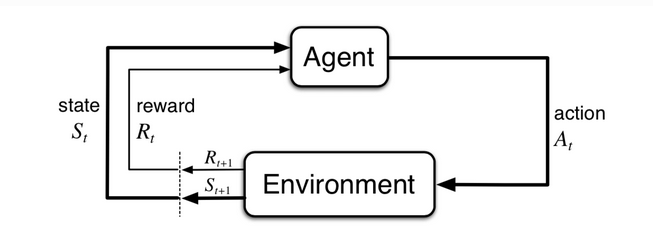

# 有限马尔科夫决策过程（MDP）

> MDP是顺序决策的经典形式化，其中行动不仅影响直接奖励，还影响后续状态，以及贯穿到未来的奖励。因此MDP设计延迟奖励以及交换即使与延迟奖励的需要。

在MDP中我们估计每个状态$s$中每个动作$a$的价值$q_*(s,a)$，或者我们估计给出最佳行动的每个状态价值$v_*(s)$。

## 个体环境接口

每个时间步$t$,状态$S_t \in \mathcal S$,并再次基础上选择一个动作$A_t \in \mathcal A(S_t)$。接收到一个奖励值$R_t \in \mathcal R$。并且自身处于一个新的状态$S_{t+1}$。MDP和个体一起产生了这个交互序列。
$$
S_0 \to A_0 \to R_0 \to S_1 \to A_1 \to R_1 \to S_2 \to \cdots
$$
在有限MDP中($\mathcal S, \mathcal A, \mathcal R$)都是有哦显得，$R_t$和$S_t$具有明确定义的离散概率分布，仅取决于先前的状态和动作。对于这些随机变量的值$s \in \mathcal S$和$r \in \mathcal R$，我们有：
$$
p(s',r|s,a) = Pr(S_t = s, R_t = r | S_{t-1} = s, A_{t-1} = a)
$$
> 在状态s,动作a下，状态s'和奖励r的概率。

动力学函数$p: \mathcal S \times \mathcal R \times \mathcal S \times \mathcal A   \to \mathcal [0,1]$定义了MDP的动态。
$$
\sum_{s'\in \mathcal S} \sum_{r \in \mathcal R} p(s',r|s,a) = 1, for all s\in \mathcal S, a\in \mathcal A(s)
$$

$S_t$和$R_t$的每个可能值的概率仅取决于前一个状态和动作$S_{t-1}和A_{t-1}$,最好将其视为对决策过程的限制，而不是对状态的限制。

三参数$p: \mathcal S \times \mathcal S \times \mathcal A \to \mathcal [0,1]$定义了MDP的动态。
$$
p(s'|s,a) = Pr(S_t=s'|S_{t-1}=s,A_{t-1}=a)=\sum_{r \in \mathcal R} p(s',r|s,a)
$$
> 在状态s,动作a下，状态s'的概率。

双参数$r: \mathcal S\times \mathcal A \to R$
$$
r(s,a) = E[R_t|S_{t-1}=s, A_{t-1}=a] = \sum_{r \in \mathcal R} p(s',r|s,a)
$$

> 状态s，动作a下的奖励期望
三参数奖励函数$r: \mathcal S \times \mathcal A \times \mathcal R \to \mathcal R$
$$
r(s,a,s') = E[R_t|S_{t-1}=s,A_{t-1}=a,S_t=s']=\sum_{r\in \mathcal R} r\frac{p(s',r|s,a)}{p(s'|s,a)}
$$
> 状态s，动作a，选择下一个状态s'下的奖励期望r(s,a,s')

强化学习任务的典型特征是具有这种结构化表示的状态和动作，另一方面，奖励只是一个标量。

## 目标和奖励

在每个时间步,奖励是一个简单的数字,$R_t\in R$，非正式的，个体的目标是最大化其收到的总奖励/长期奖励。

## 回报和情节

回报是奖励的总和:
$$
G_t = \sum_{i=t}^{T} R_{t+i}
$$
> 未来的回报
加上衰减因子
$$
G_t = R_{t+1} + \gamma G_{t+1} = R_{t+1} + \gamma R_{t+2} + \gamma^2 R_{t+3} + \cdots = \sum_{k=0}^{\infty} \gamma^k R_{t+k+1}
$$

> 如果$\gamma=0$，则agent是短视的，只关注最大化立即奖励。当$\gamma \to 1$时，目标回报更加强烈地考虑了未来回报，个体变得更有远见。

$$
G_t = \sum_{k=0}^{\infty} \gamma^k = \frac{1}{1-\gamma}
$$

## 情节和持续任务的统一符号

$$
G_t = \sum_{k=t+1}^{T}\gamma^{k-t-1} R_{k}
$$
> 包括$T=\infty$或$\gamma=1$的可能性。

## 策略和价值函数

几乎所有的强化学习算法都涉及估计状态（或状态-动作对）的 价值函数，它们估计个体在给定状态下的 好坏程度 （或者在给定状态下执行给定动作的程度有多好）

个体未来可能获得的回报取决于它将采取的行动。因此，价值函数是根据特定的行为方式来定义的，称为策略。

形式上，策略是从状态到选择每个可能动作的概率的映射。如果个体在时间$t$遵循策略$\pi$,则$\pi(a|s)$是个体在状态$s$下选择动作$a$的概率。$\pi(a|s)$

