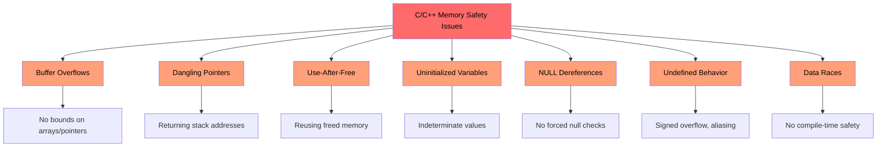
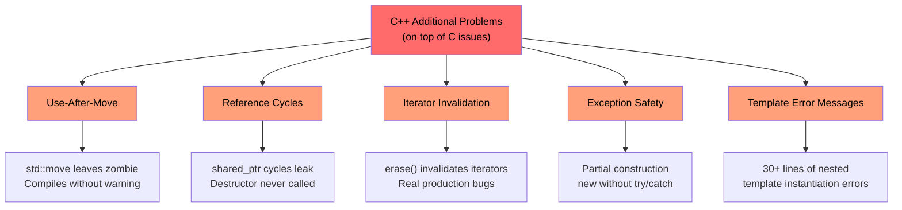
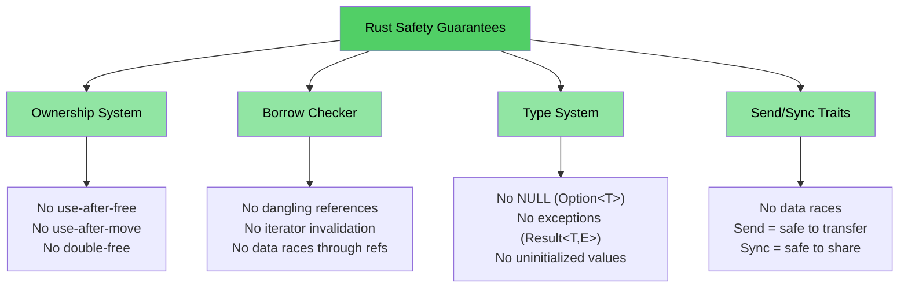

# 为什么 C/C++ 开发者需要 Rust

> **你将学到：**
> - Rust 消除的完整问题列表 — 内存安全、未定义行为、数据竞争等
> - 为什么 `shared_ptr`、`unique_ptr` 和其他 C++ 缓解措施只是权宜之计，而非解决方案
> - 具体的 C 和 C++ 漏洞示例，这些在安全 Rust 中从结构上就不可能发生

> **想直接看代码？** 跳转到 [给我看代码](ch02-getting-started.md#enough-talk-already-show-me-some-code)

## Rust 消除了什么 — 完整列表

在深入示例之前，先看一个概要。安全 Rust **从结构上防止**了此列表中的每个问题 — 不是通过纪律、工具或代码审查，而是通过类型系统和编译器：

| **消除的问题** | **C** | **C++** | **Rust 如何防止** |
|---------------|:-----:|:-------:|------------------|
| 缓冲区上溢/下溢 | ✅ | ✅ | 所有数组、切片和字符串都携带边界信息；索引访问在运行时检查 |
| 内存泄漏（无需 GC） | ✅ | ✅ | `Drop` 特征 = 做对了的 RAII；自动清理，无需五法则 |
| 悬垂指针 | ✅ | ✅ | 生命周期系统在编译期证明引用的有效性超过其引用对象 |
| 释放后使用 | ✅ | ✅ | 所有权系统使其成为编译错误 |
| 使用后移动 | — | ✅ | 移动是**破坏性的** — 原始绑定不再存在 |
| 未初始化变量 | ✅ | ✅ | 所有变量必须在使用前初始化；编译器强制执行 |
| 整数上溢/下溢未定义行为 | ✅ | ✅ | 调试构建在溢出时 panic；发布构建回绕（两种都是已定义行为） |
| NULL 指针解引用 / SEGV | ✅ | ✅ | 没有空指针；`Option<T>` 强制显式处理 |
| 数据竞争 | ✅ | ✅ | `Send`/`Sync` 特征 + 借用检查器使数据竞争成为编译错误 |
| 不受控的副作用 | ✅ | ✅ | 默认不可变；修改需要显式 `mut` |
| 无继承（更好的可维护性） | — | ✅ | 特征 + 组合取代类层次结构；促进复用而不产生耦合 |
| 无异常；可预测的控制流 | — | ✅ | 错误是值（`Result<T, E>`）；不可能被忽略，没有隐藏的 `throw` 路径 |
| 迭代器失效 | — | ✅ | 借用检查器禁止在迭代时修改集合 |
| 引用循环 / 泄漏的析构器 | — | ✅ | 所有权是树形结构；`Rc` 循环是可选的，可以用 `Weak` 打破 |
| 忘记解锁互斥锁 | ✅ | ✅ | `Mutex<T>` 包装数据；锁守卫是唯一的访问途径 |
| 未定义行为（通用） | ✅ | ✅ | 安全 Rust **零**未定义行为；`unsafe` 块是显式的且可审计的 |

> **底线：** 这些不是通过编码规范来强制执行的理想目标。它们是**编译期保证**。如果你的代码能编译通过，这些 bug 就不可能存在。

---

## C 和 C++ 共有的问题

> **想跳过示例？** 跳转到 [Rust 如何解决所有这些问题](#how-rust-addresses-all-of-this) 或直接到 [给我看代码](ch02-getting-started.md#enough-talk-already-show-me-some-code)

这两种语言共有一组核心的内存安全问题，它们是超过 70% 的 CVE（通用漏洞与暴露）的根本原因：

### 缓冲区溢出

C 数组、指针和字符串没有内在的边界信息。超出边界极其容易：

```c
#include <stdlib.h>
#include <string.h>

void buffer_dangers() {
    char buffer[10];
    strcpy(buffer, "This string is way too long!");  // Buffer overflow

    int arr[5] = {1, 2, 3, 4, 5};
    int *ptr = arr;           // Loses size information
    ptr[10] = 42;             // No bounds check — undefined behavior
}
```

在 C++ 中，`std::vector::operator[]` 仍然不进行边界检查。只有 `.at()` 才会 — 但谁来捕获那个异常呢？

### 悬垂指针和释放后使用

```c
int *bar() {
    int i = 42;
    return &i;    // Returns address of stack variable — dangling!
}

void use_after_free() {
    char *p = (char *)malloc(20);
    free(p);
    *p = '\0';   // Use after free — undefined behavior
}
```

### 未初始化变量和未定义行为

C 和 C++ 都允许未初始化变量。其结果值是不确定的，读取它们是未定义行为：

```c
int x;               // Uninitialized
if (x > 0) { ... }  // UB — x could be anything
```

对于无符号类型，整数溢出在 C 中是**已定义的**，但对于有符号类型则是**未定义的**。在 C++ 中，有符号溢出同样是未定义行为。两种编译器都可以且确实会利用这一点进行"优化"，以出人意料的方式破坏程序。

### NULL 指针解引用

```c
int *ptr = NULL;
*ptr = 42;           // SEGV — but the compiler won't stop you
```

在 C++ 中，`std::optional<T>` 有所帮助，但语法冗长，而且经常被 `.value()` 绕过，而后者会抛出异常。

### 可视化：共有问题



---

## C++ 带来了更多问题

> **C 语言读者**：如果你不使用 C++，可以 [跳到 Rust 如何解决这些问题](#how-rust-addresses-all-of-this)。
>
> **想直接看代码？** 跳转到 [给我看代码](ch02-getting-started.md#enough-talk-already-show-me-some-code)

C++ 引入了智能指针、RAII、移动语义和异常来解决 C 的问题。这些是**权宜之计，而非根治之法** — 它们将故障模式从"运行时崩溃"转变为"运行时更隐蔽的 bug"。

### `unique_ptr` 和 `shared_ptr` — 权宜之计，而非解决方案

C++ 智能指针相比原始 `malloc`/`free` 是重大改进，但它们并没有解决根本问题：

| C++ 缓解措施 | 修复了什么 | **没有**修复什么 |
|-------------|-----------|----------------|
| `std::unique_ptr` | 通过 RAII 防止泄漏 | **使用后移动**仍能编译；留下一个僵尸 nullptr |
| `std::shared_ptr` | 共享所有权 | **引用循环**会悄无声息地泄漏；`weak_ptr` 的使用纪律是手动的 |
| `std::optional` | 替代部分 null 用法 | `.value()` 为空时**抛出异常** — 隐藏的控制流 |
| `std::string_view` | 避免拷贝 | 如果源字符串被释放就会**悬垂** — 没有生命周期检查 |
| 移动语义 | 高效转移 | 被移动的对象处于**"有效但未指定的状态"** — 潜伏的未定义行为 |
| RAII | 自动清理 | 需要**五法则**才能正确实现；一个错误就会破坏一切 |

```cpp
// unique_ptr: use-after-move compiles cleanly
std::unique_ptr<int> ptr = std::make_unique<int>(42);
std::unique_ptr<int> ptr2 = std::move(ptr);
std::cout << *ptr;  // Compiles! Undefined behavior at runtime.
                     // In Rust, this is a compile error: "value used after move"
```

```cpp
// shared_ptr: reference cycles leak silently
struct Node {
    std::shared_ptr<Node> next;
    std::shared_ptr<Node> parent;  // Cycle! Destructor never called.
};
auto a = std::make_shared<Node>();
auto b = std::make_shared<Node>();
a->next = b;
b->parent = a;  // Memory leak — ref count never reaches 0
                 // In Rust, Rc<T> + Weak<T> makes cycles explicit and breakable
```

### 使用后移动 — 沉默的杀手

C++ 的 `std::move` 并不是真正的移动 — 它只是一个类型转换。原始对象仍然处于"有效但未指定的状态"。编译器允许你继续使用它：

```cpp
auto vec = std::make_unique<std::vector<int>>({1, 2, 3});
auto vec2 = std::move(vec);
vec->size();  // Compiles! But dereferencing nullptr — crash at runtime
```

在 Rust 中，移动是**破坏性的**。原始绑定消失了：

```rust
let vec = vec![1, 2, 3];
let vec2 = vec;           // Move — vec is consumed
// vec.len();             // Compile error: value used after move
```

### 迭代器失效 — 来自生产环境 C++ 的真实 bug

这些不是人为构造的示例 — 它们代表了在大型 C++ 代码库中发现的**真实 bug 模式**：

```cpp
// BUG 1: erase without reassigning iterator (undefined behavior)
while (it != pending_faults.end()) {
    if (*it != nullptr && (*it)->GetId() == fault->GetId()) {
        pending_faults.erase(it);   // ← iterator invalidated!
        removed_count++;            //   next loop uses dangling iterator
    } else {
        ++it;
    }
}
// Fix: it = pending_faults.erase(it);
```

```cpp
// BUG 2: index-based erase skips elements
for (auto i = 0; i < entries.size(); i++) {
    if (config_status == ConfigDisable::Status::Disabled) {
        entries.erase(entries.begin() + i);  // ← shifts elements
    }                                         //   i++ skips the shifted one
}
```

```cpp
// BUG 3: one erase path correct, the other isn't
while (it != incomplete_ids.end()) {
    if (current_action == nullptr) {
        incomplete_ids.erase(it);  // ← BUG: iterator not reassigned
        continue;
    }
    it = incomplete_ids.erase(it); // ← Correct path
}
```

**这些都能编译通过且没有任何警告。** 在 Rust 中，借用检查器会让这三种情况都成为编译错误 — 你不能在迭代集合的同时修改它，没有例外。

### 异常安全和 `dynamic_cast`/`new` 模式

现代 C++ 代码库仍然大量依赖没有编译期安全保证的模式：

```cpp
// Typical C++ factory pattern — every branch is a potential bug
DriverBase* driver = nullptr;
if (dynamic_cast<ModelA*>(device)) {
    driver = new DriverForModelA(framework);
} else if (dynamic_cast<ModelB*>(device)) {
    driver = new DriverForModelB(framework);
}
// What if driver is still nullptr? What if new throws? Who owns driver?
```

在一个典型的 10 万行 C++ 代码库中，你可能会发现数百个 `dynamic_cast` 调用（每个都是潜在的运行时失败）、数百个原始 `new` 调用（每个都是潜在的泄漏）、以及数百个 `virtual`/`override` 方法（到处都是虚表开销）。

### 悬垂引用和 lambda 捕获

```cpp
int& get_reference() {
    int x = 42;
    return x;  // Dangling reference — compiles, UB at runtime
}

auto make_closure() {
    int local = 42;
    return [&local]() { return local; };  // Dangling capture!
}
```

### 可视化：C++ 额外的问题



---

## Rust 如何解决所有这些问题

上面列出的每个问题 — 来自 C 和 C++ 的 — 都被 Rust 的编译期保证所防止：

| 问题 | Rust 的解决方案 |
|------|----------------|
| 缓冲区溢出 | 切片携带长度；索引访问有边界检查 |
| 悬垂指针 / 释放后使用 | 生命周期系统在编译期证明引用的有效性 |
| 使用后移动 | 移动是破坏性的 — 编译器拒绝让你触碰原始值 |
| 内存泄漏 | `Drop` 特征 = 无需五法则的 RAII；自动、正确的清理 |
| 引用循环 | 所有权是树形结构；`Rc` + `Weak` 使循环显式化 |
| 迭代器失效 | 借用检查器禁止在借用集合的同时修改它 |
| NULL 指针 | 没有 null。`Option<T>` 通过模式匹配强制显式处理 |
| 数据竞争 | `Send`/`Sync` 特征使数据竞争成为编译错误 |
| 未初始化变量 | 所有变量必须初始化；编译器强制执行 |
| 整数未定义行为 | 调试模式在溢出时 panic；发布模式回绕（两者都是已定义行为） |
| 异常 | 无异常；`Result<T, E>` 在类型签名中可见，用 `?` 传播 |
| 继承复杂性 | 特征 + 组合；没有菱形继承问题，没有虚表脆弱性 |
| 忘记解锁互斥锁 | `Mutex<T>` 包装数据；锁守卫是唯一的访问路径 |

```rust
fn rust_prevents_everything() {
    // ✅ No buffer overflow — bounds checked
    let arr = [1, 2, 3, 4, 5];
    // arr[10];  // panic at runtime, never UB

    // ✅ No use-after-move — compile error
    let data = vec![1, 2, 3];
    let moved = data;
    // data.len();  // error: value used after move

    // ✅ No dangling pointer — lifetime error
    // let r;
    // { let x = 5; r = &x; }  // error: x does not live long enough

    // ✅ No null — Option forces handling
    let maybe: Option<i32> = None;
    // maybe.unwrap();  // panic, but you'd use match or if let instead

    // ✅ No data race — compile error
    // let mut shared = vec![1, 2, 3];
    // std::thread::spawn(|| shared.push(4));  // error: closure may outlive
    // shared.push(5);                         //   borrowed value
}
```

### Rust 的安全模型 — 全景图



## 快速参考：C vs C++ vs Rust

| **概念** | **C** | **C++** | **Rust** | **关键区别** |
|----------|-------|---------|----------|-------------|
| 内存管理 | `malloc()/free()` | `unique_ptr`, `shared_ptr` | `Box<T>`, `Rc<T>`, `Arc<T>` | 自动管理，无循环，无僵尸对象 |
| 数组 | `int arr[10]` | `std::vector<T>`, `std::array<T>` | `Vec<T>`, `[T; N]` | 默认进行边界检查 |
| 字符串 | 以 `\0` 结尾的 `char*` | `std::string`, `string_view` | `String`, `&str` | 保证 UTF-8，有生命周期检查 |
| 引用 | `int*`（原始） | `T&`, `T&&`（移动） | `&T`, `&mut T` | 生命周期 + 借用检查 |
| 多态 | 函数指针 | 虚函数，继承 | 特征，特征对象 | 组合优于继承 |
| 泛型 | 宏 / `void*` | 模板 | 泛型 + 特征约束 | 清晰的错误信息 |
| 错误处理 | 返回码，`errno` | 异常，`std::optional` | `Result<T, E>`, `Option<T>` | 没有隐藏的控制流 |
| NULL 安全 | `ptr == NULL` | `nullptr`, `std::optional<T>` | `Option<T>` | 强制进行空值检查 |
| 线程安全 | 手动（pthreads） | 手动（`std::mutex` 等） | 编译期 `Send`/`Sync` | 数据竞争不可能发生 |
| 构建系统 | Make, CMake | CMake, Make 等 | Cargo | 集成工具链 |
| 未定义行为 | 泛滥 | 隐蔽（有符号溢出、别名） | 安全代码中为零 | 安全有保证 |

***
