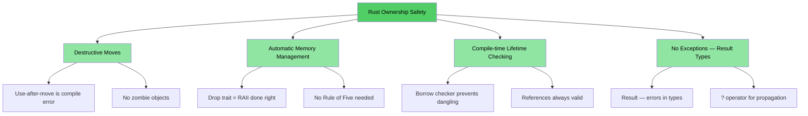
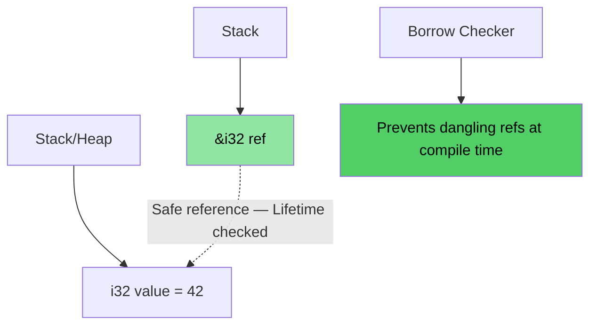
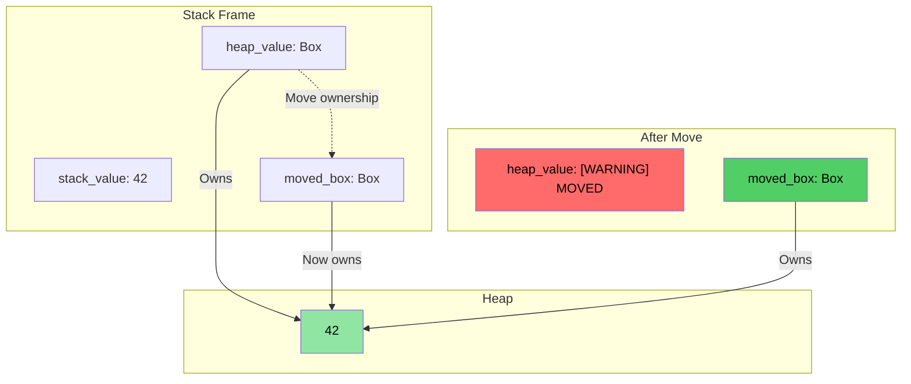
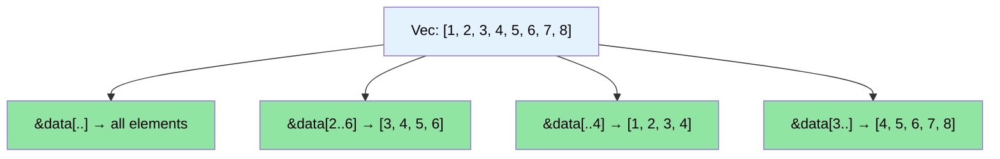

# 讲师介绍和总体方法

> **你将学到：** 课程结构、互动形式，以及熟悉的 C/C++ 概念如何映射到 Rust 中的等价物。本章设定预期，并为你提供本书其余部分的学习路线图。

- 讲师介绍
    - 微软 SCHIE（硅与云硬件基础设施工程）团队的首席固件架构师
    - 行业资深专家，擅长安全、系统编程（固件、操作系统、虚拟化管理程序）、CPU 和平台架构以及 C++ 系统
    - 2017 年开始使用 Rust 编程（在 AWS EC2），从此爱上了这门语言
- 本课程尽可能采用互动形式
    - 假设前提：你了解 C、C++，或两者都了解
    - 示例特意设计为将熟悉的概念映射到 Rust 中的等价物
    - **请随时提出澄清性问题**
- 讲师期待与各团队的持续交流

# Rust 的优势
> **想直接看代码？** 跳转到 [给我看代码](ch02-getting-started.md#enough-talk-already-show-me-some-code)

无论你来自 C 还是 C++，核心痛点都是一样的：内存安全 bug 能顺利编译通过，却在运行时崩溃、数据损坏或内存泄漏。

- 超过 **70% 的 CVE** 由内存安全问题引起 — 缓冲区溢出、悬垂指针、释放后使用
- C++ 的 `shared_ptr`、`unique_ptr`、RAII 和移动语义是朝正确方向迈出的一步，但它们是**权宜之计，而非根治之法** — 使用后移动、引用循环、迭代器失效和异常安全漏洞仍然敞开着
- Rust 提供了你在 C/C++ 中所依赖的性能，同时具有**编译期安全保证**

> **📖 深入阅读：** 参见 [为什么 C/C++ 开发者需要 Rust](ch01-1-why-c-cpp-developers-need-rust.md)，了解具体的漏洞示例、Rust 消除的完整问题列表，以及为什么 C++ 智能指针还不够

----

# Rust 如何解决这些问题？

## 缓冲区溢出和越界访问
- 所有 Rust 数组、切片和字符串都有明确的边界信息。编译器会插入检查，确保任何越界访问都会导致**运行时崩溃**（Rust 中称为 panic） — 而非未定义行为

## 悬垂指针和引用
- Rust 引入了生命周期和借用检查来在**编译期**消除悬垂引用
- 没有悬垂指针，没有释放后使用 — 编译器根本不允许你这样做

## 使用后移动
- Rust 的所有权系统使移动具有**破坏性** — 一旦你移动了一个值，编译器**拒绝**让你使用原来的值。没有僵尸对象，没有"有效但未指定的状态"

## 资源管理
- Rust 的 `Drop` 特征是做对了的 RAII — 编译器在值超出作用域时自动释放资源，并且**防止使用后移动**，这是 C++ RAII 无法做到的
- 不需要五法则（不需要定义拷贝构造函数、移动构造函数、拷贝赋值、移动赋值、析构函数）

## 错误处理
- Rust 没有异常。所有错误都是值（`Result<T, E>`），使错误处理在类型签名中显式可见

## 迭代器失效
- Rust 的借用检查器**禁止在迭代集合的同时修改它**。你根本无法写出困扰 C++ 代码库的那些 bug：
```rust
// Rust 中等价于"边迭代边删除"的方式：retain()
pending_faults.retain(|f| f.id != fault_to_remove.id);

// 或者：收集到一个新的 Vec（函数式风格）
let remaining: Vec<_> = pending_faults
    .into_iter()
    .filter(|f| f.id != fault_to_remove.id)
    .collect();
```

## 数据竞争
- 类型系统通过 `Send` 和 `Sync` 特征在**编译期**防止数据竞争

## 内存安全可视化

### Rust 所有权 — 设计即安全

```rust
fn safe_rust_ownership() {
    // Move is destructive: original is gone
    let data = vec![1, 2, 3];
    let data2 = data;           // Move happens
    // data.len();              // Compile error: value used after move
    
    // Borrowing: safe shared access
    let owned = String::from("Hello, World!");
    let slice: &str = &owned;  // Borrow — no allocation
    println!("{}", slice);     // Always safe
    
    // No dangling references possible
    /*
    let dangling_ref;
    {
        let temp = String::from("temporary");
        dangling_ref = &temp;  // Compile error: temp doesn't live long enough
    }
    */
}
```



## 内存布局：Rust 引用



### `Box<T>` 堆分配可视化

```rust
fn box_allocation_example() {
    // Stack allocation
    let stack_value = 42;
    
    // Heap allocation with Box
    let heap_value = Box::new(42);
    
    // Moving ownership
    let moved_box = heap_value;
    // heap_value is no longer accessible
}
```



## 切片操作可视化

```rust
fn slice_operations() {
    let data = vec![1, 2, 3, 4, 5, 6, 7, 8];
    
    let full_slice = &data[..];        // [1,2,3,4,5,6,7,8]
    let partial_slice = &data[2..6];   // [3,4,5,6]
    let from_start = &data[..4];       // [1,2,3,4]
    let to_end = &data[3..];           // [4,5,6,7,8]
}
```



# Rust 的其他独特卖点和特性
- 线程之间没有数据竞争（编译期 `Send`/`Sync` 检查）
- 没有使用后移动（不像 C++ 的 `std::move` 会留下僵尸对象）
- 没有未初始化变量
    - 所有变量必须在使用前初始化
- 没有低级内存泄漏
    - `Drop` 特征 = 做对了的 RAII，不需要五法则
    - 编译器在变量超出作用域时自动释放内存
- 不会忘记解锁互斥锁
    - 锁守卫是访问数据的*唯一*方式（`Mutex<T>` 包装的是数据，而不是访问操作）
- 没有异常处理的复杂性
    - 错误是值（`Result<T, E>`），在函数签名中可见，用 `?` 传播
- 优秀的类型推断、枚举、模式匹配和零成本抽象支持
- 内置的依赖管理、构建、测试、格式化和代码检查支持
    - `cargo` 取代了 make/CMake + lint + 测试框架

# 快速参考：Rust vs C/C++

| **概念** | **C** | **C++** | **Rust** | **关键区别** |
|----------|-------|---------|----------|-------------|
| 内存管理 | `malloc()/free()` | `unique_ptr`, `shared_ptr` | `Box<T>`, `Rc<T>`, `Arc<T>` | 自动管理，无循环引用 |
| 数组 | `int arr[10]` | `std::vector<T>`, `std::array<T>` | `Vec<T>`, `[T; N]` | 默认进行边界检查 |
| 字符串 | 以 `\0` 结尾的 `char*` | `std::string`, `string_view` | `String`, `&str` | 保证 UTF-8，有生命周期检查 |
| 引用 | `int* ptr` | `T&`, `T&&`（移动） | `&T`, `&mut T` | 借用检查，生命周期 |
| 多态 | 函数指针 | 虚函数，继承 | 特征，特征对象 | 组合优于继承 |
| 泛型编程 | 宏（`void*`） | 模板 | 泛型 + 特征约束 | 更好的错误信息 |
| 错误处理 | 返回码，`errno` | 异常，`std::optional` | `Result<T, E>`, `Option<T>` | 没有隐藏的控制流 |
| NULL/null 安全 | `ptr == NULL` | `nullptr`, `std::optional<T>` | `Option<T>` | 强制进行空值检查 |
| 线程安全 | 手动（pthreads） | 手动同步 | 编译期保证 | 数据竞争不可能发生 |
| 构建系统 | Make, CMake | CMake, Make 等 | Cargo | 集成工具链 |
| 未定义行为 | 运行时崩溃 | 隐蔽的 UB（有符号溢出、别名） | 编译期错误 | 安全有保证 |
