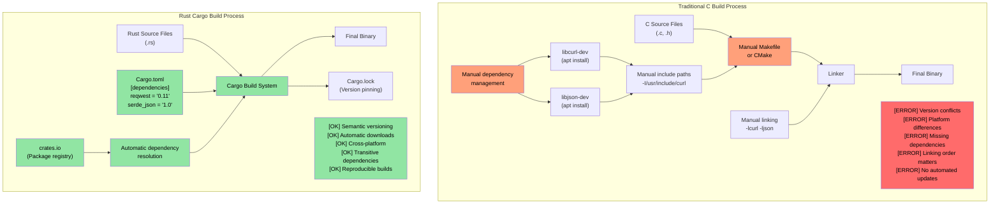
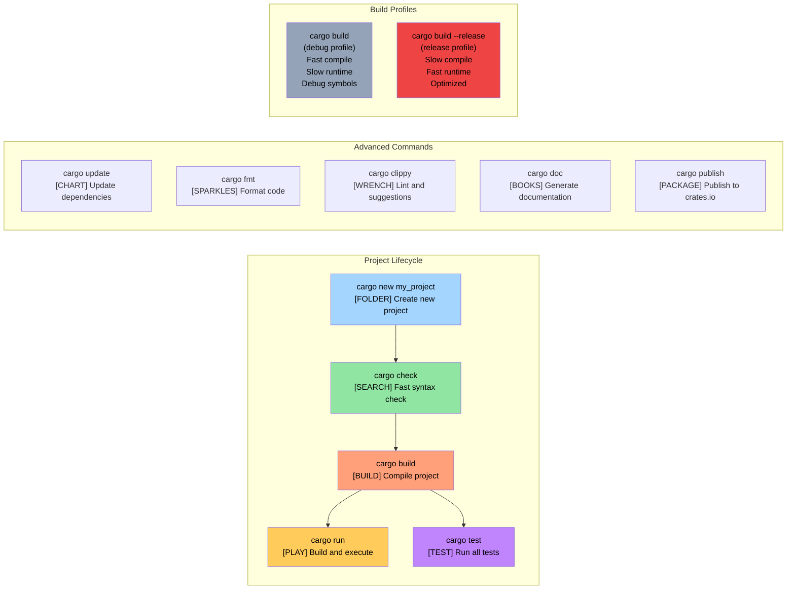

# 别说了：给我看代码

> **你将学到：** 你的第一个 Rust 程序 — `fn main()`、`println!()`，以及 Rust 宏与 C/C++ 预处理器宏的本质区别。学完后你将能够编写、编译和运行简单的 Rust 程序。

```rust
fn main() {
    println!("Hello world from Rust");
}
```
- 上面的语法对任何熟悉 C 风格语言的人来说都很相似
    - Rust 中所有函数都以 ```fn``` 关键字开头
    - 可执行文件的默认入口点是 ```main()```
    - ```println!``` 看起来像一个函数，但实际上是一个**宏**。Rust 中的宏与 C/C++ 预处理器宏非常不同 — 它们是卫生的、类型安全的，并且操作的是语法树而非文本替换
- 两种快速尝试 Rust 代码片段的好方法：
    - **在线**：[Rust Playground](https://play.rust-lang.org/) — 粘贴代码，点击运行，分享结果。无需安装
    - **本地 REPL**：安装 [`evcxr_repl`](https://github.com/evcxr/evcxr)，获得一个交互式 Rust REPL（类似 Python 的 REPL，但用于 Rust）：
```bash
cargo install --locked evcxr_repl
evcxr   # Start the REPL, type Rust expressions interactively
```

### Rust 本地安装
- Rust 可以通过以下方式本地安装
    - Windows: https://static.rust-lang.org/rustup/dist/x86_64-pc-windows-msvc/rustup-init.exe
    - Linux / WSL: ```curl --proto '=https' --tlsv1.2 -sSf https://sh.rustup.rs | sh```
- Rust 生态系统由以下组件组成
    - ```rustc``` 是独立的编译器，但很少直接使用
    - 首选工具 ```cargo``` 是一把瑞士军刀，用于依赖管理、构建、测试、格式化、代码检查等
    - Rust 工具链有 ```stable```（稳定版）、```beta```（测试版）和 ```nightly```（实验版）通道，但我们会坚持使用 ```stable```。使用 ```rustup update``` 命令来升级每六周发布一次的 ```stable``` 版本
- 我们还将安装 VSCode 的 ```rust-analyzer``` 插件

# Rust 包（crate）
- Rust 二进制文件通过包（以下称为 crate）来创建
    - 一个 crate 可以是独立的，也可以依赖其他 crate。依赖的 crate 可以是本地的或远程的。第三方 crate 通常从一个名为 ```crates.io``` 的集中式仓库下载
    - ```cargo``` 工具自动处理 crate 及其依赖项的下载。这在概念上等同于链接 C 库
    - Crate 依赖在名为 ```Cargo.toml``` 的文件中声明。它还定义了 crate 的目标类型：独立可执行文件、静态库、动态库（不常见）
    - 参考：https://doc.rust-lang.org/cargo/reference/cargo-targets.html

## Cargo 与传统 C 构建系统的对比

### 依赖管理对比



### Cargo 项目结构

```text
my_project/
|-- Cargo.toml          # Project configuration (like package.json)
|-- Cargo.lock          # Exact dependency versions (auto-generated)
|-- src/
|   |-- main.rs         # Main entry point for binary
|   |-- lib.rs          # Library root (if creating a library)
|   `-- bin/            # Additional binary targets
|-- tests/              # Integration tests
|-- examples/           # Example code
|-- benches/            # Benchmarks
`-- target/             # Build artifacts (like C's build/ or obj/)
    |-- debug/          # Debug builds (fast compile, slow runtime)
    `-- release/        # Release builds (slow compile, fast runtime)
```

### 常用 Cargo 命令



# 示例：cargo 和 crate
- 在这个示例中，我们有一个没有其他依赖的独立可执行 crate
- 使用以下命令创建一个名为 ```helloworld``` 的新 crate
```bash
cargo new helloworld
cd helloworld
cat Cargo.toml
```
- 默认情况下，```cargo run``` 会编译并运行 ```debug```（未优化）版本的 crate。要执行 ```release``` 版本，使用 ```cargo run --release```
- 注意实际的二进制文件位于 ```target``` 文件夹下的 ```debug``` 或 ```release``` 文件夹中
- 你可能还注意到源代码同一目录下有一个名为 ```Cargo.lock``` 的文件。它是自动生成的，不应手动修改
    - 我们稍后会重新讨论 ```Cargo.lock``` 的具体用途
