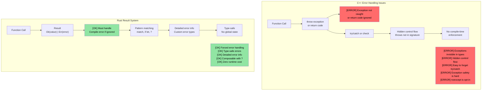
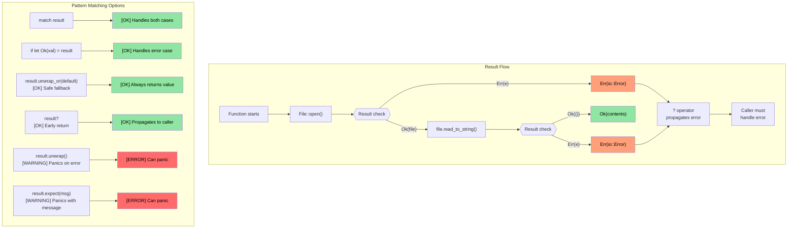

## 将枚举与 Option 和 Result 关联起来

> **你将学到：** Rust 如何用 `Option<T>` 替代空指针，用 `Result<T, E>` 替代异常，以及 `?` 运算符如何使错误传播变得简洁。这是 Rust 最具特色的模式 —— 错误是值，而非隐藏的控制流。

- 还记得我们之前学的 `enum` 类型吗？Rust 的 `Option` 和 `Result` 只是定义在标准库中的枚举：
```rust
// 这就是 Option 在 std 中的实际定义：
enum Option<T> {
    Some(T),  // 包含一个值
    None,     // 没有值
}

// 而 Result：
enum Result<T, E> {
    Ok(T),    // 成功并带有值
    Err(E),   // 错误并带有详情
}
```
- 这意味着你学到的关于 `match` 模式匹配的一切都可以直接用于 `Option` 和 `Result`
- Rust 中**没有空指针** -- `Option<T>` 是替代方案，编译器强制你处理 `None` 的情况

### C++ 对比：异常 vs Result
| **C++ 模式** | **Rust 等价物** | **优势** |
|----------------|--------------------|--------------|
| `throw std::runtime_error(msg)` | `Err(MyError::Runtime(msg))` | 错误在返回类型中 —— 不会忘记处理 |
| `try { } catch (...) { }` | `match result { Ok(v) => ..., Err(e) => ... }` | 没有隐藏的控制流 |
| `std::optional<T>` | `Option<T>` | 需要穷尽匹配 —— 不会忘记 None |
| `noexcept` 标注 | 默认 —— 所有 Rust 函数都是 "noexcept" | 异常不存在 |
| `errno` / 返回码 | `Result<T, E>` | 类型安全，不能忽略 |

# Rust Option 类型
- Rust 的 ```Option``` 类型是一个只有两个变体的 ```enum```：```Some<T>``` 和 ```None```
    - 其思想是表示一个 ```可空``` 类型，即它要么包含该类型的有效值（```Some<T>```），要么没有有效值（```None```）
    - ```Option``` 类型用于操作结果要么成功返回有效值、要么失败（但具体错误无关紧要）的 API 中。例如，考虑从字符串中解析整数值
```rust
fn main() {
    // 返回 Option<usize>
    let a = "1234".find("1");
    match a {
        Some(a) => println!("Found 1 at index {a}"),
        None => println!("Couldn't find 1")
    }
}
```

# Rust Option 类型
- Rust 的 ```Option``` 可以用多种方式处理
    - ```unwrap()``` 在 ```Option<T>``` 为 ```None``` 时会 panic，否则返回 ```T```，这是最不推荐的方式
    - ```or()``` 可用于返回替代值
    - ```if let``` 让我们可以测试 ```Some<T>```

> **生产模式**：参见 [使用 unwrap_or 安全提取值](ch17-2-avoiding-unchecked-indexing.md#safe-value-extraction-with-unwrap_or) 和 [函数式变换：map、map_err、find_map](ch17-2-avoiding-unchecked-indexing.md#functional-transforms-map-map_err-find_map) 了解来自生产 Rust 代码的实际示例。
```rust
fn main() {
  // 返回 Option<usize>
  let a = "1234".find("1");
  println!("{a:?} {}", a.unwrap());
  let a = "1234".find("5").or(Some(42));
  println!("{a:?}");
  if let Some(a) = "1234".find("1") {
      println!("{a}");
  } else {
    println!("Not found in string");
  }
  // 这会 panic
  // "1234".find("5").unwrap();
}
```

# Rust Result 类型
- Result 是一个类似于 ```Option``` 的 ```enum``` 类型，有两个变体：```Ok<T>``` 或 ```Err<E>```
    - ```Result``` 在可能失败的 Rust API 中被广泛使用。其思想是成功时函数返回 ```Ok<T>```，失败时返回特定错误 ```Err<T>```
```rust
  use std::num::ParseIntError;
  fn main() {
  let a : Result<i32, ParseIntError>  = "1234z".parse();
  match a {
      Ok(n) => println!("Parsed {n}"),
      Err(e) => println!("Parsing failed {e:?}"),
  }
  let a : Result<i32, ParseIntError>  = "1234z".parse().or(Ok(-1));
  println!("{a:?}");
  if let Ok(a) = "1234".parse::<i32>() {
    println!("Let OK {a}");  
  }
  // 这会 panic
  //"1234z".parse().unwrap();
}
```

## Option 和 Result：一枚硬币的两面

`Option` 和 `Result` 密切相关 —— `Option<T>` 本质上就是 `Result<T, ()>`（一个错误不携带信息的 result）：

| `Option<T>` | `Result<T, E>` | 含义 |
|-------------|---------------|---------|
| `Some(value)` | `Ok(value)` | 成功 —— 值存在 |
| `None` | `Err(error)` | 失败 —— 无值（Option）或错误详情（Result） |

**相互转换：**

```rust
fn main() {
    let opt: Option<i32> = Some(42);
    let res: Result<i32, &str> = opt.ok_or("value was None");  // Option → Result
    
    let res: Result<i32, &str> = Ok(42);
    let opt: Option<i32> = res.ok();  // Result → Option（丢弃错误）
    
    // 它们共享许多相同的方法：
    // .map()、.and_then()、.unwrap_or()、.unwrap_or_else()、.is_some()/is_ok()
}
```

> **经验法则**：当缺失是正常情况时使用 `Option`（例如查找键）。当失败需要解释时使用 `Result`（例如文件 I/O、解析）。

# 练习：使用 Option 实现 log() 函数

🟢 **入门**

- 实现一个接受 ```Option<&str>``` 参数的 ```log()``` 函数。如果参数是 ```None```，应该打印一个默认字符串
- 函数应该返回一个 ```Result```，成功和错误类型都是 ```()```（本例中不会有错误）

<details><summary>答案（点击展开）</summary>

```rust
fn log(message: Option<&str>) -> Result<(), ()> {
    match message {
        Some(msg) => println!("LOG: {msg}"),
        None => println!("LOG: (no message provided)"),
    }
    Ok(())
}

fn main() {
    let _ = log(Some("System initialized"));
    let _ = log(None);
    
    // 使用 unwrap_or 的替代方式：
    let msg: Option<&str> = None;
    println!("LOG: {}", msg.unwrap_or("(default message)"));
}
// 输出：
// LOG: System initialized
// LOG: (no message provided)
// LOG: (default message)
```

</details>

----
# Rust 错误处理
 - Rust 错误可以是不可恢复的（致命的）或可恢复的。致命错误导致 ``panic```
    - 通常应避免导致 ```panic``` 的情况。```panic``` 由程序中的 bug 引起，包括越界索引、对 ```Option<None>``` 调用 ```unwrap()``` 等。
    - 对于不可能发生的条件，显式 ```panic``` 是可以的。```panic!``` 或 ```assert!``` 宏可用于健全性检查
```rust
fn main() {
   let x : Option<u32> = None;
   // println!("{x}", x.unwrap()); // 会 panic
   println!("{}", x.unwrap_or(0));  // OK -- 打印 0
   let x = 41;
   //assert!(x == 42); // 会 panic
   //panic!("Something went wrong"); // 无条件 panic
   let _a = vec![0, 1];
   // println!("{}", a[2]); // 越界 panic；使用 a.get(2) 会返回 Option<T>
}
```

## 错误处理：C++ vs Rust

### C++ 基于异常的错误处理问题

```cpp
// C++ 错误处理 - 异常创建隐藏的控制流
#include <fstream>
#include <stdexcept>

std::string read_config(const std::string& path) {
    std::ifstream file(path);
    if (!file.is_open()) {
        throw std::runtime_error("Cannot open: " + path);
    }
    std::string content;
    // 如果 getline 抛出异常怎么办？文件是否正确关闭了？
    // 使用 RAII 的话是的，但其他资源呢？
    std::getline(file, content);
    return content;  // 如果调用者没有 try/catch 怎么办？
}

int main() {
    // 错误：忘记用 try/catch 包装！
    auto config = read_config("nonexistent.txt");
    // 异常静默传播，程序崩溃
    // 函数签名中没有任何警告
    return 0;
}
```



### `Result<T, E>` 可视化

```rust
// Rust 错误处理 - 全面且强制
use std::fs::File;
use std::io::Read;

fn read_file_content(filename: &str) -> Result<String, std::io::Error> {
    let mut file = File::open(filename)?;  // ? 自动传播错误
    let mut contents = String::new();
    file.read_to_string(&mut contents)?;
    Ok(contents)  // 成功情况
}

fn main() {
    match read_file_content("example.txt") {
        Ok(content) => println!("File content: {}", content),
        Err(error) => println!("Failed to read file: {}", error),
        // 编译器强制我们处理两种情况！
    }
}
```



# Rust 错误处理
- Rust 使用 ```enum Result<T, E>``` 枚举进行可恢复的错误处理
    - ```Ok<T>``` 变体在成功时包含结果，```Err<E>``` 包含错误
```rust
fn main() {
    let x = "1234x".parse::<u32>();
    match x {
        Ok(x) => println!("Parsed number {x}"),
        Err(e) => println!("Parsing error {e:?}"),
    }
    let x  = "1234".parse::<u32>();
    // 与上面相同，但使用有效数字
    if let Ok(x) = &x {
        println!("Parsed number {x}")
    } else if let Err(e) = &x {
        println!("Error: {e:?}");
    }
}
```

# Rust 错误处理
- try 运算符 ```?``` 是 ```match``` ```Ok``` / ```Err``` 模式的便捷简写
    - 注意方法必须返回 ```Result<T, E>``` 才能使用 ```?```
    - ```Result<T, E>``` 的类型可以更改。在下面的示例中，我们返回与 ```str::parse()``` 返回的相同错误类型（```std::num::ParseIntError```）
```rust
fn double_string_number(s : &str) -> Result<u32, std::num::ParseIntError> {
   let x = s.parse::<u32>()?; // 出错时立即返回
   Ok(x*2)
}
fn main() {
    let result = double_string_number("1234");
    println!("{result:?}");
    let result = double_string_number("1234x");
    println!("{result:?}");
}
```

# Rust 错误处理
- 错误可以映射为其他类型，或映射为默认值（https://doc.rust-lang.org/std/result/enum.Result.html#method.unwrap_or_default）
```rust
// 在出错时将错误类型更改为 ()
fn double_string_number(s : &str) -> Result<u32, ()> {
   let x = s.parse::<u32>().map_err(|_|())?; // 出错时立即返回
   Ok(x*2)
}
```
```rust
fn double_string_number(s : &str) -> Result<u32, ()> {
   let x = s.parse::<u32>().unwrap_or_default(); // 解析出错时默认为 0
   Ok(x*2)
}
```
```rust
fn double_optional_number(x : Option<u32>) -> Result<u32, ()> {
    // ok_or 将 Option<None> 转换为 Result<u32, ()>
    x.ok_or(()).map(|x|x*2) // .map() 仅在 Ok(u32) 上应用
}
```

# 练习：错误处理

🟡 **中级**
- 实现一个带有单个 u32 参数的 ```log()``` 函数。如果参数不是 42，返回一个错误。成功和错误类型的 ```Result<>``` 都是 ```()```
- 调用 ```log()``` 函数，如果 ```log()``` 返回错误则以相同的 ```Result<>``` 类型退出。否则打印一条消息说 log 被成功调用

```rust
fn log(x: u32) -> ?? {

}

fn call_log(x: u32) -> ?? {
    // 调用 log(x)，如果返回错误则立即退出
    println!("log was successfully called");
}

fn main() {
    call_log(42);
    call_log(43);
}
``` 

<details><summary>答案（点击展开）</summary>

```rust
fn log(x: u32) -> Result<(), ()> {
    if x == 42 {
        Ok(())
    } else {
        Err(())
    }
}

fn call_log(x: u32) -> Result<(), ()> {
    log(x)?;  // 如果 log() 返回错误则立即退出
    println!("log was successfully called with {x}");
    Ok(())
}

fn main() {
    let _ = call_log(42);  // 打印：log was successfully called with 42
    let _ = call_log(43);  // 返回 Err(())，不打印任何内容
}
// 输出：
// log was successfully called with 42
```

</details>
