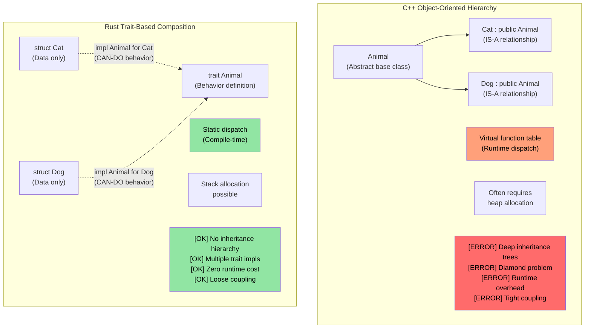
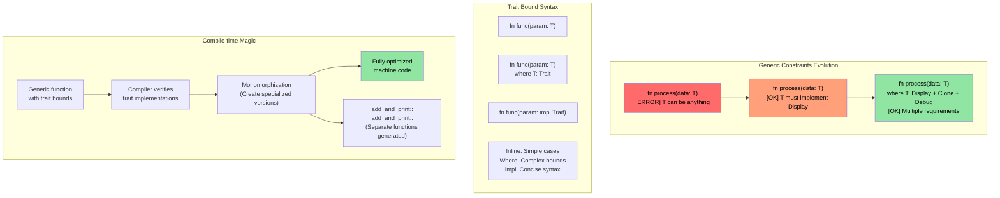

# Rust 特征

> **你将学到：** 特征 —— Rust 对接口、抽象基类和运算符重载的解答。你将学习如何定义特征、为你的类型实现特征，以及使用动态分发（`dyn Trait`）vs 静态分发（泛型）。对 C++ 开发者来说：特征替代了虚函数、CRTP 和 concepts。对 C 开发者来说：特征是 Rust 实现多态的结构化方式。

- Rust 特征类似于其他语言中的接口
    - 特征定义了实现该特征的类型必须定义的方法。
```rust
fn main() {
    trait Pet {
        fn speak(&self);
    }
    struct Cat;
    struct Dog;
    impl Pet for Cat {
        fn speak(&self) {
            println!("Meow");
        }
    }
    impl Pet for Dog {
        fn speak(&self) {
            println!("Woof!")
        }
    }
    let c = Cat{};
    let d = Dog{};
    c.speak();  // Cat 和 Dog 之间没有 "is a" 关系
    d.speak(); // Cat 和 Dog 之间没有 "is a" 关系
}
```

## 特征 vs C++ Concepts 和接口

### 传统 C++ 继承 vs Rust 特征

```cpp
// C++ - 基于继承的多态
class Animal {
public:
    virtual void speak() = 0;  // 纯虚函数
    virtual ~Animal() = default;
};

class Cat : public Animal {  // "Cat IS-A Animal"
public:
    void speak() override {
        std::cout << "Meow" << std::endl;
    }
};

void make_sound(Animal* animal) {  // 运行时多态
    animal->speak();  // 虚函数调用
}
```

```rust
// Rust - 组合优于继承，使用特征
trait Animal {
    fn speak(&self);
}

struct Cat;  // Cat 不是 Animal，但实现了 Animal 行为

impl Animal for Cat {  // "Cat 能做 Animal 的行为"
    fn speak(&self) {
        println!("Meow");
    }
}

fn make_sound<T: Animal>(animal: &T) {  // 静态多态
    animal.speak();  // 直接函数调用（零开销）
}
```



### 特征约束和泛型限制

```rust
use std::fmt::Display;
use std::ops::Add;

// C++ 模板等价物（约束更少）
// template<typename T>
// T add_and_print(T a, T b) {
//     // 无法保证 T 支持 + 或打印
//     return a + b;  // 可能在编译时失败
// }

// Rust - 显式特征约束
fn add_and_print<T>(a: T, b: T) -> T 
where 
    T: Display + Add<Output = T> + Copy,
{
    println!("Adding {} + {}", a, b);  // Display 特征
    a + b  // Add 特征
}
```



### C++ 运算符重载 → Rust `std::ops` 特征

在 C++ 中，你通过编写具有特殊名称的自由函数或成员函数来重载运算符（`operator+`、`operator<<`、`operator[]` 等）。在 Rust 中，每个运算符都映射到 `std::ops`（或用于输出的 `std::fmt`）中的一个特征。你**实现特征**而不是编写魔法命名的函数。

#### 并排对比：`+` 运算符

```cpp
// C++：作为成员或自由函数的运算符重载
struct Vec2 {
    double x, y;
    Vec2 operator+(const Vec2& rhs) const {
        return {x + rhs.x, y + rhs.y};
    }
};

Vec2 a{1.0, 2.0}, b{3.0, 4.0};
Vec2 c = a + b;  // 调用 a.operator+(b)
```

```rust
use std::ops::Add;

#[derive(Debug, Clone, Copy)]
struct Vec2 { x: f64, y: f64 }

impl Add for Vec2 {
    type Output = Vec2;                     // 关联类型 —— + 的结果
    fn add(self, rhs: Vec2) -> Vec2 {
        Vec2 { x: self.x + rhs.x, y: self.y + rhs.y }
    }
}

let a = Vec2 { x: 1.0, y: 2.0 };
let b = Vec2 { x: 3.0, y: 4.0 };
let c = a + b;  // 调用 <Vec2 as Add>::add(a, b)
println!("{c:?}"); // Vec2 { x: 4.0, y: 6.0 }
```

#### 与 C++ 的关键区别

| 方面 | C++ | Rust |
|--------|-----|------|
| **机制** | 魔法函数名（`operator+`） | 实现特征（`impl Add for T`） |
| **发现** | 搜索 `operator+` 或阅读头文件 | 查看特征实现 —— IDE 支持优秀 |
| **返回类型** | 自由选择 | 由 `Output` 关联类型固定 |
| **接收者** | 通常接受 `const T&`（借用） | 默认接受 `self` 按值（移动！） |
| **对称性** | 可以写 `impl operator+(int, Vec2)` | 必须添加 `impl Add<Vec2> for i32`（外部特征规则适用） |
| **`<<` 用于打印** | `operator<<(ostream&, T)` —— 为*任何*流重载 | `impl fmt::Display for T` —— 一个规范的 `to_string` 表示 |

#### `self` 按值传递的陷阱

在 Rust 中，`Add::add(self, rhs)` 按**值**接受 `self`。对于 `Copy` 类型（如上面的 `Vec2`，派生了 `Copy`）这没问题 —— 编译器会复制。但对于非 `Copy` 类型，`+` **消耗**操作数：

```rust
let s1 = String::from("hello ");
let s2 = String::from("world");
let s3 = s1 + &s2;  // s1 被移动到 s3 中！
// println!("{s1}");  // 编译错误：值在移动后使用
println!("{s2}");     // s2 只是被借用了（&s2）
```

这就是为什么 `String + &str` 可以工作但 `&str + &str` 不行 —— `Add` 只为 `String + &str` 实现了，消耗左侧的 `String` 以重用其缓冲区。这在 C++ 中没有类似物：`std::string::operator+` 总是创建一个新字符串。

#### 完整映射：C++ 运算符 → Rust 特征

| C++ 运算符 | Rust 特征 | 说明 |
|-------------|-----------|-------|
| `operator+` | `std::ops::Add` | `Output` 关联类型 |
| `operator-` | `std::ops::Sub` | |
| `operator*` | `std::ops::Mul` | 不是指针解引用 —— 那是 `Deref` |
| `operator/` | `std::ops::Div` | |
| `operator%` | `std::ops::Rem` | |
| `operator-`（一元） | `std::ops::Neg` | |
| `operator!` / `operator~` | `std::ops::Not` | Rust 对逻辑和按位 NOT 都使用 `!`（没有 `~` 运算符） |
| `operator&`、`\|`、`^` | `BitAnd`、`BitOr`、`BitXor` | |
| `operator<<`、`>>`（移位） | `Shl`、`Shr` | 不是流 I/O！ |
| `operator+=` | `std::ops::AddAssign` | 接受 `&mut self`（不是 `self`） |
| `operator[]` | `std::ops::Index` / `IndexMut` | 返回 `&Output` / `&mut Output` |
| `operator()` | `Fn` / `FnMut` / `FnOnce` | 闭包实现这些；你不能直接 `impl Fn` |
| `operator==` | `PartialEq`（+ `Eq`） | 在 `std::cmp` 中，不在 `std::ops` |
| `operator<` | `PartialOrd`（+ `Ord`） | 在 `std::cmp` 中 |
| `operator<<`（流） | `fmt::Display` | `println!("{}", x)` |
| `operator<<`（调试） | `fmt::Debug` | `println!("{:?}", x)` |
| `operator bool` | 无直接等价物 | 使用 `impl From<T> for bool` 或命名方法如 `.is_empty()` |
| `operator T()`（隐式转换） | 无隐式转换 | 使用 `From`/`Into` 特征（显式） |

#### 防护措施：Rust 防止了什么

1. **无隐式转换**：C++ 的 `operator int()` 可能导致静默的、令人惊讶的类型转换。Rust 没有隐式转换运算符 —— 使用 `From`/`Into` 并显式调用 `.into()`。
2. **不能重载 `&&` / `||`**：C++ 允许（破坏短路语义！）。Rust 不允许。
3. **不能重载 `=`**：赋值始终是移动或复制，永远不是用户定义的。复合赋值（`+=`）可以通过 `AddAssign` 等重载。
4. **不能重载 `,`**：C++ 允许 `operator,()` —— 这是 C++ 最臭名昭著的陷阱之一。Rust 不允许。
5. **不能重载 `&`（取地址）**：另一个 C++ 陷阱（`std::addressof` 就是为了绕过它而存在的）。Rust 的 `&` 始终意味着"借用"。
6. **一致性规则**：你只能为自己的类型实现 `Add<Foreign>`，或为外部类型实现 `Add<YourType>` —— 永远不能为 `Foreign` 实现 `Add<Foreign>`。这防止了跨 crate 的冲突运算符定义。

> **底线**：在 C++ 中，运算符重载强大但基本不受监管 —— 你几乎可以重载任何东西，包括逗号和取地址，隐式转换可以静默触发。Rust 通过特征为算术和比较运算符提供了相同的表达能力，但**阻止了历史上危险的重载**，并强制所有转换都是显式的。

----
# Rust 特征
- Rust 允许在内置类型（如本例中的 u32）上实现用户定义的特征。但是，特征或类型必须属于当前 crate
```rust
trait IsSecret {
  fn is_secret(&self);
}
// IsSecret 特征属于当前 crate，所以没问题
impl IsSecret for u32 {
  fn is_secret(&self) {
      if *self == 42 {
          println!("Is secret of life");
      }
  }
}

fn main() {
  42u32.is_secret();
  43u32.is_secret();
}
```


# Rust 特征
- 特征支持接口继承和默认实现
```rust
trait Animal {
  // 默认实现
  fn is_mammal(&self) -> bool {
    true
  }
}
trait Feline : Animal {
  // 默认实现
  fn is_feline(&self) -> bool {
    true
  }
}

struct Cat;
// 使用默认实现。注意超级特征的所有特征都必须单独实现
impl Feline for Cat {}
impl Animal for Cat {}
fn main() {
  let c = Cat{};
  println!("{} {}", c.is_mammal(), c.is_feline());
}
```
----
# 练习：Logger 特征实现

🟡 **中级**

- 实现一个 ```Log 特征```，包含一个接受 u64 的 log() 方法
    - 实现两个不同的 logger ```SimpleLogger``` 和 ```ComplexLogger```，它们都实现 ```Log 特征```。一个应该输出 "Simple logger" 加上 ```u64```，另一个应该输出 "Complex logger" 加上 ```u64```

<details><summary>答案（点击展开）</summary>

```rust
trait Log {
    fn log(&self, value: u64);
}

struct SimpleLogger;
struct ComplexLogger;

impl Log for SimpleLogger {
    fn log(&self, value: u64) {
        println!("Simple logger: {value}");
    }
}

impl Log for ComplexLogger {
    fn log(&self, value: u64) {
        println!("Complex logger: {value} (hex: 0x{value:x}, binary: {value:b})");
    }
}

fn main() {
    let simple = SimpleLogger;
    let complex = ComplexLogger;
    simple.log(42);
    complex.log(42);
}
// 输出：
// Simple logger: 42
// Complex logger: 42 (hex: 0x2a, binary: 101010)
```

</details>

----
# Rust 特征关联类型
```rust
#[derive(Debug)]
struct Small(u32);
#[derive(Debug)]
struct Big(u32);
trait Double {
    type T;
    fn double(&self) -> Self::T;
}

impl Double for Small {
    type T = Big;
    fn double(&self) -> Self::T {
        Big(self.0 * 2)
    }
}
fn main() {
    let a = Small(42);
    println!("{:?}", a.double());
}
```

# Rust 特征 impl
- ```impl``` 可以与特征一起使用，接受任何实现了该特征的类型
```rust
trait Pet {
    fn speak(&self);
}
struct Dog {}
struct Cat {}
impl Pet for Dog {
    fn speak(&self) {println!("Woof!")}
}
impl Pet for Cat {
    fn speak(&self) {println!("Meow")}
}
fn pet_speak(p: &impl Pet) {
    p.speak();
}
fn main() {
    let c = Cat {};
    let d = Dog {};
    pet_speak(&c);
    pet_speak(&d);
}
```

# Rust 特征 impl
- ```impl``` 也可以用在返回值中
```rust
trait Pet {}
struct Dog;
struct Cat;
impl Pet for Cat {}
impl Pet for Dog {}
fn cat_as_pet() -> impl Pet {
    let c = Cat {};
    c
}
fn dog_as_pet() -> impl Pet {
    let d = Dog {};
    d
}
fn main() {
    let p = cat_as_pet();
    let d = dog_as_pet();
}
```
----
# Rust 动态特征
- 动态特征可以在不知道底层类型的情况下调用特征功能。这被称为 ```类型擦除```
```rust
trait Pet {
    fn speak(&self);
}
struct Dog {}
struct Cat {x: u32}
impl Pet for Dog {
    fn speak(&self) {println!("Woof!")}
}
impl Pet for Cat {
    fn speak(&self) {println!("Meow")}
}
fn pet_speak(p: &dyn Pet) {
    p.speak();
}
fn main() {
    let c = Cat {x: 42};
    let d = Dog {};
    pet_speak(&c);
    pet_speak(&d);
}
```
----

## 在 `impl Trait`、`dyn Trait` 和枚举之间选择

这三种方法都能实现多态，但有不同的权衡：

| 方法 | 分发方式 | 性能 | 支持异构集合？ | 使用场景 |
|----------|----------|-------------|---------------------------|-------------|
| `impl Trait` / 泛型 | 静态（单态化） | 零开销 —— 编译时内联 | 否 —— 每个槽位只有一个具体类型 | 默认选择。函数参数、返回类型 |
| `dyn Trait` | 动态（虚表） | 每次调用小开销（约 1 次指针间接寻址） | 是 —— `Vec<Box<dyn Trait>>` | 需要在集合中混合类型，或插件式可扩展性 |
| `enum` | Match | 零开销 —— 编译时已知变体 | 是 —— 但仅限已知变体 | 变体集合是**封闭的**且在编译时已知 |

```rust
trait Shape {
    fn area(&self) -> f64;
}
struct Circle { radius: f64 }
struct Rect { w: f64, h: f64 }
impl Shape for Circle { fn area(&self) -> f64 { std::f64::consts::PI * self.radius * self.radius } }
impl Shape for Rect   { fn area(&self) -> f64 { self.w * self.h } }

// 静态分发 —— 编译器为每种类型生成单独的代码
fn print_area(s: &impl Shape) { println!("{}", s.area()); }

// 动态分发 —— 一个函数，适用于指针背后的任何 Shape
fn print_area_dyn(s: &dyn Shape) { println!("{}", s.area()); }

// 枚举 —— 封闭集合，不需要特征
enum ShapeEnum { Circle(f64), Rect(f64, f64) }
impl ShapeEnum {
    fn area(&self) -> f64 {
        match self {
            ShapeEnum::Circle(r) => std::f64::consts::PI * r * r,
            ShapeEnum::Rect(w, h) => w * h,
        }
    }
}
```

> **给 C++ 开发者：** `impl Trait` 类似于 C++ 模板（单态化，零开销）。`dyn Trait` 类似于 C++ 虚函数（虚表分发）。Rust 枚举配合 `match` 类似于 `std::variant` 配合 `std::visit` —— 但穷尽匹配由编译器强制执行。

> **经验法则**：从 `impl Trait`（静态分发）开始。只有在需要异构集合或编译时无法知道具体类型时才使用 `dyn Trait`。当你拥有所有变体时使用 `enum`。
