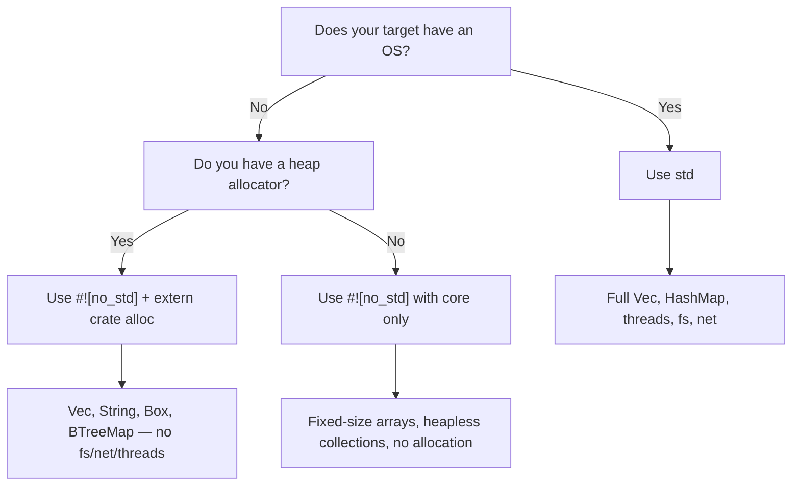

# `no_std` —— 没有标准库的 Rust

> **你将学到：** 如何使用 `#![no_std]` 为裸机和嵌入式目标编写 Rust —— `core` 和 `alloc` crate 的划分、panic 处理程序，以及与不使用 `libc` 的嵌入式 C 的对比。

如果你来自嵌入式 C 背景，你已经习惯了在没有 `libc` 或只有最小运行时的环境下工作。Rust 有一个一流的等价方案：**`#![no_std]`** 属性。

## 什么是 `no_std`？

当你在 crate 根部添加 `#![no_std]` 时，编译器会移除隐式的 `extern crate std;`，只链接 **`core`**（以及可选的 **`alloc`**）。

| 层级 | 提供什么 | 需要操作系统/堆？ |
|-------|-----------------|---------------------|
| `core` | 基本类型、`Option`、`Result`、`Iterator`、数学运算、`slice`、`str`、原子操作、`fmt` | **不需要** —— 可在裸机上运行 |
| `alloc` | `Vec`、`String`、`Box`、`Rc`、`Arc`、`BTreeMap` | 需要全局分配器，但**不需要操作系统** |
| `std` | `HashMap`、`fs`、`net`、`thread`、`io`、`env`、`process` | **需要** —— 需要操作系统 |

> **嵌入式开发者经验法则：** 如果你的 C 项目链接了 `-lc` 并使用 `malloc`，你大概可以使用 `core` + `alloc`。如果它在裸机上运行且不使用 `malloc`，就只使用 `core`。

## 声明 `no_std`

```rust
// src/lib.rs  (or src/main.rs for a binary with #![no_main])
#![no_std]

// You still get everything in `core`:
use core::fmt;
use core::result::Result;
use core::option::Option;

// If you have an allocator, opt in to heap types:
extern crate alloc;
use alloc::vec::Vec;
use alloc::string::String;
```

对于裸机二进制文件，你还需要 `#![no_main]` 和一个 panic 处理程序：

```rust
#![no_std]
#![no_main]

use core::panic::PanicInfo;

#[panic_handler]
fn panic(_info: &PanicInfo) -> ! {
    loop {} // hang on panic — replace with your board's reset/LED blink
}

// Entry point depends on your HAL / linker script
```

## 你会失去什么（以及替代方案）

| `std` 功能 | `no_std` 替代方案 |
|---------------|---------------------|
| `println!` | `core::write!` 输出到 UART / `defmt` |
| `HashMap` | `heapless::FnvIndexMap`（固定容量）或 `BTreeMap`（需要 `alloc`） |
| `Vec` | `heapless::Vec`（栈分配，固定容量） |
| `String` | `heapless::String` 或 `&str` |
| `std::io::Read/Write` | `embedded_io::Read/Write` |
| `thread::spawn` | 中断处理程序、RTIC 任务 |
| `std::time` | 硬件定时器外设 |
| `std::fs` | Flash / EEPROM 驱动 |

## 嵌入式常用 `no_std` crate

| Crate | 用途 | 备注 |
|-------|---------|-------|
| [`heapless`](https://crates.io/crates/heapless) | 固定容量的 `Vec`、`String`、`Queue`、`Map` | 不需要分配器 —— 全部在栈上 |
| [`defmt`](https://crates.io/crates/defmt) | 通过探针/ITM 进行高效日志记录 | 类似 `printf` 但在主机端延迟格式化 |
| [`embedded-hal`](https://crates.io/crates/embedded-hal) | 硬件抽象特征（SPI、I2C、GPIO、UART） | 实现一次，在任何 MCU 上运行 |
| [`cortex-m`](https://crates.io/crates/cortex-m) | ARM Cortex-M 内部函数和寄存器访问 | 底层，类似 CMSIS |
| [`cortex-m-rt`](https://crates.io/crates/cortex-m-rt) | Cortex-M 的运行时/启动代码 | 替代你的 `startup.s` |
| [`rtic`](https://crates.io/crates/rtic) | 实时中断驱动并发 | 编译时任务调度，零开销 |
| [`embassy`](https://crates.io/crates/embassy-executor) | 嵌入式异步执行器 | 裸机上的 `async/await` |
| [`postcard`](https://crates.io/crates/postcard) | `no_std` serde 序列化（二进制） | 当你承担不起字符串开销时替代 `serde_json` |
| [`thiserror`](https://crates.io/crates/thiserror) | `Error` 特征的派生宏 | 自 v2 起支持 `no_std`；优先于 `anyhow` |
| [`smoltcp`](https://crates.io/crates/smoltcp) | `no_std` TCP/IP 协议栈 | 当你需要无操作系统的网络功能时 |

## C vs Rust：裸机对比

典型的嵌入式 C 闪灯程序：

```c
// C — bare metal, vendor HAL
#include "stm32f4xx_hal.h"

void SysTick_Handler(void) {
    HAL_GPIO_TogglePin(GPIOA, GPIO_PIN_5);
}

int main(void) {
    HAL_Init();
    __HAL_RCC_GPIOA_CLK_ENABLE();
    GPIO_InitTypeDef gpio = { .Pin = GPIO_PIN_5, .Mode = GPIO_MODE_OUTPUT_PP };
    HAL_GPIO_Init(GPIOA, &gpio);
    HAL_SYSTICK_Config(HAL_RCC_GetHCLKFreq() / 1000);
    while (1) {}
}
```

Rust 等价写法（使用 `embedded-hal` + 板级 crate）：

```rust
#![no_std]
#![no_main]

use cortex_m_rt::entry;
use panic_halt as _; // panic handler: infinite loop
use stm32f4xx_hal::{pac, prelude::*};

#[entry]
fn main() -> ! {
    let dp = pac::Peripherals::take().unwrap();
    let gpioa = dp.GPIOA.split();
    let mut led = gpioa.pa5.into_push_pull_output();

    let rcc = dp.RCC.constrain();
    let clocks = rcc.cfgr.freeze();
    let mut delay = dp.TIM2.delay_ms(&clocks);

    loop {
        led.toggle();
        delay.delay_ms(500u32);
    }
}
```

**C 开发者需要注意的关键区别：**
- `Peripherals::take()` 返回 `Option` —— 在编译期确保单例模式（没有重复初始化 bug）
- `.split()` 移动单个引脚的所有权 —— 不会有两个模块驱动同一引脚的风险
- 所有寄存器访问都经过类型检查 —— 你不能意外写入只读寄存器
- 借用检查器防止 `main` 和中断处理程序之间的数据竞争（配合 RTIC）

## 何时使用 `no_std` vs `std`



# 练习：`no_std` 环形缓冲区

🔴 **挑战** —— 在 `no_std` 上下文中结合泛型、`MaybeUninit` 和 `#[cfg(test)]`

在嵌入式系统中，你经常需要一个永远不会分配内存的固定大小环形缓冲区（循环缓冲区）。使用仅 `core`（不使用 `alloc`，不使用 `std`）来实现一个。

**要求：**
- 对元素类型 `T: Copy` 泛型
- 固定容量 `N`（const 泛型）
- `push(&mut self, item: T)` —— 满时覆盖最旧的元素
- `pop(&mut self) -> Option<T>` —— 返回最旧的元素
- `len(&self) -> usize`
- `is_empty(&self) -> bool`
- 必须使用 `#![no_std]` 编译

```rust
// Starter code
#![no_std]

use core::mem::MaybeUninit;

pub struct RingBuffer<T: Copy, const N: usize> {
    buf: [MaybeUninit<T>; N],
    head: usize,  // next write position
    tail: usize,  // next read position
    count: usize,
}

impl<T: Copy, const N: usize> RingBuffer<T, N> {
    pub const fn new() -> Self {
        todo!()
    }
    pub fn push(&mut self, item: T) {
        todo!()
    }
    pub fn pop(&mut self) -> Option<T> {
        todo!()
    }
    pub fn len(&self) -> usize {
        todo!()
    }
    pub fn is_empty(&self) -> bool {
        todo!()
    }
}
```

<details>
<summary>解答</summary>

```rust
#![no_std]

use core::mem::MaybeUninit;

pub struct RingBuffer<T: Copy, const N: usize> {
    buf: [MaybeUninit<T>; N],
    head: usize,
    tail: usize,
    count: usize,
}

impl<T: Copy, const N: usize> RingBuffer<T, N> {
    pub const fn new() -> Self {
        Self {
            // SAFETY: MaybeUninit does not require initialization
            buf: unsafe { MaybeUninit::uninit().assume_init() },
            head: 0,
            tail: 0,
            count: 0,
        }
    }

    pub fn push(&mut self, item: T) {
        self.buf[self.head] = MaybeUninit::new(item);
        self.head = (self.head + 1) % N;
        if self.count == N {
            // Buffer is full — overwrite oldest, advance tail
            self.tail = (self.tail + 1) % N;
        } else {
            self.count += 1;
        }
    }

    pub fn pop(&mut self) -> Option<T> {
        if self.count == 0 {
            return None;
        }
        // SAFETY: We only read positions that were previously written via push()
        let item = unsafe { self.buf[self.tail].assume_init() };
        self.tail = (self.tail + 1) % N;
        self.count -= 1;
        Some(item)
    }

    pub fn len(&self) -> usize {
        self.count
    }

    pub fn is_empty(&self) -> bool {
        self.count == 0
    }
}

#[cfg(test)]
mod tests {
    use super::*;

    #[test]
    fn basic_push_pop() {
        let mut rb = RingBuffer::<u32, 4>::new();
        assert!(rb.is_empty());

        rb.push(10);
        rb.push(20);
        rb.push(30);
        assert_eq!(rb.len(), 3);

        assert_eq!(rb.pop(), Some(10));
        assert_eq!(rb.pop(), Some(20));
        assert_eq!(rb.pop(), Some(30));
        assert_eq!(rb.pop(), None);
    }

    #[test]
    fn overwrite_on_full() {
        let mut rb = RingBuffer::<u8, 3>::new();
        rb.push(1);
        rb.push(2);
        rb.push(3);
        // Buffer full: [1, 2, 3]

        rb.push(4); // Overwrites 1 → [4, 2, 3], tail advances
        assert_eq!(rb.len(), 3);
        assert_eq!(rb.pop(), Some(2)); // oldest surviving
        assert_eq!(rb.pop(), Some(3));
        assert_eq!(rb.pop(), Some(4));
        assert_eq!(rb.pop(), None);
    }
}
```

**对嵌入式 C 开发者的意义：**
- `MaybeUninit` 是 Rust 中未初始化内存的等价物 —— 编译器不会插入零填充，就像 C 中的 `char buf[N];`
- `unsafe` 块是最小化的（2 行），每个都有 `// SAFETY:` 注释
- `const fn new()` 意味着你可以在 `static` 变量中创建环形缓冲区，无需运行时构造函数
- 即使代码是 `no_std` 的，测试也能在主机上用 `cargo test` 运行

</details>


