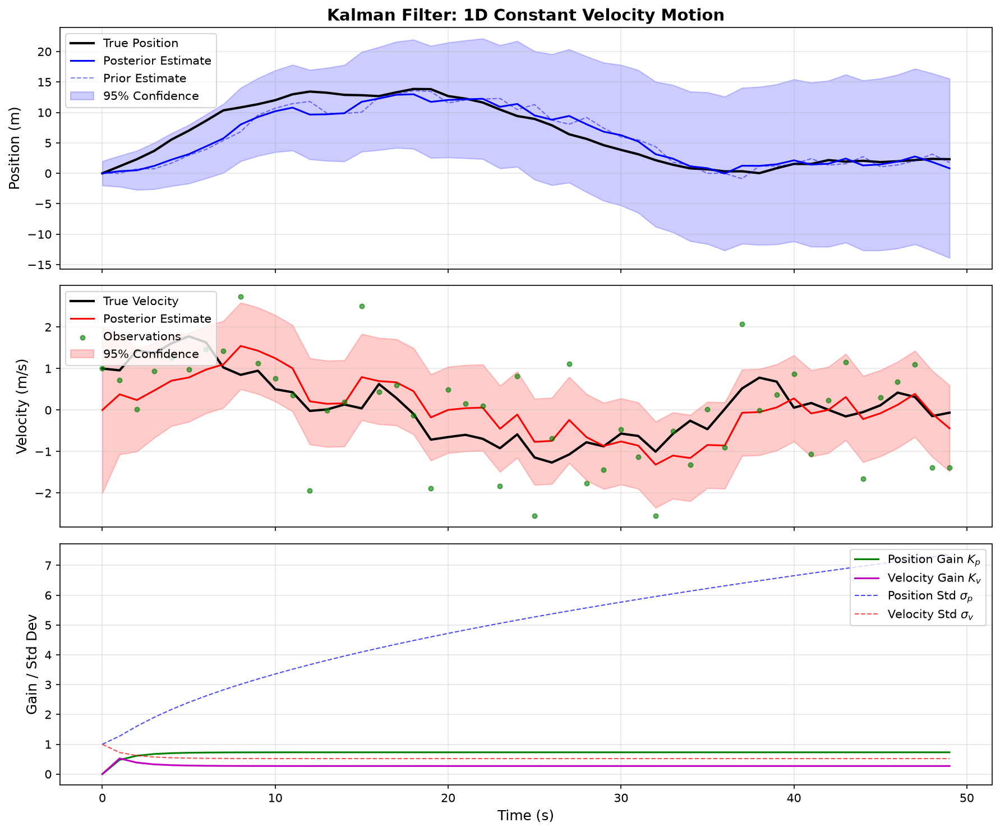
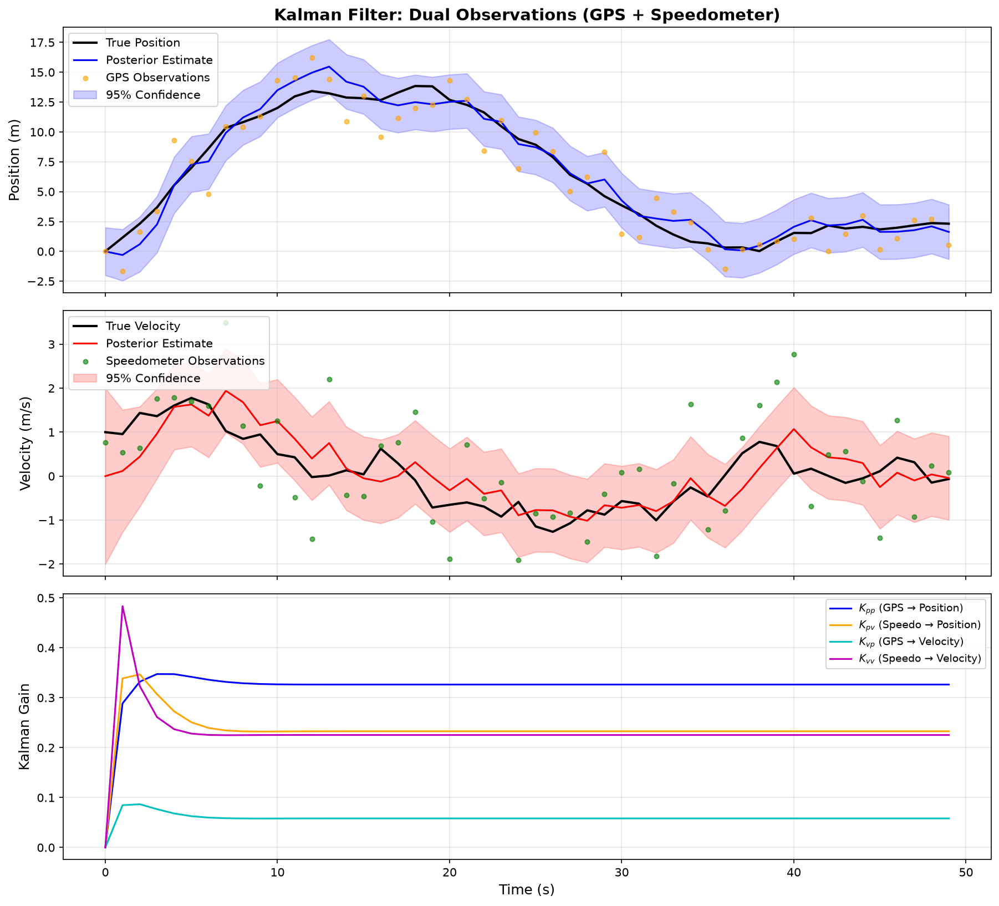
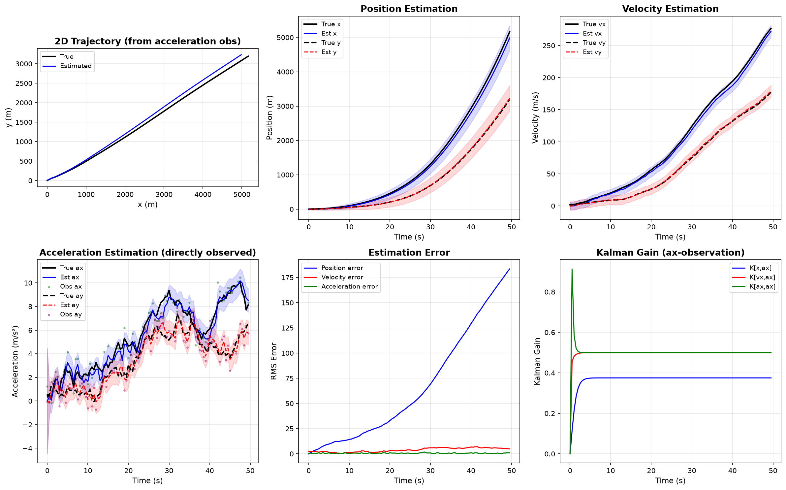
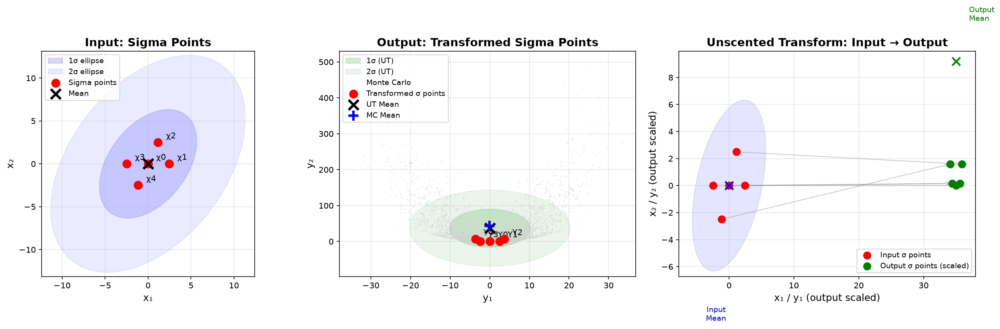

# 线性卡尔曼滤波器详解：从直觉到公式

## 0. 前置知识：无偏估计与最优估计

在理解卡尔曼滤波器之前，需要先掌握两个核心概念。

### 0.1 什么是估计？

我们想测量一个**真值** $x$（比如真实位置），但无法直接得到它。我们只能通过各种手段获得一个**估计值** $\hat{x}$。

估计值和真值之间一定有偏差：

$$e = x - \hat{x}$$

这个偏差 $e$ 是一个**随机变量**——每次测量都可能不同，有时偏大，有时偏小。

### 0.2 无偏估计（Unbiased Estimation）

> [!info] 无偏的含义
> 一个估计量 $\hat{x}$ 是**无偏的**，意味着它的偏差的期望为零：
>
> $$E[e] = E[x - \hat{x}] = 0 \quad \Leftrightarrow \quad E[\hat{x}] = x$$
>
> 通俗地说：估计值**平均下来**恰好等于真值，不会系统性地偏大或偏小。

**生活中的例子**：

| 估计方式 | 是否无偏 | 原因 |
|---------|---------|------|
| 用体温计测体温（校准过的） | ✅ 无偏 | 多次测量的平均值接近真实体温 |
| 用一把偏短的尺子量长度 | ❌ 有偏 | 每次测量都系统性偏小 |

无偏并不意味着每次估计都准确，只是说**没有系统性偏差**。单次估计可能偏离真值很远，但多次平均后偏差会相互抵消。

> [!tip] 无偏 vs 有偏
> 如果一个估计是有偏的（$E[e] = b \neq 0$），可以把它拆解为：
>
> $$\hat{x} = \underbrace{E[\hat{x}]}_{\text{系统性偏差}} + \underbrace{(\hat{x} - E[\hat{x}])}_{\text{随机波动}}$$
>
> 有偏估计的问题在于：无论测量多少次，平均值都不会收敛到真值，而是收敛到 $x + b$。

### 0.3 方差：衡量估计的 " 不靠谱程度 "

即使估计是无偏的，单次结果仍可能偏离真值。方差衡量的就是这种**偏离的幅度**：

$$\text{Var}(\hat{x}) = E[(\hat{x} - E[\hat{x}])^2]$$

对于无偏估计（$E[\hat{x}] = x$），方差简化为：

$$\text{Var}(\hat{x}) = E[(\hat{x} - x)^2] = E[e^2]$$

> [!note] 方差的直观含义
> - 方差小 → 估计值紧密聚集在真值附近 → **靠谱**
> - 方差大 → 估计值分散在真值周围很远 → **不靠谱**
>
> 这就是为什么方差可以衡量 " 不确定性 "。

### 0.4 最优估计：最小方差原则（MVU Estimator）

现在关键问题来了：如果有**多种无偏估计方法**，该选哪个？

答案是：**选方差最小的那个**。

> [!important] 最小方差无偏估计（MVU）
> 在所有无偏估计中，方差最小的那个称为**最小方差无偏估计**（Minimum Variance Unbiased Estimator）。
>
> $$\hat{x}_{\text{MVU}} = \arg\min_{\hat{x}:\, E[\hat{x}]=x} \text{Var}(\hat{x})$$
>
> 这就是**最优估计**的含义——不是任意一个无偏估计，而是在无偏的前提下，找到最精确（方差最小）的那个。

**为什么卡尔曼滤波器要最小化后验方差？**

因为卡尔曼滤波器的目标就是：在保证估计无偏的前提下，让方差最小。这正是 MVU 估计的思想。

> [!example] 一个直觉类比
> 两个射击手都瞄准靶心（无偏），但一个的弹孔散布很小（方差小），另一个散布很大（方差大）。你当然选散布小的那个——他的射击更 " 确定 "。
>
> 卡尔曼滤波器做的事一样：在两个无偏信息源（预测和观测）中，找到那个方差最小的融合方式。

### 0.5 回顾：为什么后验方差公式里 $E[e] = 0$？

在后面的推导中，我们会反复用到这个性质。现在你知道原因了：

- 预测误差 $\omega$ 是无偏的：$E[\omega] = 0$
- 观测噪声 $\mu$ 是无偏的：$E[\mu] = 0$
- 它们的加权组合 $e = (1-k)\omega + k\mu$ 也是无偏的：$E[e] = 0$

因此后验方差可以直接写成 $\sigma = E[e^2]$，省去了 $(E[e])^2$ 项。

> [!warning] 如果估计有偏会怎样？
> 如果预测或观测存在系统性偏差，$E[e] \neq 0$，那么：
>
> $$\sigma = E[e^2] - (E[e])^2 \neq E[e^2]$$
>
> 卡尔曼滤波器的标准公式将不再完全适用。此时需要使用扩展手段（如偏置卡尔曼滤波器）来处理。

---

## 1. 核心问题：两个不完美的信息，该如何参考？

想象 GPS 导航：

- **GPS ：现在在 A 点（但 GPS 有误差，可能在 A 附近几十米）
- **根据上一秒的位置和速度推算**：现在应该在 B 点（但推算也有误差，比如速度估计不准）

两个信息**都不完美**。

问题是：**怎么把它们融合起来，得到一个比两者都更准确的结果？**

---

## 2. 从最简单的情况开始：两个数的加权平均

### 2.1 问题设定

假设有两个对同一个真值 $x$ 的估计：

- **估计值** $\hat{x}^-$：根据模型推算出来的，不确定程度用方差 $\sigma_1$ 衡量
- **观测值** $z$：传感器测到的，不确定程度用方差 $\sigma_2$ 衡量

> [!note] 符号约定（标量部分）
> 在本节的标量推导中，我们用以下符号表示方差：
> - $\sigma_1$：**预测方差**（估计值的不确定性）
> - $\sigma_2$：**观测方差**（观测值的不确定性）
> - $\sigma$：**后验方差**（融合后的不确定性）
>
> 后面矩阵形式（第 4 节）会切换到 $\mathbf{P}$、$\mathbf{R}$ 等标准记号。

你想得到一个更好的估计 $\hat{x}$，直觉上应该做**加权平均**：

$$\hat{x} = (1 - k) \cdot \hat{x}^- + k \cdot z = \hat{x}^- + k \cdot(z-\hat{x}^-)$$

其中 $k \in [0, 1]$ 是权重。$k$ 越大，越相信观测；$k$ 越小，越相信预测。

### 2.2 直觉：谁更确定，就多信谁

考虑两种极端情况：

| 场景             | 预测方差 $\sigma_1$ | 观测方差 $\sigma_2$ | 选择                   |
| -------------- | ---------- | -------- | -------------------- |
| GPS 精度很高，推算很粗糙 | 大          | 小        | 信观测，$k$ 应该接近 1       |
| GPS 信号差，推算很准确  | 小          | 大        | 信预测，$k$ 应该接近 0       |
| 两者差不多          | 中          | 中        | 各信一半，$k \approx 0.5$ |

所以 $k$ 应该和**两者的不确定程度的比值**有关。

### 2.3 推导最优权重 $k$

我们希望融合后的估计 $\hat{x}$ 的方差 $\sigma$ 最小。

> [!info] 为什么叫 " 先验 " 和 " 后验 "？
> 这两个术语来自贝叶斯统计，区分的是**观测数据到来的前后**：
> - **先验估计**（Prior）$\hat{x}^-$：在看到当前观测 $z$ **之前**，根据模型推算出的估计。它只依赖历史信息和物理规律。
> - **后验估计**（Posterior）$\hat{x}$：在看到当前观测 $z$ **之后**，融合了观测信息得到的估计。
>
> " 后验 " 的 " 后 " 不是时间上的先后，而是**信息上的先后**——先有预测，再有观测，观测到来之后的更新就是后验。
>
> 因此 $\hat{x} = (1-k)\hat{x}^- + kz$ 是后验估计：它既包含了先验的预测，又融入了新的观测。

后验估计误差为：

$$e = x - \hat{x} = x - [(1-k)\hat{x}^- + kz]$$

$x$ 为真实值（Ground Truth）

如果认为观测值 $z$ 和估计值 $\hat{x}^-$ 都具有真实值的成分，观测噪声为 $\mu$,测量为 $\omega$，那么可以把 $z$ 和 $\hat{x}^-$ 分别分解为： $z = x + \mu$（真值加观测噪声），$\hat{x}^- = x + \omega$（真值加预测误差），代入：

$$e = (1-k)(x - \hat{x}^-) + k(x - z) = (1-k)(-\omega) + k(-\mu)=-((1-k)\omega+k\mu)$$

即最后的误差为估计值的误差和观测值的噪声按权重 $k$ 加权混合。

现在计算后验误差的方差。根据方差的定义：

$$\sigma = \text{Var}(e) = E[e^2] - (E[e])^2$$

所以要算 $\sigma$，需要分别求 $E[e]$ 和 $E[e^2]$。

先看 $E[e]$。代入 $e = -[(1-k)\omega + k\mu]$：

$$E[e] = -(1-k)E[\omega] - kE[\mu]$$

由于 $\omega$（预测误差）和 $\mu$（观测噪声）都是**零均值**的（误差有时偏正、有时偏负，平均为零），即 $E[\omega] = 0$，$E[\mu] = 0$，所以：

$$E[e] = 0$$

> [!tip] 为什么可以假设零均值？
> 这是卡尔曼滤波器的一个基本假设：预测和观测都是**无偏的**。如果存在系统性偏差（比如传感器有固定偏移），需要先做校准或使用扩展卡尔曼滤波器等方法处理。

后验误差 $e$ 也是零均值的，因此方差公式中的 $(E[e])^2 = 0$，方差就等于二阶矩：

$$\sigma = \text{Var}(e) = E[e^2] - 0 = E[e^2]$$

现在将 $e = -[(1-k)\omega + k\mu]$ 代入 $E[e^2]$：

$$\sigma = E[e^2] = E\{[(1-k)\omega + k\mu]^2\}$$

展开平方：

$$\sigma = E[(1-k)^2\omega^2 + 2k(1-k)\omega\mu + k^2\mu^2]$$

利用期望的线性性 $E[aX + bY] = aE[X] + bE[Y]$，把常数提到外面：

$$\sigma = (1-k)^2 E[\omega^2] + 2k(1-k)E[\omega\mu] + k^2 E[\mu^2]$$

> [!note] 逐项分析
>
> **第一项** $(1-k)^2 E[\omega^2]$：其中 $\omega = \hat{x}^- - x$ 是**预测误差**（估计值与真值的偏差）。回顾我们之前的定义：预测方差 $\sigma_1$ 衡量的正是 " 估计值偏离真值的程度 "，即 $\sigma_1 = E[\omega^2]$。所以这一项直接等于 $(1-k)^2 \sigma_1$。
>
> **第三项** $k^2 E[\mu^2]$：其中 $\mu = z - x$ 是**观测噪声**（观测值与真值的偏差）。同样，观测方差 $\sigma_2$ 衡量的正是 " 观测值偏离真值的程度 "，即 $\sigma_2 = E[\mu^2]$。所以这一项直接等于 $k^2 \sigma_2$。
>
> **第二项** $2k(1-k)E[\omega\mu]$：这是预测误差和观测噪声的**协方差**。由于预测误差 $\omega$ 来自系统模型的不确定性，观测噪声 $\mu$ 来自传感器的测量误差，两者来源不同、**相互独立**，因此 $E[\omega\mu] = E[\omega] \cdot E[\mu] = 0$。
>
> 为什么 $E[\omega] = 0$ 和 $E[\mu] = 0$？因为我们假设预测和观测都是**无偏的**——误差有时偏大、有时偏小，平均下来为零。如果存在系统性偏差（比如传感器有固定偏移），那就是另一个问题了。

最终得到：

$$\sigma = (1-k)^2 \sigma_1 + k^2 \sigma_2$$

现在对 $k$ 求导，令其为零，找到使 $\sigma$ 最小的 $k$：

$$\frac{d\sigma}{dk} = -2(1-k)\sigma_1 + 2k\sigma_2 = 0$$

$$\Rightarrow (1-k)\sigma_1 = k\sigma_2$$

$$\Rightarrow \sigma_1 - k\sigma_1 = k\sigma_2$$

$$\Rightarrow \sigma_1 = k(\sigma_1 + \sigma_2)$$

$$\boxed{k = \frac{\sigma_1}{\sigma_1 + \sigma_2}}$$

这就是**卡尔曼增益（Kalman Gain）**！

### 2.4 验证：它确实符合直觉

把 $k = \frac{\sigma_1}{\sigma_1 + \sigma_2}$ 代入后验方差公式：

$$\sigma = (1-k)^2 \sigma_1 + k^2 \sigma_2 = \left(\frac{\sigma_2}{\sigma_1 + \sigma_2}\right)^2 \sigma_1 + \left(\frac{\sigma_1}{\sigma_1 + \sigma_2}\right)^2 \sigma_2$$

化简后得到一个非常漂亮的结果：

$$\boxed{\sigma = \frac{\sigma_1 \cdot \sigma_2}{\sigma_1 + \sigma_2}}$$

这说明**融合后的方差比任何一个单独的方差都小**——两个不完美的信息源融合后，比任何一个都好！

| 对比 | 值 |
|------|---|
| 预测方差 | $\sigma_1$ |
| 观测方差 | $\sigma_2$ |
| 融合后方差 | $\frac{\sigma_1 \sigma_2}{\sigma_1 + \sigma_2}$（小于两者中较小的那个） |

### 2.5 另一种写法：把后验估计写成残差修正

把 $\hat{x} = (1-k)\hat{x}^- + kz$ 变形：

$$\hat{x} = \hat{x}^- + k(z - \hat{x}^-)$$

其中 $(z - \hat{x}^-)$ 叫做**残差（Innovation / Residual）**——观测值和预测值之间的 " 意外偏差 "。

这个公式的含义是：**在预测值的基础上，用残差做修正。修正多少？取决于卡尔曼增益 $k = \frac{\sigma_1}{\sigma_1 + \sigma_2}$。**

---

## 3. 完整的卡尔曼滤波器（标量形式）

上面只讲了 " 融合 " 这一步。但卡尔曼滤波器是一个**递推过程**：每来一个新观测，就做一次 " 预测→更新 " 的循环。

### 3.1 场景设定：一维匀速运动

一辆小车沿直线匀速运动，状态为 $x = [p, v]^T$（位置和速度）。

但我们**只观测速度**（比如通过编码器），想估计**位置**。

为什么需要卡尔曼滤波？因为：

- 速度观测有噪声
- 我们想通过多次速度观测，积累出对位置的精确估计

### 3.2 状态转移（物理模型）

匀速运动的物理规律：

$$p_k = p_{k-1} + v_{k-1} \cdot \Delta t$$

$$v_k = v_{k-1}$$

但真实世界有干扰（比如微小的加速度波动），所以加上过程噪声 $w$：

$$p_k = p_{k-1} + v_{k-1} \cdot \Delta t + w_p$$

$$v_k = v_{k-1} + w_v$$

其中 $w_p, w_v \sim N(0, Q)$，$Q$ 是过程噪声方差。

### 3.3 观测模型

我们只观测速度：

$$z_k = v_k + n_k$$

其中 $n_k \sim N(0, \sigma_2)$，$\sigma_2$ 是观测噪声方差。

### 3.4 标量形式的递推公式

为了讲解原理，先用标量形式。假设我们只关心位置 $p$ 的估计，把它看作一个标量状态。

#### 预测步（Predict）

根据运动模型推算下一时刻的位置：

$$\hat{p}_k^- = \hat{p}_{k-1} + \hat{v}_{k-1} \cdot \Delta t$$

预测的不确定性（方差）会**增大**，因为运动模型本身有误差：

$$\sigma_{1,k} = \sigma_{k-1} + Q$$

> 直觉：随着时间推移，预测越来越不确定，方差越来越大。

#### 更新步（Update）

当新的速度观测 $z_k$ 到来时：

**第一步：计算卡尔曼增益**

$$k_k = \frac{\sigma_{1,k}}{\sigma_{1,k} + \sigma_2}$$

**第二步：用残差修正预测值**

$$\hat{p}_k = \hat{p}_k^- + k_k (z_k - \hat{p}_k^-)$$

其中 $(z_k - \hat{p}_k^-)$ 是残差——观测值和预测值的差距。

**第三步：更新不确定性**

$$\sigma_k = (1 - k_k) \sigma_{1,k}$$

> 注意：更新后的方差 $\sigma_k < \sigma_{1,k}$——因为观测带来了新信息，不确定性降低了。

### 3.5 一个数值例子

设 $\Delta t = 1$s，$Q = 0.1$，$\sigma_2 = 1.0$，真值位置从 $0$ 开始以 $v = 1$m/s 匀速运动。

**初始状态**：$\hat{p}_0 = 0$，$\sigma_0 = 1.0$

| 步骤 | 预测 $\hat{p}^-$ | 预测方差 $\sigma_1$ | 观测 $z$ | 卡尔曼增益 $k$ | 后验 $\hat{p}$ | 后验方差 $\sigma$ |
|------|-----------------|---------------|---------|--------------|---------------|-------------|
| 1 | 0.0 | 1.1 | 1.2 | 0.524 | 0.63 | 0.524 |
| 2 | 1.63 | 0.624 | 0.9 | 0.384 | 1.35 | 0.384 |
| 3 | 2.35 | 0.484 | 1.1 | 0.326 | 2.08 | 0.326 |
| … | … | … | … | … | … | … |

可以看到：

- **方差逐渐减小**：每融合一次观测，不确定性就降低一些
- **卡尔曼增益逐渐减小**：随着估计越来越确定，越来越信任预测而非观测
- **后验估计逐渐逼近真值**

### 3.6 方差的稳态值

当 $k \to \infty$ 时，$\sigma$ 会收敛到一个稳态值 $\sigma_\infty$，满足：

$$\sigma_\infty = (1 - k_\infty)(\sigma_\infty + Q)$$

代入 $k_\infty = \frac{\sigma_\infty}{\sigma_\infty + \sigma_2}$，解方程可得稳态增益。

> 这意味着卡尔曼滤波器最终会 " 学会 " 一个固定的权重，不再变化。

---

## 4. 从标量到矩阵：完整的线性卡尔曼滤波器

### 4.1 为什么需要矩阵形式？

当状态不止一个维度时（位置 + 速度 + 加速度 + …），标量公式就不够用了。矩阵形式可以：

- 同时估计多个状态变量
- 描述状态变量之间的**相关性**（比如位置误差和速度误差是相关的）
- 统一处理各种线性系统

### 4.2 状态转移矩阵 $\mathbf{F}$

标量形式：$\hat{x}_k^- = F \cdot \hat{x}_{k-1}$

矩阵形式：

$$\hat{\mathbf{x}}_k^- = \mathbf{F} \hat{\mathbf{x}}_{k-1}$$

对于匀速运动，$\mathbf{x} = [p, v]^T$：

$$\mathbf{F} = \begin{bmatrix} 1 & \Delta t \\ 0 & 1 \end{bmatrix}$$

验证：

$$\begin{bmatrix} p_k^- \\ v_k^- \end{bmatrix} = \begin{bmatrix} 1 & \Delta t \\ 0 & 1 \end{bmatrix} \begin{bmatrix} p_{k-1} \\ v_{k-1} \end{bmatrix} = \begin{bmatrix} p_{k-1} + v_{k-1}\Delta t \\ v_{k-1} \end{bmatrix}$$

### 4.3 控制矩阵 $\mathbf{B}$

如果我们有外部控制输入（比如施加加速度 $u$），需要加一个控制矩阵：

$$\hat{\mathbf{x}}_k^- = \mathbf{F} \hat{\mathbf{x}}_{k-1} + \mathbf{B}_k \mathbf{u}_k$$

对于匀加速运动：

$$\mathbf{B} = \begin{bmatrix} \frac{1}{2}\Delta t^2 \\ \Delta t \end{bmatrix}$$

> 没有外部控制时，$\mathbf{B}\mathbf{u}_k$ 项为零。

### 4.4 协方差矩阵 $\mathbf{P}$

标量的方差 $P$ 推广为协方差矩阵 $\mathbf{P}$：

$$\mathbf{P}_k^- = \mathbf{F} \mathbf{P}_{k-1} \mathbf{F}^T + \mathbf{Q}$$

其中 $\mathbf{Q}$ 是过程噪声的协方差矩阵。

> [!note] 这个公式怎么来的？
>
> 从状态预测方程出发：
>
> $$\hat{\mathbf{x}}_k^- = \mathbf{F} \hat{\mathbf{x}}_{k-1} + \mathbf{B}\mathbf{u}_k$$
>
> 而真实状态满足：
>
> $$\mathbf{x}_k = \mathbf{F} \mathbf{x}_{k-1} + \mathbf{B}\mathbf{u}_k + \mathbf{w}_k$$
>
> 其中 $\mathbf{w}_k \sim N(\mathbf{0}, \mathbf{Q})$ 是过程噪声。
>
> 两式相减，得到**预测误差**的递推关系：
>
> $$\tilde{\mathbf{x}}_k^- = \mathbf{x}_k - \hat{\mathbf{x}}_k^- = \mathbf{F}(\mathbf{x}_{k-1} - \hat{\mathbf{x}}_{k-1}) + \mathbf{w}_k = \mathbf{F} \tilde{\mathbf{x}}_{k-1} + \mathbf{w}_k$$
>
> 注意 $\mathbf{B}\mathbf{u}_k$ 项相减抵消了——控制输入对预测误差没有贡献。
>
> 现在计算预测协方差 $\mathbf{P}_k^- = E[\tilde{\mathbf{x}}_k^- (\tilde{\mathbf{x}}_k^-)^T]$：
>
> $$\mathbf{P}_k^- = E[(\mathbf{F}\tilde{\mathbf{x}}_{k-1} + \mathbf{w}_k)(\mathbf{F}\tilde{\mathbf{x}}_{k-1} + \mathbf{w}_k)^T]$$
>
> 展开：
>
> $$= E[\mathbf{F}\tilde{\mathbf{x}}_{k-1}\tilde{\mathbf{x}}_{k-1}^T\mathbf{F}^T] + E[\mathbf{F}\tilde{\mathbf{x}}_{k-1}\mathbf{w}_k^T] + E[\mathbf{w}_k\tilde{\mathbf{x}}_{k-1}^T\mathbf{F}^T] + E[\mathbf{w}_k\mathbf{w}_k^T]$$
>
> 由于 $\tilde{\mathbf{x}}_{k-1}$（上一步的估计误差）和 $\mathbf{w}_k$（当前步的过程噪声）**相互独立**，交叉项为零：
>
> $$E[\mathbf{F}\tilde{\mathbf{x}}_{k-1}\mathbf{w}_k^T] = \mathbf{F} \cdot E[\tilde{\mathbf{x}}_{k-1}] \cdot E[\mathbf{w}_k^T] = \mathbf{0}$$
>
> 剩下两项：
>
> $$\mathbf{P}_k^- = \mathbf{F} \underbrace{E[\tilde{\mathbf{x}}_{k-1}\tilde{\mathbf{x}}_{k-1}^T]}_{=\,\mathbf{P}_{k-1}} \mathbf{F}^T + \underbrace{E[\mathbf{w}_k\mathbf{w}_k^T]}_{=\,\mathbf{Q}}$$
>
> 即：
>
> $$\mathbf{P}_k^- = \mathbf{F} \mathbf{P}_{k-1} \mathbf{F}^T + \mathbf{Q}$$
>
> **直觉**：预测不确定性 = 上一步的不确定性经过系统演化（$\mathbf{F}\mathbf{P}\mathbf{F}^T$）+ 过程噪声带来的新增不确定性（$\mathbf{Q}$）。随着时间推移，$\mathbf{P}$ 会越来越大——预测越来越不确定。

> 对角线元素是各状态的方差，非对角线元素描述状态之间的相关性。

### 4.5 观测矩阵 $\mathbf{H}$

标量形式：$z = x + n$

矩阵形式：

$$\mathbf{z}_k = \mathbf{H} \mathbf{x}_k + \mathbf{n}_k$$

$\mathbf{H}$ 把状态空间映射到观测空间。对于只观测速度的情况：

$$\mathbf{H} = \begin{bmatrix} 0 & 1 \end{bmatrix}$$

验证：

$$z_k = \begin{bmatrix} 0 & 1 \end{bmatrix} \begin{bmatrix} p_k \\ v_k \end{bmatrix} = v_k$$

正是只观测速度！

### 4.6 完整的矩阵形式公式

#### 预测步

$$\hat{\mathbf{x}}_k^- = \mathbf{F} \hat{\mathbf{x}}_{k-1} + \mathbf{B}_k \mathbf{u}_k$$

$$\mathbf{P}_k^- = \mathbf{F} \mathbf{P}_{k-1} \mathbf{F}^T + \mathbf{Q}$$

#### 更新步

$$\mathbf{K}_k = \mathbf{P}_k^- \mathbf{H}^T (\mathbf{H} \mathbf{P}_k^- \mathbf{H}^T + \mathbf{R})^{-1}$$

$$\hat{\mathbf{x}}_k = \hat{\mathbf{x}}_k^- + \mathbf{K}_k (\mathbf{z}_k - \mathbf{H} \hat{\mathbf{x}}_k^-)$$

$$\mathbf{P}_k = (\mathbf{I} - \mathbf{K}_k \mathbf{H}) \mathbf{P}_k^-$$

### 4.7 标量形式与矩阵形式的对应关系

| 标量形式 | 矩阵形式 | 含义 |
|---------|---------|------|
| $x$ | $\mathbf{x}$ | 状态 |
| $F$ | $\mathbf{F}$ | 状态转移矩阵 |
| $\sigma$ | $\mathbf{P}$ | 估计协方差 |
| $Q$ | $\mathbf{Q}$ | 过程噪声协方差 |
| $\sigma_2$ | $\mathbf{R}$ | 观测噪声协方差 |
| $H$ | $\mathbf{H}$ | 观测矩阵 |
| $k$ | $\mathbf{K}$ | 卡尔曼增益 |
| $z$ | $\mathbf{z}$ | 观测值 |
| $k = \frac{\sigma_1}{\sigma_1 + \sigma_2}$ | $\mathbf{K} = \mathbf{P}^-\mathbf{H}^T(\mathbf{H}\mathbf{P}^-\mathbf{H}^T + \mathbf{R})^{-1}$ | 增益公式 |
| $\sigma = (1-k)\sigma_1$ | $\mathbf{P} = (\mathbf{I} - \mathbf{KH})\mathbf{P}^-$ | 方差更新 |

### 4.8 卡尔曼增益的矩阵形式直觉

标量增益 $k = \frac{\sigma_1}{\sigma_1 + \sigma_2}$ 的核心逻辑是：**用不确定性的比值决定权重**。

矩阵增益 $\mathbf{K} = \mathbf{P}^-\mathbf{H}^T(\mathbf{H}\mathbf{P}^-\mathbf{H}^T + \mathbf{R})^{-1}$ 做的是同样的事，但在多维空间中：

- $\mathbf{P}^-\mathbf{H}^T$：把预测不确定性从状态空间映射到观测空间
- $\mathbf{H}\mathbf{P}^-\mathbf{H}^T + \mathbf{R}$：预测不确定性 + 观测不确定性（在观测空间中）
- 求逆：计算 " 信观测多少 " 的比例
- 再乘以 $\mathbf{P}^-$：把比例映射回状态空间

本质还是：**谁更确定，就多信谁**。

### 4.9 代码示例：仅观测速度

> [!example] 场景设定
> - 状态：$\mathbf{x} = [p, v]^T$（位置、速度）
> - 观测：**只有速度**（通过速度计，噪声方差 $\mathbf{R} = [1.0]$）
> - 目标：从速度观测中估计位置

**第一步：定义系统矩阵**

```python
import numpy as np
np.random.seed(42)

dt = 1.0; N = 50; v_true = 1.0

F = np.array([[1, dt], [0, 1]])        # 状态转移矩阵
Q = np.array([[0.1, 0], [0, 0.1]])    # 过程噪声协方差
H = np.array([[0, 1]])                 # 观测矩阵：只观测速度
R = np.array([[1.0]])                  # 观测噪声协方差
```

$\mathbf{H} = \begin{bmatrix} 0 & 1 \end{bmatrix}$ 表示只观测状态的第二个分量（速度），第一个分量（位置）不直接观测。

**第二步：生成真实轨迹和观测**

```python
x_true = np.zeros((N, 2))
x_true[0] = [0, v_true]
for k in range(1, N):
    w = np.random.multivariate_normal([0, 0], Q)
    x_true[k] = F @ x_true[k-1] + w

z = np.array([H @ x_true[k] + np.random.normal(0, R[0, 0]**0.5)
              for k in range(N)])
```

注意真实轨迹现在用矩阵形式 `F @ x_true[k-1] + w` 生成，而不是分开写位置和速度。

**第三步：初始化滤波器**

```python
x_est, P_est = np.zeros((N, 2)), np.zeros((N, 2, 2))
x_est[0], P_est[0] = [0, 0], np.eye(2)
```

**第四步：卡尔曼滤波主循环**

```python
for k in range(1, N):
    # --- 预测步 ---
    x_pred = F @ x_est[k-1]
    P_pred = F @ P_est[k-1] @ F.T + Q

    # --- 更新步 ---
    S = H @ P_pred @ H.T + R
    K = P_pred @ H.T @ np.linalg.inv(S)
    x_est[k] = x_pred + (K @ (z[k] - H @ x_pred)).flatten()
    P_est[k] = (np.eye(2) - K @ H) @ P_pred
```

> [!tip] 逐行对应公式
>
> | 代码 | 对应公式 |
> |------|---------|
> | `x_pred = F @ x_est[k-1]` | $\hat{\mathbf{x}}_k^- = \mathbf{F}\hat{\mathbf{x}}_{k-1}$ |
> | `P_pred = F @ P_est[k-1] @ F.T + Q` | $\mathbf{P}_k^- = \mathbf{F}\mathbf{P}_{k-1}\mathbf{F}^T + \mathbf{Q}$ |
> | `S = H @ P_pred @ H.T + R` | $\mathbf{S} = \mathbf{H}\mathbf{P}_k^-\mathbf{H}^T + \mathbf{R}$ |
> | `K = P_pred @ H.T @ np.linalg.inv(S)` | $\mathbf{K} = \mathbf{P}_k^-\mathbf{H}^T\mathbf{S}^{-1}$ |
> | `x_est[k] = x_pred + K @ (z - H@x_pred)` | $\hat{\mathbf{x}}_k = \hat{\mathbf{x}}_k^- + \mathbf{K}(\mathbf{z}_k - \mathbf{H}\hat{\mathbf{x}}_k^-)$ |
> | `P_est[k] = (I - K@H) @ P_pred` | $\mathbf{P}_k = (\mathbf{I} - \mathbf{KH})\mathbf{P}_k^-$ |

运行结果如下：



> [!note] 图像详解
>
> **上图：位置估计**
> - **黑色实线**：真实位置（匀速直线运动，斜率为速度）
> - **蓝色实线**：卡尔曼滤波器的后验估计 $\hat{p}_k$——尽管我们**从未直接观测位置**，滤波器仍然通过速度观测和运动模型推算出了大致准确的位置
> - **蓝色虚线**：先验估计（预测步的结果），比后验估计更 " 粗糙 "
> - **蓝色阴影区域**：95% 置信区间（$\pm 2\sigma$），**随时间逐渐增大**——这是因为位置是通过速度**积分**得到的，每次积分都会累积误差，不确定性越来越大
>
> > [!warning] 位置误差累积是本质问题
> > 只观测速度时，位置估计相当于对速度做积分：$\hat{p}_k = \sum \hat{v}_i \cdot \Delta t$。每次速度观测的噪声都会累积到位置中，导致位置的不确定性**只增不减**。这是积分过程的固有特性——即使速度估计很准，位置误差也会随时间漂移。
>
> **中图：速度估计**
> - **黑色实线**：真实速度（基本恒定在 1.0 m/s，有微小过程噪声扰动）
> - **红色实线**：后验估计——从初始值 0 逐渐收敛到真实值
> - **绿色散点**：带噪声的速度观测值（$\mathbf{R} = 1.0$），散布较大
> - **红色阴影区域**：95% 置信区间——因为直接观测速度，不确定性**逐渐减小并收敛**
>
> **下图：卡尔曼增益与标准差**
> - **绿色线**（$K_p$）：位置维度的卡尔曼增益——趋于稳定值
> - **紫色线**（$K_v$）：速度维度的卡尔曼增益——趋于稳态
> - **虚线**：速度的标准差（红色）逐渐减小并收敛；**位置的标准差（蓝色）逐渐增大**——这正是上面说的误差累积效应
> - 增益趋于稳定意味着滤波器 " 学会 " 了一个固定的融合权重

### 4.10 代码示例：双观测源（速度计 + GPS）

> [!example] 场景设定
> - 状态：$\mathbf{x} = [p, v]^T$（位置、速度）
> - 观测源 1：**速度计**——测量速度，噪声方差 $1.0$
> - 观测源 2：**GPS**——测量位置，噪声方差 $4.0$
> - 两个观测**相互独立**，同时到达

两个独立观测可以**合并成一个观测向量**，对应一个观测矩阵和一个噪声协方差矩阵：

$$\mathbf{H} = \begin{bmatrix} 1 & 0 \\ 0 & 1 \end{bmatrix} = \mathbf{I}, \quad \mathbf{z} = \begin{bmatrix} z_p \\ z_v \end{bmatrix}, \quad \mathbf{R} = \begin{bmatrix} 4.0 & 0 \\ 0 & 1.0 \end{bmatrix}$$

因为两个观测独立，$\mathbf{R}$ 是对角矩阵（交叉项为零）。

完整代码见 [kalman_filter_dual_obs.py](kalman_filter_dual_obs.py)。下面分步讲解。

**第一步：定义合并的观测模型**

```python
# 合并两个独立观测为一个
H = np.array([[1, 0],        # GPS：观测位置
              [0, 1]])       # 速度计：观测速度
R = np.array([[4.0, 0],      # GPS 噪声方差
              [0, 1.0]])     # 速度计噪声方差
```

$\mathbf{H} = \mathbf{I}$ 意味着我们**同时直接观测位置和速度**。$\mathbf{R}$ 的对角结构体现了两个观测源相互独立。

**第二步：生成观测**

```python
z = np.zeros((N, 2))
for k in range(N):
    z[k] = H @ x_true[k] + np.random.multivariate_normal([0, 0], R)
```

每个时刻的观测向量 $\mathbf{z}_k = [z_p, z_v]^T$ 同时包含 GPS 位置和速度计速度。

**第三步：卡尔曼滤波（和 4.9 完全一样的结构）**

```python
for k in range(1, N):
    # 预测步
    x_pred = F @ x_est[k-1]
    P_pred = F @ P_est[k-1] @ F.T + Q

    # 更新步（唯一的区别：H 和 R 是 2x2 矩阵）
    S = H @ P_pred @ H.T + R
    K = P_pred @ H.T @ np.linalg.inv(S)
    x_est[k] = x_pred + (K @ (z[k] - H @ x_pred)).flatten()
    P_est[k] = (np.eye(2) - K @ H) @ P_pred
```

> [!tip] 对比 4.9：代码结构完全一样
> 预测步和更新步的代码**一行都没变**，只是 $\mathbf{H}$ 从 $1 \times 2$ 变成 $2 \times 2$，$\mathbf{R}$ 从 $1 \times 1$ 变成 $2 \times 2$，$\mathbf{z}$ 从标量变成 2 维向量。卡尔曼滤波器的公式**自动处理**多观测源的融合。

运行结果如下：



> [!note] 图像详解
>
> **上图：位置估计**
> - **黑色实线**：真实位置
> - **蓝色实线**：后验估计——融合了速度计和 GPS 两个信息源
> - **橙色散点**：GPS 观测值（$\mathbf{R}_{pp} = 4.0$），散布很大
> - **蓝色阴影区域**：95% 置信区间——比 4.9 节**更窄**，因为多了 GPS 信息；注意这里是**稳定的**而非持续增大，因为 GPS 直接观测位置，阻止了误差无限累积
>
> **中图：速度估计**
> - **黑色实线**：真实速度
> - **红色实线**：后验估计
> - **绿色散点**：速度计观测值（$\mathbf{R}_{vv} = 1.0$），比 GPS 精确得多
> - 速度估计同样比 4.9 节更准确——GPS 虽然只观测位置，但通过 $\mathbf{P}$ 的相关性间接改善了速度估计
>
> **下图：卡尔曼增益矩阵的四个元素**
> - $K_{pp}$（位置→位置）和 $K_{vv}$（速度→速度）：对角元素，较大
> - $K_{pv}$（速度→位置）和 $K_{vp}$（位置→速度）：非对角元素，较小但不为零
>
> [!important] 关键结论
> 1. **$\mathbf{H} = \mathbf{I}$ 时，每个观测直接更新对应状态**：$K_{pp}$ 和 $K_{vv}$ 较大
> 2. **非对角增益不为零**：因为 $\mathbf{P}$ 中位置和速度相关，GPS 也会间接改善速度估计
> 3. **多观测源融合优于单一观测源**：对比 4.9 和 4.10，双观测的置信区间更窄且稳定
> 4. **合并更新和序贯更新数学上等价**：当观测独立且同时到达时，两种方式结果完全一样

### 4.11 代码示例：二维加速度模型

> [!example] 场景设定
> - 状态：$\mathbf{x} = [x, y, v_x, v_y, a_x, a_y]^T$（位置、速度、加速度）
> - 观测：**只有加速度** $(a_x, a_y)$，噪声方差 $\mathbf{R} = \text{diag}(0.5, 0.5)$
> - 运动模型：**匀加速运动**（加速度随时间缓慢变化）
> - 目标：从加速度观测中估计位置和速度（通过积分）

完整代码见 [kalman_filter_2d_accel.py](kalman_filter_2d_accel.py)。

**第一步：定义状态转移矩阵**

匀加速运动的物理规律：

$$x_k = x_{k-1} + v_{x,k-1} \Delta t + \frac{1}{2} a_{x,k-1} \Delta t^2$$

$$v_{x,k} = v_{x,k-1} + a_{x,k-1} \Delta t$$

$$a_{x,k} = a_{x,k-1}$$

对应的矩阵形式（$y$ 方向同理）：

$$\mathbf{F} = \begin{bmatrix} 1 & 0 & \Delta t & 0 & \frac{1}{2}\Delta t^2 & 0 \\ 0 & 1 & 0 & \Delta t & 0 & \frac{1}{2}\Delta t^2 \\ 0 & 0 & 1 & 0 & \Delta t & 0 \\ 0 & 0 & 0 & 1 & 0 & \Delta t \\ 0 & 0 & 0 & 0 & 1 & 0 \\ 0 & 0 & 0 & 0 & 0 & 1 \end{bmatrix}$$

```python
dt = 0.5
F = np.array([
    [1, 0, dt, 0,  0.5*dt**2, 0],
    [0, 1, 0,  dt, 0, 0.5*dt**2],
    [0, 0, 1,  0,  dt, 0],
    [0, 0, 0,  1,  0,  dt],
    [0, 0, 0,  0,  1,  0],
    [0, 0, 0,  0,  0,  1]
])
```

**第二步：定义观测矩阵**

我们只观测加速度，不直接观测位置和速度：

$$\mathbf{H} = \begin{bmatrix} 0 & 0 & 0 & 0 & 1 & 0 \\ 0 & 0 & 0 & 0 & 0 & 1 \end{bmatrix}$$

```python
H = np.array([
    [0, 0, 0, 0, 1, 0],
    [0, 0, 0, 0, 0, 1]
])
```

**第三步：定义过程噪声**

过程噪声通过加速度进入系统。设加速度噪声为 $q_a$，则：

$$\mathbf{G} = \begin{bmatrix} \frac{1}{2}\Delta t^2 & 0 \\ 0 & \frac{1}{2}\Delta t^2 \\ \Delta t & 0 \\ 0 & \Delta t \\ 1 & 0 \\ 0 & 1 \end{bmatrix}, \quad \mathbf{Q} = \mathbf{G} \begin{bmatrix} q_{ax}^2 & 0 \\ 0 & q_{ay}^2 \end{bmatrix} \mathbf{G}^T$$

```python
q_ax, q_ay = 0.5, 0.5  # 加速度噪声标准差 (m/s²)
G = np.array([
    [0.5*dt**2, 0],
    [0, 0.5*dt**2],
    [dt, 0],
    [0, dt],
    [1, 0],
    [0, 1]
])
Q = G @ np.diag([q_ax**2, q_ay**2]) @ G.T
```

> [!tip] 为什么用 $\mathbf{G}$ 矩阵？
> 过程噪声不是直接加在所有状态上，而是**通过加速度进入系统**（牛顿第二定律）。$\mathbf{G}$ 矩阵描述了加速度噪声如何传播到位置、速度等状态分量。

**第四步：卡尔曼滤波主循环**

```python
for k in range(1, N):
    # 预测步
    x_pred = F @ x_est[k-1]
    P_pred = F @ P_est[k-1] @ F.T + Q

    # 更新步
    S = H @ P_pred @ H.T + R
    K = P_pred @ H.T @ np.linalg.inv(S)
    residual = z[k] - H @ x_pred
    x_est[k] = x_pred + K @ residual
    P_est[k] = (np.eye(6) - K @ H) @ P_pred
```

运行结果如下：



> [!note] 图像详解
>
> **左上：2D 轨迹**
> - 黑色：真实轨迹（带加速度的曲线运动）
> - 蓝色：估计轨迹——从加速度观测中估计，有明显偏差
> - 注意：位置误差随时间**累积**（加速度→速度→位置，两次积分）
>
> **中上：位置估计**
> - 实线：$x$ 方向，虚线：$y$ 方向
> - 蓝色阴影：95% 置信区间，**随时间增大**（积分累积误差）
> - 位置从未直接观测，通过加速度两次积分得到，误差很大
>
> **右上：速度估计**
> - 卡尔曼滤波器从未直接观测速度，但通过加速度积分推算
> - 估计值有偏差，但比位置好（只积分一次）
>
> **左下：加速度估计**
> - **直接观测**加速度（绿色/紫色散点），估计值（蓝/红线）紧贴真实值
> - 置信区间很小——因为加速度是直接观测的
>
> **中下：估计误差**
> - 加速度误差最小（直接观测）
> - 速度误差次之（一阶积分）
> - 位置误差最大（二阶积分，误差累积）
>
> **右下：卡尔曼增益**
> - $K[ax,ax]$：加速度的增益（直接观测，较大且稳定）
> - $K[vx,ax]$：速度对加速度观测的增益（通过积分传播）
> - $K[x,ax]$：位置对加速度观测的增益（通过两次积分传播，最小）
> - 所有增益都趋于稳态值

> [!important] 关键结论
> 1. **观测加速度 vs 观测位置**：对比 4.9 和 4.11，观测加速度时位置误差大得多（积分累积）
> 2. **信息传播方向**：加速度→速度→位置，每多积分一次，不确定性就增大一些
> 3. **$\mathbf{F}$ 矩阵编码了物理规律**：匀加速运动的牛顿公式被 " 编码 " 在 $\mathbf{F}$ 中
> 4. **$\mathbf{G}$ 矩阵描述了噪声传播**：加速度噪声通过物理规律传播到所有状态

---

## 5. 卡尔曼滤波器流水线

```
┌─────────────────────────────────────────────────────┐
│                    预测步 (Predict)                 
│                                                     
│   状态预测：  x̂⁻ = F·x̂ + B·u                       
│   方差预测：  P⁻  = F·P·Fᵀ + Q                      
│                                                      
├─────────────────────────────────────────────────────┤
│                    更新步 (Update)                    
│                                                      
│   卡尔曼增益：K = P⁻Hᵀ(HP⁻Hᵀ + R)⁻¹                
│   状态更新：  x̂  = x̂⁻ + K(z - Hx̂⁻)                  
│   方差更新：  P  = (I - KH)P⁻                        
│                                                      
└─────────────────────────────────────────────────────┘
```

---

## 6. 附：后验方差推导的详细过程

从 $\hat{x} = (1-k)\hat{x}^- + kz$ 出发，记预测误差 $\tilde{x}^- = x - \hat{x}^-$，观测噪声 $n = z - x$，则：

$$\tilde{x} = x - \hat{x} = x - (1-k)\hat{x}^- - kz$$

$$= (1-k)(x - \hat{x}^-) + k(x - z)$$

$$= (1-k)\tilde{x}^- - kn$$

两边平方取期望：

$$\sigma = E[\tilde{x}^2] = (1-k)^2 E[(\tilde{x}^-)^2] + k^2 E[n^2] - 2k(1-k)E[\tilde{x}^- \cdot n]$$

因为预测误差和观测噪声**独立**，$E[\tilde{x}^- \cdot n] = 0$，所以：

$$\sigma = (1-k)^2 \sigma_1 + k^2 \sigma_2$$

对 $k$ 求导：

$$\frac{d\sigma}{dk} = -2(1-k)\sigma_1 + 2k\sigma_2 = 0$$

解得 $k = \frac{\sigma_1}{\sigma_1 + \sigma_2}$，代回：

$$\sigma = \left(\frac{\sigma_2}{\sigma_1 + \sigma_2}\right)^2 \sigma_1 + \left(\frac{\sigma_1}{\sigma_1 + \sigma_2}\right)^2 \sigma_2 = \frac{\sigma_1 \sigma_2}{\sigma_1 + \sigma_2}$$

---

## 7. 总结

卡尔曼滤波器的核心思想只有三句话：

1. **预测**：根据物理模型推算状态，但不确定性会增大
2. **更新**：拿观测值修正预测值，修正的幅度由卡尔曼增益决定
3. **最优权重**：谁更确定，就多信谁——$k = \frac{\sigma_1}{\sigma_1 + \sigma_2}$

它是一种**递推贝叶斯估计**：每来一个新观测，就做一次 " 预测→更新 "，不断迭代，估计越来越精确。

## 8. 无迹卡尔曼滤波（UKF）

### 1. 为什么需要无迹卡尔曼滤波器？

#### 1.1 线性卡尔曼滤波器的局限

线性卡尔曼滤波器假设系统是**线性**的：

$$\hat{\mathbf{x}}_k = \mathbf{F}\hat{\mathbf{x}}_{k-1}, \quad \mathbf{z}_k = \mathbf{H}\mathbf{x}_k$$

但现实世界充满了**非线性**：

| 场景 | 非线性来源 |
|------|-----------|
| 雷达跟踪 | 距离 = $\sqrt{x^2 + y^2}$，角度 = $\arctan(y/x)$ |
| 空气阻力 | 阻力与速度的平方成正比 |
| 机器人导航 | 旋转矩阵涉及三角函数 |

#### 1.2 非线性对高斯分布的影响

线性卡尔曼滤波器的核心假设是：**高斯分布经过线性变换后仍然是高斯分布**。

但高斯分布经过**非线性变换**后，**不再是高斯分布**：

```
高斯输入 ──→ 非线性函数 ──→ 非高斯输出（可能是多峰、偏斜、等等）
```

> [!warning] 非线性带来的问题
> 如果输出不是高斯分布，我们就不能用均值和协方差来完整描述它。线性卡尔曼滤波器的公式将不再适用，或者产生严重误差。

#### 1.3 解决思路：采样近似

一个直观的想法是：**用采样点来近似分布**。

- 从输入高斯分布中采样很多点
- 把每个点通过非线性函数变换
- 用变换后的点计算新的均值和协方差

这就是**蒙特卡罗方法**的思想。但问题是：需要的点数随维度**指数增长**（维度灾难）。

> [!example] 维度灾难
> - 1 维：需要 500 个点
> - 2 维：需要 $500^2 = 250,000$ 个点
> - 3 维：需要 $500^3 = 125,000,000$ 个点
>
> 计算成本太高！

**无迹卡尔曼滤波器（UKF）** 的核心思想是：**不需要大量随机采样，只需要精心选择少量确定性的 sigma 点，就能准确近似非线性变换后的均值和协方差。**

---

### 2. 核心思想：无迹变换（Unscented Transform）

#### 2.1 什么是 sigma 点？

Sigma 点是从高斯分布中**确定性选择**的一组点，它们能够捕捉分布的均值和协方差信息。

对于一个 $n$ 维状态，只需要 $2n + 1$ 个 sigma 点：

| 维度 | Sigma 点数 |
|------|-----------|
| 1 | 3 |
| 2 | 5 |
| 3 | 7 |
| 4 | 9 |

> [!tip] 关键洞察
> 用 5 个精心选择的 sigma 点，就能以惊人的精度近似非线性变换后的均值——比 50,000 个随机采样点还要准确！

#### 2.2 无迹变换的步骤

无迹变换（UT）的步骤非常简单：

```
1. 从输入分布 N(μ, Σ) 生成 sigma 点 χ
2. 把每个 sigma 点通过非线性函数：Y = f(χ)
3. 用变换后的点 Y 计算新的均值和协方差
```

用公式表示：

$$\mu_{out} = \sum_{i=0}^{2n} w_i^m Y_i$$

$$\Sigma_{out} = \sum_{i=0}^{2n} w_i^c (Y_i - \mu_{out})(Y_i - \mu_{out})^T$$

其中 $w_i^m$ 是均值权重，$w_i^c$ 是协方差权重。

#### 2.3 为什么只用 2n+1 个点就够了？

直觉上：

- **1 个点**（均值）：只能捕捉位置，不能捕捉不确定性
- **3 个点**（均值 + 两侧）：可以捕捉一阶（均值）和二阶（方差）信息
- **2n+1 个点**：在 $n$ 维空间中，沿每个维度的正负方向各取一个点，加上均值点

这 $2n+1$ 个点构成的集合，其**样本均值和样本协方差恰好等于输入分布的均值和协方差**。

#### 2.4 可视化：Sigma 点的无迹变换

下面的代码展示了 sigma 点如何通过非线性函数变换。完整代码见 [ukf_sigma_points.py](ukf_sigma_points.py)。

```python
import numpy as np
from numpy.linalg import cholesky

# 输入分布
mean = np.array([0., 0.])
cov = np.array([[32., 15.],
                [15., 40.]])

# 非线性函数
def f_nonlinear(x):
    return np.array([x[0] + x[1],
                     0.1 * x[0]**2 + x[1]**2])

# 生成 sigma 点
n = len(mean)
alpha, beta, kappa = 0.3, 2., 0.1
lam = alpha**2 * (n + kappa) - n
L = cholesky((n + lam) * cov)

sigmas = np.zeros((2*n + 1, n))
sigmas[0] = mean
for i in range(n):
    sigmas[i + 1] = mean + L[i]
    sigmas[n + i + 1] = mean - L[i]

# 通过非线性函数变换
sigmas_out = np.array([f_nonlinear(s) for s in sigmas])

# 用无迹变换计算新的均值和协方差
Wm = np.full(2*n + 1, 1.0 / (2 * (n + lam)))
Wm[0] = lam / (n + lam)
ut_mean = np.average(sigmas_out, weights=Wm, axis=0)
```

运行结果如下：



> [!note] 图像详解
>
> **左图：输入 sigma 点**
> - 5 个红色 sigma 点分布在 2D 高斯椭圆内
> - 中心点是均值 $\chi_0 = \mu$，其余 4 个点沿协方差矩阵的主轴对称分布
> - 椭圆表示 1σ 和 2σ 等概率 contour
>
> **中图：变换后的 sigma 点**
> - 灰色散点：50,000 个蒙特卡罗采样的真实输出分布
> - 红色点：5 个 sigma 点通过非线性函数 $f()$ 后的位置
> - 黑色 ×：无迹变换计算的均值
> - 蓝色 +：蒙特卡罗的真实均值
> - 两者非常接近！仅用 5 个点就捕捉到了非线性变换后的均值
>
> **右图：变换过程**
> - 箭头展示了每个 sigma 点如何被非线性函数 " 拉伸 " 和 " 扭曲 "
> - 注意输出分布不再是椭圆形（非线性导致），但无迹变换仍能准确估计其统计特性

---

### 3. Sigma 点的选择算法

#### 3.1 Van der Merwe 的 Scaled Sigma Points

目前最常用的选择算法是 Rudolph Van der Merwe 在 2004 年提出的**缩放 sigma 点算法**。它使用 3 个参数控制 sigma 点的分布：

| 参数 | 典型值 | 作用 |
|------|--------|------|
| $\alpha$ | $0 \leq \alpha \leq 1$ | 控制 sigma 点的散布程度，越大越分散 |
| $\beta$ | 2（高斯分布最优） | 编码分布的先验知识（高斯分布 $\beta = 2$ 最优） |
| $\kappa$ | $3 - n$（$n$ 为维度） | 辅助缩放参数 |

#### 3.2 Sigma 点的计算

**第一步**：定义缩放参数

$$\lambda = \alpha^2(n + \kappa) - n$$

**第二步**：第一个 sigma 点就是均值本身

$$\chi_0 = \mu$$

**第三步**：其余 $2n$ 个 sigma 点关于均值对称分布

$$\chi_i = \mu + \left[\sqrt{(n + \lambda)\Sigma}\right]_i, \quad i = 1, \dots, n$$

$$\chi_{i+n} = \mu - \left[\sqrt{(n + \lambda)\Sigma}\right]_i, \quad i = 1, \dots, n$$

其中 $\left[\sqrt{(n + \lambda)\Sigma}\right]_i$ 表示矩阵平方根的第 $i$ 行。

> [!note] 矩阵平方根
> 矩阵 $\mathbf{A}$ 的平方根 $\mathbf{L}$ 满足 $\mathbf{A} = \mathbf{L}\mathbf{L}^T$。这类似于标量的平方根：$\sigma^2 = \sigma \cdot \sigma$。
>
> 在 Python 中可以用 `scipy.linalg.cholesky` 计算（Cholesky 分解）。

#### 3.3 权重的计算

**均值权重**（第一个点）：

$$w_0^m = \frac{\lambda}{n + \lambda}$$

**协方差权重**（第一个点）：

$$w_0^c = \frac{\lambda}{n + \lambda} + (1 - \alpha^2 + \beta)$$

**其余点的权重**（均值和协方差相同）：

$$w_i^m = w_i^c = \frac{1}{2(n + \lambda)}, \quad i = 1, \dots, 2n$$

> [!warning] 权重之和不一定等于 1
> 这是正常的！$w_0^c$ 可能为负值，权重之和可能大于 1。这是缩放 sigma 点算法的特性，不影响滤波器的正确性。

#### 3.4 参数选择建议

| 场景 | $\alpha$ | $\beta$ | $\kappa$ |
|------|----------|---------|----------|
| 一般用途 | 0.1 | 2 | $3 - n$ |
| 高非线性 | 0.3~1.0 | 2 | $3 - n$ |
| 简单线性 | 0.01 | 2 | $3 - n$ |

---

### 4. UKF 算法

#### 4.1 与线性卡尔曼滤波器的对比

UKF 的结构和线性卡尔曼滤波器**完全一样**，只是用 sigma 点和无迹变换代替了矩阵运算：

| | 线性 KF | UKF |
|--|--------|-----|
| 状态转移 | $\hat{\mathbf{x}}^- = \mathbf{F}\hat{\mathbf{x}}$ | $\hat{\mathbf{x}}^- = \sum w_i^m Y_i$，其中 $Y_i = f(\chi_i)$ |
| 方差预测 | $\mathbf{P}^- = \mathbf{F}\mathbf{P}\mathbf{F}^T + \mathbf{Q}$ | $\mathbf{P}^- = \sum w_i^c (Y_i - \hat{\mathbf{x}}^-)(Y_i - \hat{\mathbf{x}}^-)^T + \mathbf{Q}$ |
| 观测预测 | $\hat{\mathbf{z}} = \mathbf{H}\hat{\mathbf{x}}^-$ | $\hat{\mathbf{z}} = \sum w_i^m Z_i$，其中 $Z_i = h(Y_i)$ |
| 残差 | $\mathbf{y} = \mathbf{z} - \mathbf{H}\hat{\mathbf{x}}^-$ | $\mathbf{y} = \mathbf{z} - \hat{\mathbf{z}}$ |
| 新息协方差 | $\mathbf{S} = \mathbf{H}\mathbf{P}^-\mathbf{H}^T + \mathbf{R}$ | $\mathbf{S} = \sum w_i^c (Z_i - \hat{\mathbf{z}})(Z_i - \hat{\mathbf{z}})^T + \mathbf{R}$ |
| 卡尔曼增益 | $\mathbf{K} = \mathbf{P}^-\mathbf{H}^T\mathbf{S}^{-1}$ | $\mathbf{K} = \mathbf{P}_{xz}\mathbf{S}^{-1}$ |
| 状态更新 | $\hat{\mathbf{x}} = \hat{\mathbf{x}}^- + \mathbf{K}\mathbf{y}$ | $\hat{\mathbf{x}} = \hat{\mathbf{x}}^- + \mathbf{K}\mathbf{y}$ |
| 方差更新 | $\mathbf{P} = (\mathbf{I} - \mathbf{KH})\mathbf{P}^-$ | $\mathbf{P} = \mathbf{P}^- - \mathbf{K}\mathbf{S}\mathbf{K}^T$ |

> [!tip] 核心区别
> UKF 用 **sigma 点 + 无迹变换**代替了**矩阵乘法**。这使得 UKF 能够处理非线性系统，而不需要计算雅可比矩阵（EKF 需要）。

#### 4.2 预测步（Predict）

**第一步**：生成 sigma 点

$$\chi_{k-1} = \text{sigma\_points}(\hat{\mathbf{x}}_{k-1}, \mathbf{P}_{k-1})$$

**第二步**：把每个 sigma 点通过状态转移函数

$$Y_i = f(\chi_i, \Delta t)$$

**第三步**：用无迹变换计算先验均值和协方差

$$\hat{\mathbf{x}}_k^- = \sum_{i=0}^{2n} w_i^m Y_i$$

$$\mathbf{P}_k^- = \sum_{i=0}^{2n} w_i^c (Y_i - \hat{\mathbf{x}}_k^-)(Y_i - \hat{\mathbf{x}}_k^-)^T + \mathbf{Q}$$

#### 4.3 更新步（Update）

**第四步**：把先验 sigma 点通过观测函数

$$Z_i = h(Y_i)$$

**第五步**：用无迹变换计算观测的均值和协方差

$$\hat{\mathbf{z}}_k = \sum_{i=0}^{2n} w_i^m Z_i$$

$$\mathbf{S}_k = \sum_{i=0}^{2n} w_i^c (Z_i - \hat{\mathbf{z}}_k)(Z_i - \hat{\mathbf{z}}_k)^T + \mathbf{R}$$

**第六步**：计算交叉协方差

$$\mathbf{P}_{xz} = \sum_{i=0}^{2n} w_i^c (Y_i - \hat{\mathbf{x}}_k^-)(Z_i - \hat{\mathbf{z}}_k)^T$$

**第七步**：计算卡尔曼增益、更新状态和协方差

$$\mathbf{K}_k = \mathbf{P}_{xz} \mathbf{S}_k^{-1}$$

$$\hat{\mathbf{x}}_k = \hat{\mathbf{x}}_k^- + \mathbf{K}_k (\mathbf{z}_k - \hat{\mathbf{z}}_k)$$

$$\mathbf{P}_k = \mathbf{P}_k^- - \mathbf{K}_k \mathbf{S}_k \mathbf{K}_k^T$$

> [!important] 卡尔曼增益的直觉
>
> $$\mathbf{K} \approx \frac{\mathbf{P}_{xz}}{\mathbf{S}} \approx \frac{\text{状态的不确定性}}{\text{观测的不确定性}}$$
>
> 和线性卡尔曼滤波器一样：**谁更确定，就多信谁**。

---

### 5. UKF vs EKF：为什么选择 UKF？

扩展卡尔曼滤波器（EKF）是另一种处理非线性的方法，它通过**雅可比矩阵线性化**非线性函数。但 UKF 有几个优势：

| 特性 | EKF | UKF |
|------|-----|-----|
| 需要计算雅可比矩阵 | ✅ 需要（可能很复杂） | ❌ 不需要 |
| 对强非线性的适应性 | 差（线性化误差大） | 好（sigma 点捕捉非线性） |
| 实现复杂度 | 需要手动推导导数 | 只需定义函数 $f()$ 和 $h()$ |
| 计算量 | 较小 | 稍大（$2n+1$ 次函数调用） |
| 精度 | 一阶近似 | 二阶或更高精度 |

> [!example] 一个直观的例子
> 考虑非线性函数 $f(x) = \cos(4x) - 1.3x$：
> - **EKF**：在均值处线性化，用切线近似曲线——如果曲率很大，误差很大
> - **UKF**：用 3 个 sigma 点采样曲线——自动捕捉弯曲，误差小得多

---

### 6. 代码示例：非线性观测的跟踪

> [!example] 场景设定
> - 状态：$\mathbf{x} = [x, y, v_x, v_y]^T$（位置和速度）
> - 观测：**雷达**——测量距离 $r = \sqrt{x^2 + y^2}$ 和角度 $\theta = \arctan(y/x)$
> - 目标：跟踪一个做匀速运动的物体

#### 6.1 定义非线性函数

```python
import numpy as np

def fx(x, dt):
    """状态转移函数（匀速运动，线性但用函数表示）"""
    F = np.array([[1, 0, dt, 0],
                  [0, 1, 0, dt],
                  [0, 0, 1,  0],
                  [0, 0, 0,  1]])
    return F @ x

def hx(x):
    """观测函数（非线性：笛卡尔坐标 → 极坐标）"""
    r = np.sqrt(x[0]**2 + x[1]**2)          # 距离
    theta = np.arctan2(x[1], x[0])           # 角度
    return np.array([r, theta])
```

> [!note] 关键区别
> 线性卡尔曼滤波器用矩阵 $\mathbf{H}$ 表示观测，UKF 用**函数** $h(\mathbf{x})$ 表示。这就是 UKF 能处理非线性的原因——我们直接定义非线性映射，不需要线性化。

#### 6.2 创建 UKF

```python
from filterpy.kalman import UnscentedKalmanFilter, MerweScaledSigmaPoints
from filterpy.common import Q_discrete_white_noise

dt = 1.0  # 采样间隔

# 创建 sigma 点生成器
points = MerweScaledSigmaPoints(n=4, alpha=0.1, beta=2., kappa=-1.)

# 创建 UKF
ukf = UnscentedKalmanFilter(
    dim_x=4,      # 状态维度
    dim_z=2,      # 观测维度
    dt=dt,
    hx=hx,        # 观测函数
    fx=fx,        # 状态转移函数
    points=points # sigma 点生成器
)

# 设置噪声协方差
ukf.Q = Q_discrete_white_noise(2, dt=dt, var=0.1)  # 过程噪声
ukf.R = np.diag([5**2, np.radians(0.5)**2])         # 观测噪声
ukf.P = np.diag([100**2, 100**2, 10**2, 10**2])     # 初始协方差
ukf.x = np.array([0., 0., 100., 0.])                # 初始状态
```

#### 6.3 运行滤波器

```python
# 模拟真实轨迹和观测
true_pos = np.array([0., 1000.])  # 初始位置
true_vel = np.array([100., 0.])   # 初始速度

for k in range(50):
    # 真实轨迹更新
    true_pos = true_pos + true_vel * dt

    # 生成带噪声的雷达观测
    r = np.sqrt(true_pos[0]**2 + true_pos[1]**2) + np.random.normal(0, 5)
    theta = np.arctan2(true_pos[1], true_pos[0]) + np.random.normal(0, np.radians(0.5))

    # UKF 预测和更新
    ukf.predict()
    ukf.update([r, theta])

    # 此时 ukf.x 包含最新的状态估计
```

> [!tip] 和线性 KF 的代码对比
>
> | 线性 KF | UKF |
> |--------|-----|
> | `ukf.predict(F=F)` | `ukf.predict()`（内部调用 `fx()`） |
> | `ukf.update(z, H=H)` | `ukf.update(z)`（内部调用 `hx()`） |
> | 需要指定 $\mathbf{F}$ 和 $\mathbf{H}$ | 只需在初始化时指定函数 $f()$ 和 $h()$ |

---

### 7. UKF 的五大公式速记

```
┌─────────────────────────────────────────────────────────────┐
│                    预测步 (Predict)                          │
│                                                               │
│   生成 sigma 点：  χ = sigma_points(x̂, P)                    │
│   传播 sigma 点：  Y = f(χ)                                   │
│   先验均值：      x̄ = Σ wᵢᵐ Yᵢ                               │
│   先验协方差：    P̄ = Σ wᵢᶜ (Yᵢ-x̄)(Yᵢ-x̄)ᵀ + Q             │
│                                                               │
├─────────────────────────────────────────────────────────────┤
│                    更新步 (Update)                           │
│                                                               │
│   观测 sigma 点：  Z = h(Y)                                   │
│   观测均值：       μz = Σ wᵢᵐ Zᵢ                             │
│   新息协方差：     S = Σ wᵢᶜ (Zᵢ-μz)(Zᵢ-μz)ᵀ + R           │
│   交叉协方差：     Pxz = Σ wᵢᶜ (Yᵢ-x̄)(Zᵢ-μz)ᵀ              │
│   卡尔曼增益：     K = Pxz S⁻¹                               │
│   状态更新：       x̂ = x̄ + K(z - μz)                         │
│   方差更新：       P = P̄ - KSKᵀ                               │
│                                                               │
└─────────────────────────────────────────────────────────────┘
```

![[KalmanFilter.png]]
---

### 8. 总结

无迹卡尔曼滤波器的核心思想只有三句话：

1. **用 sigma 点采样**：从高斯分布中确定性选择 $2n+1$ 个点，而不是随机采样
2. **无迹变换**：把 sigma 点通过非线性函数，用变换后的点计算均值和协方差
3. **和线性 KF 一样的框架**：预测→更新，只是用 sigma 点代替矩阵乘法

> [!important] UKF 的本质
> UKF 不是对非线性函数做近似（像 EKF 那样线性化），而是对**分布**做近似（用 sigma 点表示高斯分布）。这使得 UKF 能够捕捉非线性带来的高阶效应，精度比 EKF 更高。
