# 世界模型与视频生成模型架构对比总结

> **范围**：LingBot-World 2.0、LingBot-Video、Cosmos 3、Qwen-RobotWorld、OmniDreams、V-JEPA 2.1
> **关注点**：各模型架构与标准 Encoder-DiT-Decoder Pipeline 的**结构性差异**

---

## 零、标准 Encoder-DiT-Decoder Pipeline（基准）

作为对比基准，标准文生图/文生视频扩散模型的基本结构：

```
Text Prompt → [T5/CLIP Encoder] → text_embeddings
                                              ↓
Noise latent → VAE Decoder → latent → [DiT (双向自注意力 + Cross-Attention)] → latent → VAE Decoder → Output
                                              ↑
Timestep → MLP → time_embedding ──────────────┘
```

### 核心特性

| 特性 | 说明 |
|------|------|
| **生成方式** | 全序列并行生成（双向注意力，一次性去噪全部帧） |
| **文本注入** | Cross-Attention（K/V 来自 T5/CLIP） |
| **时序建模** | 位置编码（RoPE/sinusoidal）+ 时间步 AdaLN |
| **FFN** | 密集 MLP（GELU 激活） |
| **参数架构** | 单流共享参数 |
| **推理模式** | 从头完全去噪，无状态复用 |
| **条件注入** | 时间步 AdaLN + 文本 Cross-Attention |

后续所有模型都在这个框架上做了**结构性偏离**。下面逐模型分析。

---

## 一、LingBot-World 2.0 (Infinity)

> **论文**：Infinite Worlds with Versatile Interactions（arXiv 2607.07534）
> **骨干**：基于 Wan2.2 的 Causal DiT

### 架构总览

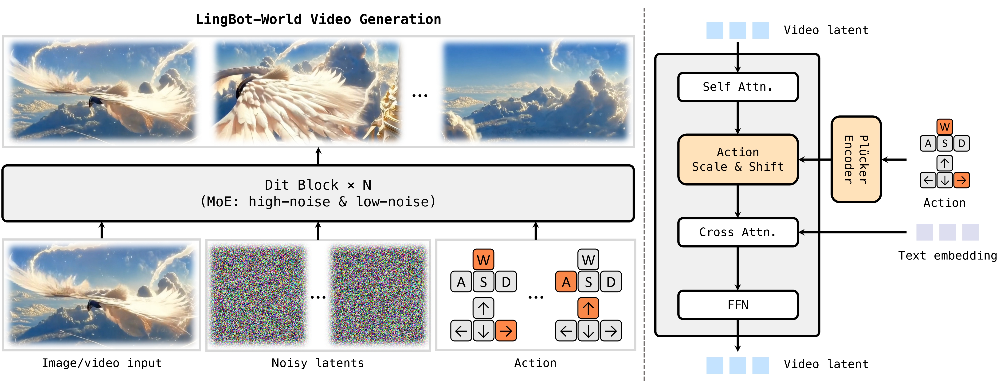

### 与标准 Pipeline 的关键区别

#### 区别 1：因果逐块生成（取代全序列并行）

标准模型一次性生成全部帧。LingBot-World **逐块因果生成**：

```
标准 Pipeline:   [x₁ x₂ x₃ x₄ x₅ x₆ x₇ x₈] ← 全部并行去噪
LingBot-World:    Chunk 1 → [x₁ x₂ x₃ x₄] → KV Cache → Chunk 2 → [x₅ x₆ x₇ x₈] → ...
                  每一块依赖前面块的 KV Cache
```


#### 区别 2：MoBA 注意力掩码（混合双向 + 因果）

Teacher Forcing 训练中加入 **双向注意力块**，帮助模型适应变长生成：

```
标准掩码:                       MoBA 掩码:
┌─── ────┐                    ┌─────────────────┐
│ 因果下三角 │                    │ x₁ x₂ x₃ x₄ [b₁ b₂]│
│ (单向)  │                    │ ✓  ✓  ✓  ✓  [✓ ✓ ]│
└─── ────┘                    │ 因果 + 双向块    │
                              └─────────────────┘
```

#### 区别 3：三重条件注入

| 条件 | 注入方式 | 与标准区别 |
|------|---------|-----------|
| **文本** | Cross-Attention（K/V 缓存复用） | 同标准，但 K/V 只算一次 |
| **摄像机轨迹** | Plücker 编码 → AdaLN-style `x = (1+scale)*x + shift` | **标准没有** |
| **时间步** | AdaLN + gate | 同标准 |

#### 区别 4：跨 Chunk KV Cache 复用

```python
# 自注意力 KV Cache（跨 chunk 持久）
self_kv_cache = [{'k': zeros(...), 'v': zeros(...)} for _ in range(num_layers)]

# 交叉注意力 KV Cache（文本 K/V 只算一次）
crossattn_cache = [{'k': zeros(...), 'v': zeros(...), 'is_init': 0} for _ in range(num_layers)]
```

**局部窗口** + **sink tokens** 机制限制 KV Cache 大小：

```
local_attn_size = 18  # 只看最近 18 个 chunk
sink_size = 6         # 保留前 6 个 chunk 作为锚点
```

#### 区别 5：双模式推理

| 模式 | 步数 | CFG | 说明 |
|------|------|-----|------|
| `causal_fast` | 4 步/块 | 无 | 一致性蒸馏 + DMD 蒸馏 |
| `causal_pretrain` | 40 步/块 | 5.0 | 完整预训练模型 |

**DMD 蒸馏在长自展开轨迹上应用**，直接优化学生的采样分布以减少累积漂移——这是标准 pipeline 不需要考虑的。

### 整体 Pipeline

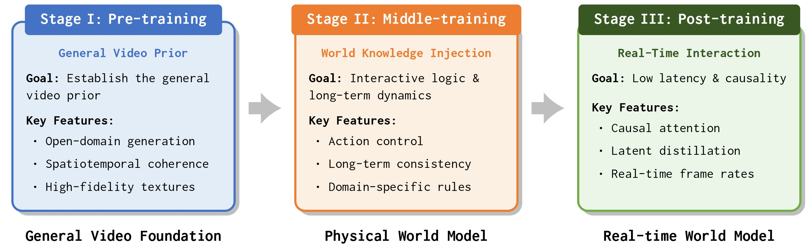

### 数据 Pipeline

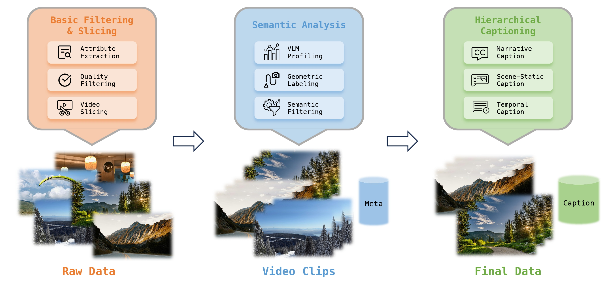

---

## 二、LingBot-Video

> **论文**：Scaling Mixture-of-Experts Video Pretraining for Embodied Intelligence（arXiv 2607.07675）

### 架构总览

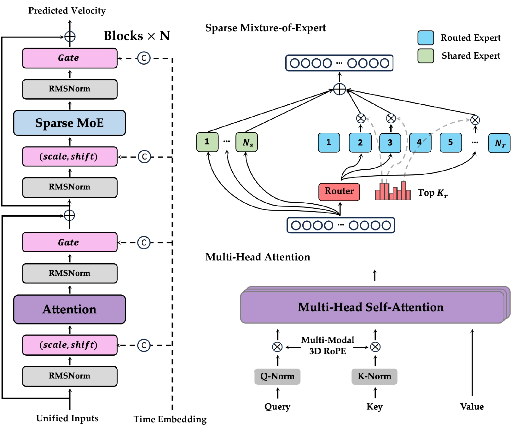

### 与标准 Pipeline 的关键区别

#### 区别 1：Sparse MoE（取代密集 FFN）

标准 DiT 每层使用密集 GELU-MLP。LingBot-Video 在部分层用 **Sparse MoE**：

```python
if layer_idx in moe_layers:
    ffn_out = SparseMoeBlock(ffn_in)   # 128 专家，top-8
else:
    ffn_out = MLP(ffn_in)              # 仍保持部分密集层
```

**关键创新**：Sigmoid 路由器（非 softmax）+ 分组限制路由 + 在线偏差校正（无辅助损失）。

| | 密集 FFN | Sparse MoE |
|---|---|---|
| 总参数 vs 活跃参数 | 相同 | **13B vs 1.4B** |
| 计算量 | 随参数量线性增长 | **参数-计算解耦** |
| 子任务干扰 | 存在 | 专家分工缓解 |

#### 区别 2：任务统一的单流设计（3D MM-RoPE）

标准 pipeline 对不同任务（T2I/T2V/TI2V）需要不同结构。LingBot-Video **统一为一条 token 序列**：

```
[条件 tokens (L 个), 视觉 patches (F×H×W 个)]
     ↑ 3D MM-RoPE: (i, 0, 0)       ↑ 3D MM-RoPE: (L+1+f, h, w)
```

**条件 tokens 和视觉 tokens 共享同一套 Transformer 参数**（非双流），通过 3D MM-RoPE 的位置坐标分离。

#### 区别 3：AdaLN-Single 调制

标准 pipeline 每层独立计算 AdaLN 调制信号。LingBot-Video **时间步 MLP 只算一次**，每层加可训练调制表：

```python
mod = shared_temb6 + self.scale_shift_table  # 共享 + 每层偏移
```

#### 区别 4：级联 Refiner

```
Base Generator (480p) → VAE Enc → Refiner DiT → VAE Dec → 1080p
     ↑ 条件 Rectified Flow（非纯噪声，从退化条件开始）
```

**条件 Rectified Flow**：从 **退化条件** 开始，非纯噪声：

$$x_t = (1-\frac{t}{\tau})x_0 + \frac{t}{\tau}x_\tau$$

标准 pipeline 的超分是独立的模型，LingBot-Video 将其作为级联的一部分联合训练。

### ACWM（Action-Conditioned World Model）架构

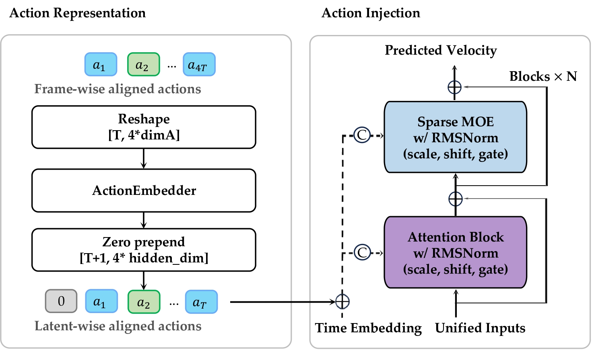

---

## 三、Cosmos 3

> **论文**：arXiv 2606.02800
> **核心**：双塔 Mixture-of-Transformers (MoT)

### MoT 架构

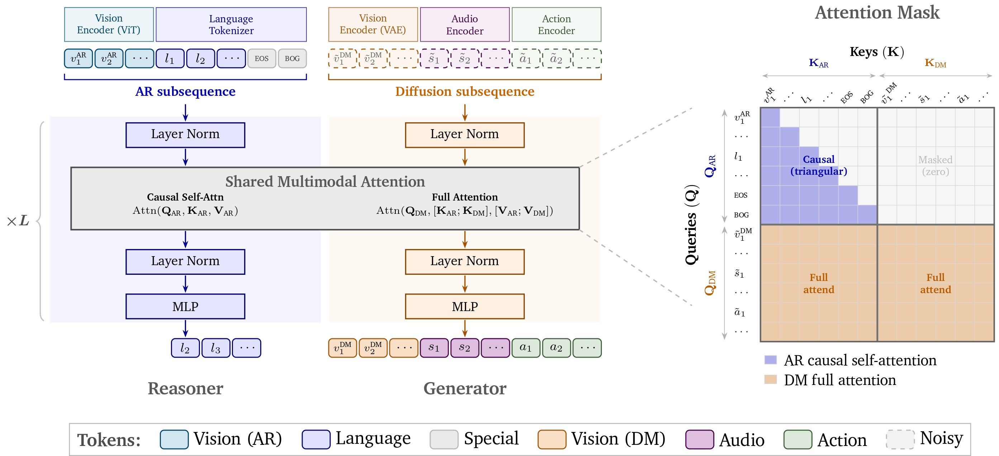

### 与标准 Pipeline 的关键区别

#### 区别 1：双塔 MoT（取代单流 DiT）

Cosmos 3 每层有 **两套独立参数**：

```
标准 Pipeline (单流):            Cosmos 3 (MoT 双流):
[文本 K/V via Cross-Attn]        [UND 塔: 因果自注意力, 只处理文本]
[视觉 Self-Attention + FFN]      [GEN 塔: 交叉注意力 → [K_und; K_gen], 处理视觉]
```

```
O_AR = Attn_causal(Q_AR, K_AR, V_AR)                # UND: 只看文本
O_DM = Attn_full(Q_DM, [K_UND; K_DM], [V_UND; V_DM]) # GEN: 看全部
```

**关键约束**：UND token **永不**被 DM token 更新——因果完整性保持。

#### 区别 2：Sequence Packing（取代单模态序列）

标准 pipeline 只处理视觉 token（文本通过 Cross-Attention 注入）。Cosmos 3 **把所有模态打包成一条序列**：

```
|←─── AR 子序列 ───→|←─────────── DM 子序列 ──────────→|
[语言, ViT | 控制, 视频, 音频, 动作]
```

各模态独立投影到 `hidden_size`，通过**模态嵌入**区分：

```python
hidden_video = self.proj_in(self.patchify(latents)) + time_embed[noisy_mask]
hidden_action = self.action_proj_in(action_tokens) + self.action_modality_embed
# 拼接成一条序列
hidden_gen = torch.cat([*controls, hidden_video, hidden_action, hidden_sound], dim=1)
```

#### 区别 3：3D mRoPE + 15,000 时间边距

标准 pipeline 使用 1D/2D RoPE。Cosmos 3 使用 **3D mRoPE** 对齐多模态：

| 模态 | t | h | w |
|------|---|---|---|
| 语言 | 单调递增 | = t | = t |
| 视频 | 帧索引 | 网格 | 网格 |
| 音频 | hop 索引 | 0 | 0 |
| 动作 | 步索引 | 0 | 0 |

**AR-DM 时间边距 = 15,000**，防止初始帧伪影。

### Sequence Packing 示意图

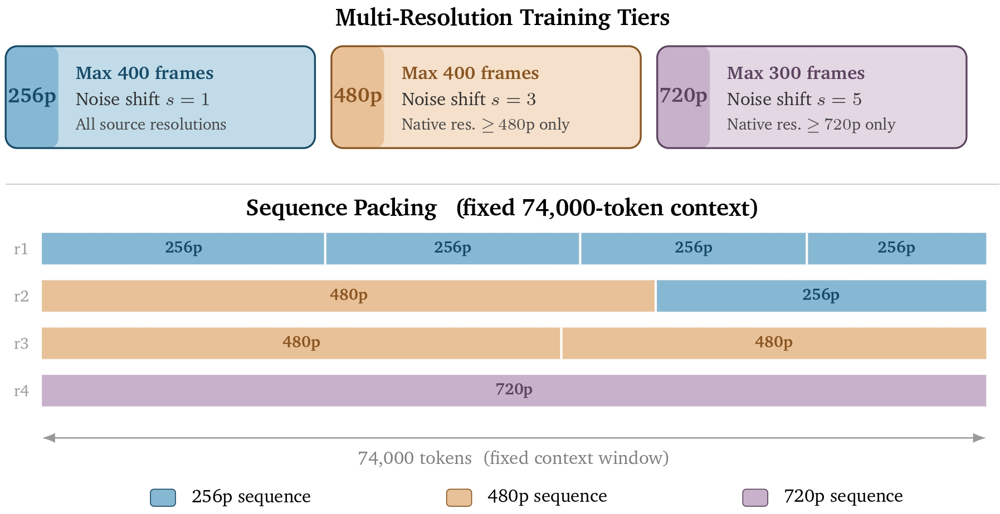

### mRoPE 坐标分配

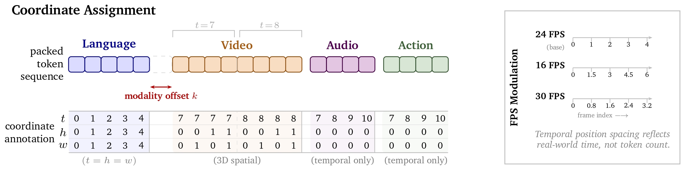

#### 区别 4：UND 缓存（最重要推理优化）

```python
# UND 只运行一次，缓存所有层的 K/V
if self.cached_kv is None:
    cached_kv_full = self.language_model(text_ids)
    self.cached_kv = cached_kv  # 所有去噪步骤复用

# GEN 每个去噪步骤运行（复用 cached_kv）
for layer, (k_und, v_und) in zip(self.gen_layers, self.cached_kv):
    hidden_gen = layer(hidden_gen, k_und=k_und, v_und=v_und)
```

标准 pipeline 每步的文本处理虽然可以缓存，但没有**双塔架构下的天然分离**——Cosmos 3 的 UND 塔完全独立于去噪循环。

#### 区别 5：可选的 Action/Sound 模态处理

标准 pipeline 只有文本 + 视觉。Cosmos 3 原生支持 **动作 token** 和 **音频 token** 的生成/条件化：

### Action Modes

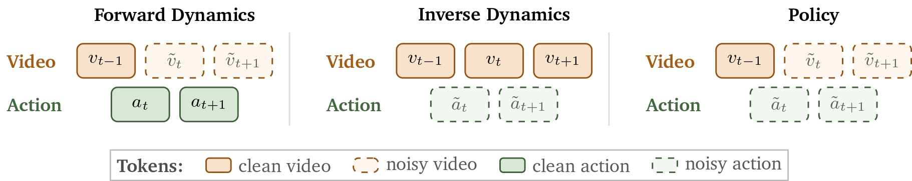

### Action Representation

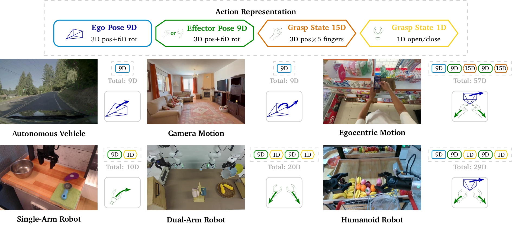

---

## 四、Qwen-RobotWorld

> **论文**：arXiv 2606.17030v3（COLM 2024）
> **架构**：Double-Stream MMDiT + MLLM Action Encoder

### 架构总览

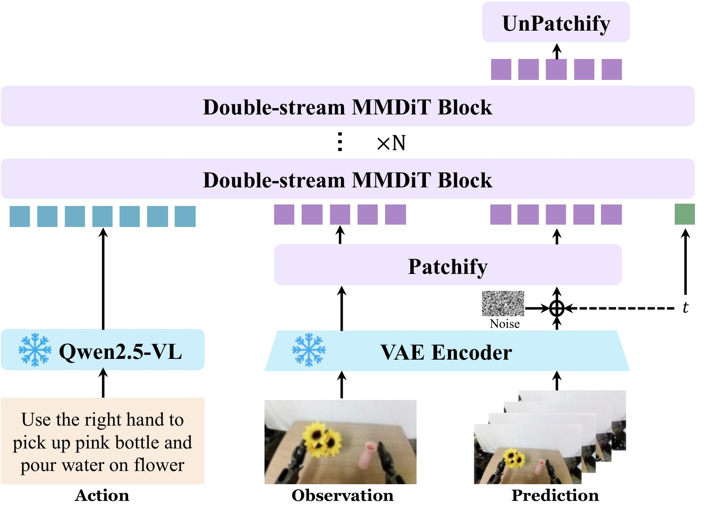

### 与标准 Pipeline 的关键区别

#### 区别 1：MLLM 作为 Action Encoder（取代 T5/CLIP）

标准 pipeline 使用 T5/CLIP 作为文本编码器。Qwen-RobotWorld 使用 **Qwen2.5-VL (7B)**：

| | T5 Encoder | Qwen2.5-VL (MLLM) |
|---|---|---|
| 参数量 | ~4.7B (T5-XXL) | **7B** |
| 能力 | 纯文本编码 | **多模态理解 + 世界知识** |
| 输出 | 文本嵌入 | **深层语义 + 物理约束** |
| 额外收益 | - | 隐式编码物体刚性、物理规律 |

**论文核心论据**：MLLM 内部化的世界知识（如机械臂是刚体）隐式约束了物理合理状态空间。

#### 区别 2：Double-Stream MMDiT（非双塔 MoT）

Cosmos 3 的**双塔 MoT** 是独立参数的双路径。Qwen-RobotWorld 的 **MMDiT** 是双流**交互**：

```
                 Joint Attention (每层)
                      ↕
Understanding Stream ←─→ Generation Stream
(文本条件编码)          (视觉去噪)
```

- 两流**每层交互**（Joint Attention），非独立
- Understanding stream 不缓存——**每步都参与计算**
- 两流共享部分参数（注意力层交互）

#### 区别 3：Asymmetric 3D RoPE

标准 RoPE 的 temporal/height/width 维度均匀分配。Qwen-RobotWorld **不对称分配**：

```
pe_axes_dim = [16, 56, 56]  # temporal=16, height=56, width=56
```

- 时域维度少：相邻帧强相关，不需要高维度
- 空间维度多：物体位置和场景布局多样性大

#### 区别 4：Action-Language Mapping

将 20+ 机器人类型的异构动作（关节角、末端执行器路点等）统一为**自然语言接口**：

```
异构动作 → 分层标注（任务目标→动作细节→物理反馈）→ 自然语言指令 → 统一条件生成
```

**本质**：世界模型学习 $s_{t+1} = f(s_t, \text{language action})$，而非 $f(s_t, \text{joint angles})$。

#### 区别 5：Scene2Robot（视频编辑式跨具身迁移）

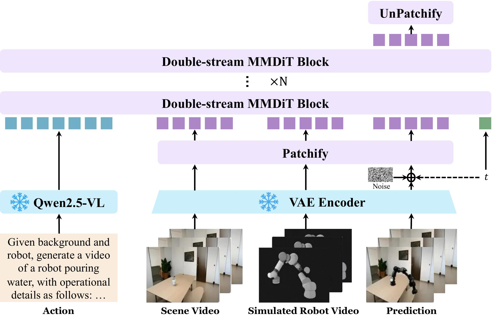

### Data Pipeline

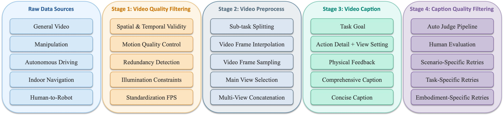

---

## 五、OmniDreams

> **论文**：NVIDIA OmniDreams（arXiv 2606.03159v1）
> **骨干**：Cosmos-Predict 2.5 因果扩散 + 轻量控制分支
> **应用**：自动驾驶闭环仿真

### 架构 Pipeline

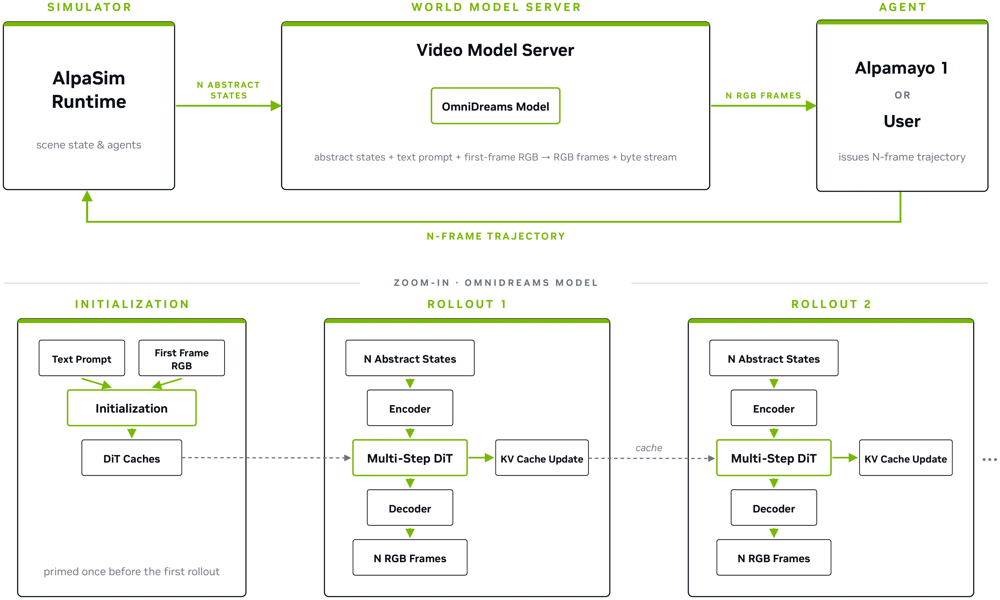

### 与标准 Pipeline 的关键区别

#### 区别 1：因果扩散（同 LingBot-World，非并行生成）

标准 Pipeline 双向并行。OmniDreams **自回归因果生成**：

```
标准: 所有帧从噪声并行去噪 → 一次输出
OmniDreams: Step t → 生成 K 帧 → KV Cache → Step t+1 → 生成 K 帧 → ...
```

使用**流式 KV Cache** 维护时序上下文，不重复计算。

#### 区别 2：轻量控制分支（取代 ControlNet 类架构）

标准的方式是 ControlNet（复制主干权重作为控制分支）。OmniDreams 使用**轻量 MLP**：

```
Simulator State → MLP → 控制 tokens → concat 到视觉 token 序列
```

**不复制主干权重**，计算开销极低。

#### 区别 3：Factorization Multi-View Attention（因子化注意力）

从全联合注意力 $\mathcal{O}(N^2 T^2)$ 分解为：

| Attention Type | 计算域 | 复杂度 |
|---|---|---|
| 时序注意力 | 单视角内，跨帧 | $\mathcal{O}(N T^2)$ |
| 跨视角注意力 | 单帧内，跨视角 | $\mathcal{O}(N^2)$ |
| **因子化后总计** | | $\mathcal{O}(N T^2 + N^2)$ |

#### 区别 4：可学习视角嵌入 + 多条件输入

```
条件输入:
1. First-frame RGB（首帧干净 latent）
2. Text prompt（天气、光照等高层描述）
3. Abstract world scenario（地图、动静态障碍物 → 控制 tokens）
4. Memory cache（流式 KV Cache）
```

### Input/Output

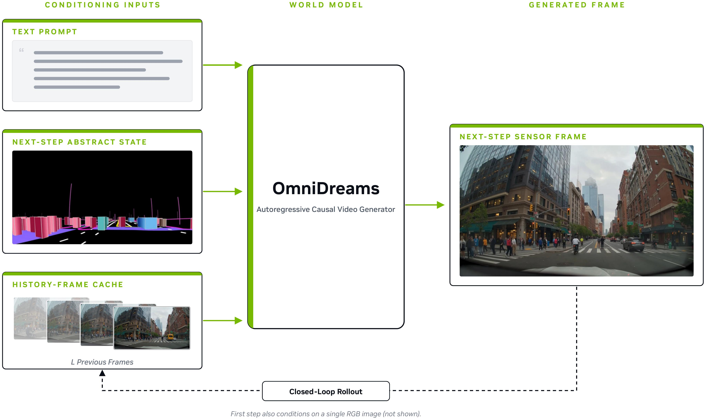

### Multi-View 架构

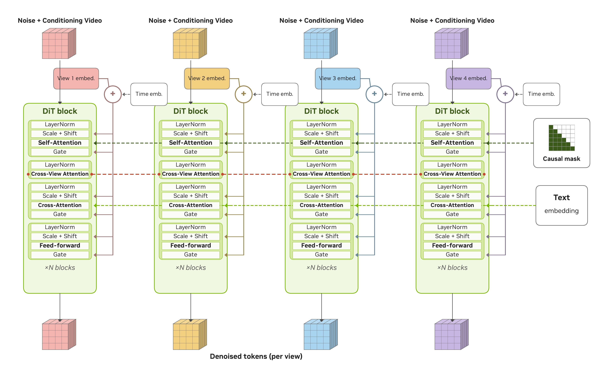

#### 区别 5：FlashDreams 推理栈

OmniDreams 将推理优化打包为 **FlashDreams**——一个开源的流式推理栈：

| 优化项 | 说明 |
|--------|------|
| 局部时序注意力 | 6-8 latent frame 窗口 |
| 流式静态形状 KV Cache | 预分配固定形状，线程异步更新 |
| CUDA Graph | 单静态形状 → 捕获一次，复用全 rollout |
| 层级上下文并行 | V → T → HW 三级 sharding |
| 轻量编解码 | LightVAE/LightTAE 替换标准 VAE |

**性能**：单视角 8 帧 @68 FPS（单 GPU），四视角 16 帧 @105 FPS/camera（16 GPU）。

---

## 六、V-JEPA 2.1

> **论文**：V-JEPA 2.1: Unlocking Dense Features in Video Self-Supervised Learning（arXiv 2603.14482v3）
> **架构**：Joint-Embedding Predictive Architecture（**非扩散模型**）

### V-JEPA 2.1 架构

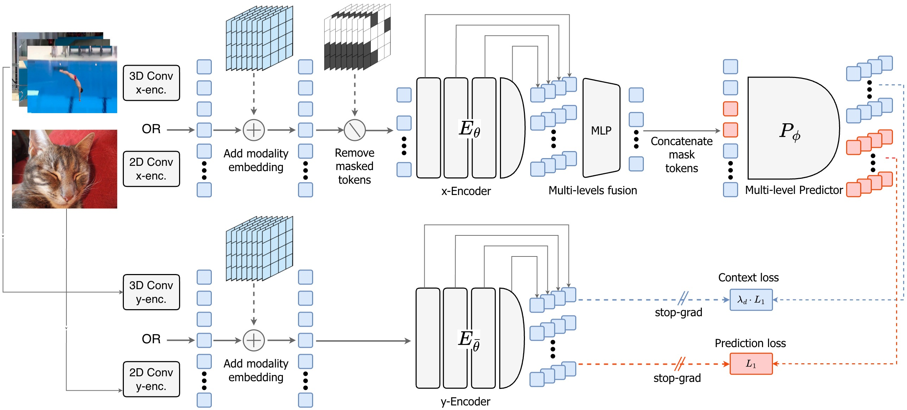

### 与标准 Pipeline 的根本性区别

#### 区别 1：不是扩散模型（完全不同的范式）

| | 标准 DiT Pipeline | V-JEPA 2.1 |
|---|---|---|
| **生成方式** | 扩散（从噪声逐步去噪） | **预测（在表示空间预测掩码区域）** |
| **损失函数** | Flow Matching / Diffusion loss | **L1 表示预测损失** |
| **编解码** | VAE（像素↔潜在） | **ViT 编码器（无解码器）** |
| **推理** | 多步迭代去噪 | **单次前向（frozen 编码器）** |
| **输出** | 生成的像素/视频 | **表示向量（供下游任务使用）** |

#### 区别 2：Encoder-Predictor 结构（取代 Encoder-DiT-Decoder）

```
标准 Pipeline:  Encoder(VAE) → DiT(去噪) → Decoder(VAE)
V-JEPA 2.1:     Encoder(ViT) → Predictor(ViT) → 表示（无解码器！）
```

$x$-encoder 处理掩码后的输入 → 输出多级表示 → Predictor 预测完整表示的掩码部分。

#### 区别 3：Dense Prediction Loss（取代扩散损失）

**自监督学习在表示空间**，而非像素/潜在空间：

$$\mathcal{L}_{\text{dense}} = \underbrace{\frac{1}{|M|} \sum_{i \in M} \|P_\phi(E_\theta(x))_i - E_{\bar{\theta}}(y)_i\|_1}_{\text{掩码预测}} + \underbrace{\frac{1}{|C|} \sum_{i \in C} \lambda_i \| \cdots \|_1}_{\text{上下文损失}}$$

- **掩码预测**（原始 V-JEPA）：只监督被掩码的 token
- **上下文损失**（V-JEPA 2.1 新增）：也监督可见 token，权重 $\lambda_i$ 与距最近掩码位置的距离成反比

#### 区别 4：Deep Self-Supervision（多级预测器）

标准模型只在最终输出施加损失。V-JEPA 2.1 在**中间层也施加监督**：

```
Encoder 中间层输出 → concat → MLP 融合降维 → Predictor → 4 级输出
                                                              ↓
                                                     每级都计算 L1 loss
```

#### 区别 5：Multi-Modal Tokenizer

标准 ViT 对所有输入使用相同 patch embedding。V-JEPA 2.1 区分 Image/Video：

```python
if input_type == "video":
    patch_emb = Conv3D(16×16×2)  # 时空 tubelet
elif input_type == "image":
    patch_emb = Conv2D(16×16)    # 空间 patch
```

+ 可学习**模态嵌入** token 区分数据来源。

### Ablation Study

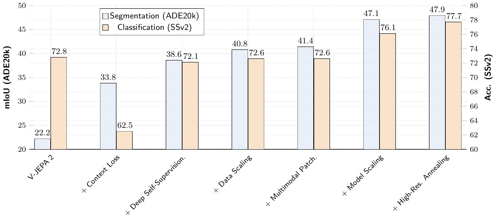

---

## 七、架构对比总表

### 核心架构维度

| 维度 | 标准 Pipeline | LingBot-World 2.0 | LingBot-Video | Cosmos 3 | Qwen-RobotWorld | OmniDreams | V-JEPA 2.1 |
|------|:---:|:---:|:---:|:---:|:---:|:---:|:---:|
| **骨干架构** | 单流 DiT | 单流 Causal DiT | 单流+MoE DiT | 双流 MoT | 双流 MMDiT | 单流 Causal DiT | **非 DiT** (JEPA) |
| **生成方式** | 并行 | **逐块因果** | 并行 | 并行 | 并行 | **逐块因果** | **表示预测（非生成）** |
| **FFN 类型** | 密集 MLP | 密集 MLP | **Sparse MoE** | 密集 GatedMLP | 密集 MLP | 密集 MLP | **ViT MLP** |
| **文本编码** | T5/CLIP | T5 | Qwen3-VL-4B | Cosmos TE | **Qwen2.5-VL (7B)** | Cosmos TE | 无（自监督） |
| **位置编码** | 1D/2D RoPE | 2D RoPE | **3D MM-RoPE** | 3D mRoPE | **Asymmetric 3D RoPE** | 标准 RoPE | 3D RoPE |
| **条件注入** | Cross-Attn | Cross-Attn + Plücker AdaLN | 序列拼接 | Cross-Attn + 拼接 | Joint Attention | 拼接+轻量控制分支 | Masking |
| **KV 缓存** | 无必要 | **跨 chunk 管理** | 无 | **UND 缓存（核心）** | 无必要 | **流式静态形状** | 不适用 |
| **模态支持** | T2I/T2V | T2V+I2V | **T2I/T2V/TI2V 统一** | T2I/V/Audio/Action | **Embodied** + T2I/T2V | **多视角自动驾驶** | **自监督图像+视频** |

### 架构创新独特性矩阵

| 创新点 | 所属模型 | 与标准 pipeline 的偏离程度 |
|--------|---------|:---:|
| 因果逐块生成 | LingBot-World 2.0, OmniDreams | ★★★ |
| 混合双向+因果注意力 (MoBA) | LingBot-World 2.0 | ★★★ |
| Plücker 摄像机控制 | LingBot-World 2.0 | ★★★ |
| Sparse MoE FFN | LingBot-Video | ★★☆ |
| AdaLN-Single | LingBot-Video | ★☆☆ |
| 3D MM-RoPE 统一任务 | LingBot-Video | ★★☆ |
| 级联 Refiner + 条件 Rectified Flow | LingBot-Video | ★★☆ |
| 双塔 MoT (UND/GEN 分离) | Cosmos 3 | ★★★ |
| Sequence Packing 多模态 | Cosmos 3 | ★★★ |
| 3D mRoPE + 15K 时间边距 | Cosmos 3 | ★★★ |
| UND 一次性缓存 | Cosmos 3 | ★★★ |
| MLLM 作为条件编码器 | Qwen-RobotWorld | ★★★ |
| MMDiT 双流交互 | Qwen-RobotWorld | ★★☆ |
| Action-Language Mapping | Qwen-RobotWorld | ★★★ |
| 因子化多视角注意力 | OmniDreams | ★★☆ |
| 轻量控制分支 | OmniDreams | ★☆☆ |
| FlashDreams 推理栈 | OmniDreams | ★★☆ |
| 表示空间自监督（非扩散） | V-JEPA 2.1 | ★★★ |
| Dense Prediction Loss | V-JEPA 2.1 | ★★★ |
| Deep Self-Supervision | V-JEPA 2.1 | ★★☆ |
| Multi-Modal Tokenizer | V-JEPA 2.1 | ★☆☆ |

### 推理效率维度

| 指标 | 标准 | LingBot-World 2.0 | LingBot-Video | Cosmos 3 | OmniDreams |
|------|:---:|:---:|:---:|:---:|:---:|
| 时间步/帧 | 20-50 | 4-40/块 | 20-50 | 20-50 | **2** (蒸馏) |
| 文本计算 | 每步重复 | **跨 chunk 缓存** | 每步重复 | **UND 一次性** | 每步重复 |
| KV Cache | 无 | **局部窗口+sink** | 无 | **全量 UND** | **静态形状** |
| 主要瓶颈 | 大步数+大序列 | KV Cache + 长序稳定 | MoE 通信 | 双塔显存 | 多视角+实时 |

---

## 八、关键趋势总结

### 趋势 1：从并行到因果（自回归生成）

```
标准 (并行) ──→ LingBot-World 2.0 (因果逐块) ──→ OmniDreams (因果逐块)
                   ↑ 无限时长                   ↑ 闭环仿真
```

**核心挑战**：KV Cache 管理成为推理瓶颈。各模型的应对策略各异：
- LingBot-World：局部窗口 + sink tokens + 滚动驱逐
- OmniDreams：静态形状预分配 + 线程异步更新
- Cosmos 3：UND 一次性缓存（双流天然优势）

### 趋势 2：从单流到多流（参数分离与交互）

```
单流 ──→ 双流 MoT (Cosmos 3: UND/GEN 完全分离)
     ──→ 双流 MMDiT (Qwen-RobotWorld: 每层交互)
     ──→ 单流+MoE (LingBot-Video: 路由专家, 容量-计算解耦)
```

### 趋势 3：从 T5/CLIP 到 MLLM 条件编码

```
T5 (文本编码) ──→ 多模态 LLM 作为条件编码器 (Qwen-RobotWorld)
                    ↑ 隐含世界知识 + 复杂指令理解
```

### 趋势 4：从单模态到多模态统一

```
视觉 only ──→ 视觉+文本 ──→ 视觉+文本+音频+动作+控制信号
               (标准)        (Cosmos 3: Sequence Packing)
                            (OmniDreams: 视角因子化)
                            (LingBot-Video: MM-RoPE 统一)
```

### 趋势 5：从逐步计算到一次性缓存

```
每步全量计算 ──→ UND 一次性缓存 (Cosmos 3)
             ──→ 跨 chunk KV Cache 复用 (LingBot-World)
             ──→ CUDA Graph 捕获复用 (OmniDreams/FlashDreams)
             ──→ T5 文本缓存 (LingBot-World)
```

### 趋势 6：非扩散路径的存在（V-JEPA 2.1）

V-JEPA 2.1 展示了**完全不使用扩散模型**的视频理解世界模型路径：
- **在表示空间做预测**（而非像素/潜在空间）
- **自监督**（不需要文本标注）
- **可为下游任务提供 dense feature**（深度估计、分割、规划）

这条路径与 Encoder-DiT-Decoder 体系互补，不是替代关系——V-JEPA 擅长**理解和表示学习**，DiT 擅长**生成**。

---

## 附：资产来源索引

| 图片 | 来源 |
|------|------|
| `lingbot_world_overview.jpg` | Note: 12-LingBot-World-v2.md |
| `lingbot_world_pipeline.jpg` | Note: 12-LingBot-World-v2.md |
| `lingbot_world_data_pipeline.jpg` | Note: 12-LingBot-World-v2.md |
| `lingbot_video_arch.jpg` | Note: 13-LingBot-Video.md |
| `lingbot_video_acwm.jpg` | Note: 13-LingBot-Video.md |
| `cosmos3_mot_arch.jpg` | Note: 07-Cosmos3-Architecture-Deep-Dive.md |
| `cosmos3_sequence_packing.jpg` | Note: 07-Cosmos3-Architecture-Deep-Dive.md |
| `cosmos3_mrope.jpg` | Note: 07-Cosmos3-Architecture-Deep-Dive.md |
| `cosmos3_action_modes.jpg` | Note: 07-Cosmos3-Architecture-Deep-Dive.md |
| `cosmos3_action_repr.jpg` | Note: 07-Cosmos3-Architecture-Deep-Dive.md |
| `qwen_robotworld_arch-1.jpg` | Paper: arXiv-2606.17030v3, `content/world_model3.pdf` |
| `qwen_scene2robot-1.jpg` | Paper: arXiv-2606.17030v3, `content/scene2robot_model.pdf` |
| `qwen_data_pipeline-1.jpg` | Paper: arXiv-2606.17030v3, `content/figure_data_pipeline.pdf` |
| `omnidreams_pipeline-1.jpg` | Paper: arXiv-2606.03159v1, `figures/pipeline-overview.pdf` |
| `omnidreams_input_output-1.jpg` | Paper: arXiv-2606.03159v1, `figures/input_output.pdf` |
| `omnidreams_multiview-1.jpg` | Paper: arXiv-2606.03159v1, `figures/cosmos_predict_multiview.pdf` |
| `vjepa_arch.jpg` | Paper: arXiv-2603.14482v3, `diagrams/architecture_vjepa2_1.jpg` |
| `vjepa_ablation-1.jpg` | Paper: arXiv-2603.14482v3, `diagrams/v2_to_25.pdf` |
