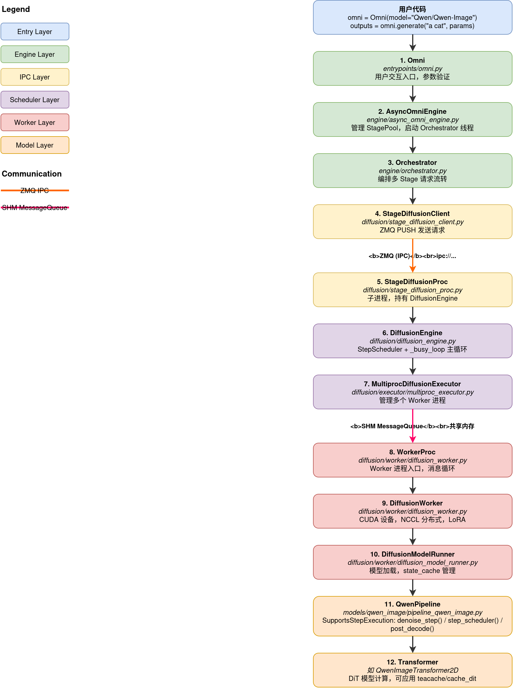
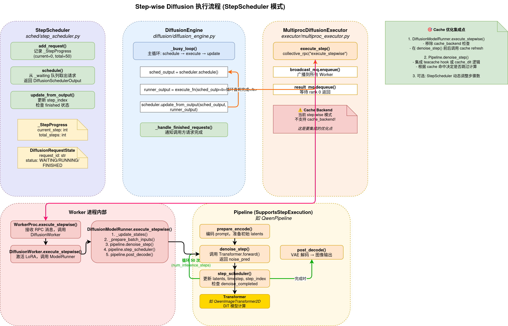
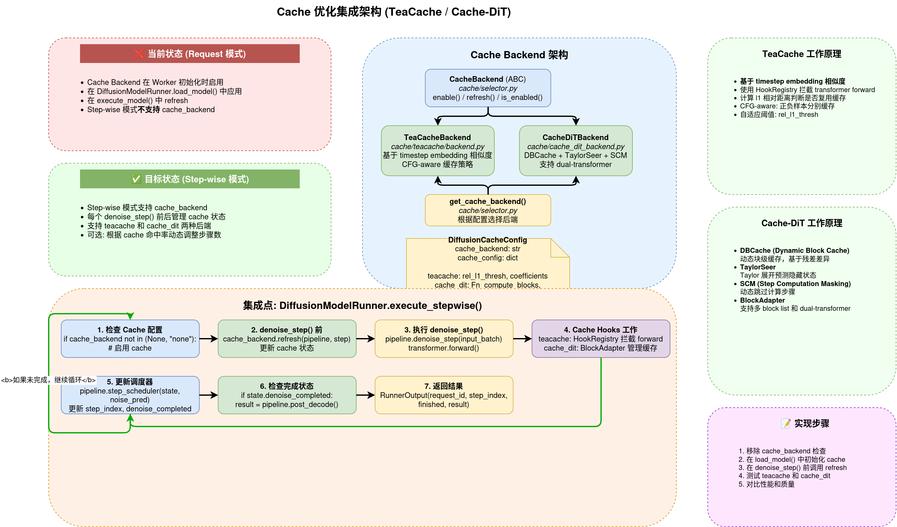

# vLLM-Omni Diffusion 完整架构链路

> 从用户入口 `Omni` 到底层 `Pipeline` 的完整调用链路解析
> 基于 vllm-omni v0.24.0 分析

---

## 架构总览



---

## Step-wise 执行流程



---

## Cache 集成架构



---

## 详细调用链路

### 1. Omni (入口层)

**文件**: `vllm_omni/entrypoints/omni.py`

```python
class Omni(OmniBase):
    """Synchronous entrypoint for offline generation."""

    def __init__(self, model, **kwargs):
        # 继承自 OmniBase，创建 AsyncOmniEngine
        self.engine = AsyncOmniEngine(model, ...)

    def generate(self, prompts, sampling_params_list):
        # 发送请求到引擎
        for req_id, prompt in zip(request_ids, request_prompts):
            self.engine.send_request(req_id, prompt, params)
        # 等待结果
        return self._collect_outputs()
```

**职责**:
- 用户交互入口
- 参数验证和预处理
- 调用 `AsyncOmniEngine` 发送请求

---

### 2. AsyncOmniEngine (异步引擎)

**文件**: `vllm_omni/engine/async_omni_engine.py`

```python
class AsyncOmniEngine:
    def __init__(self, model, **kwargs):
        # 1. 解析 stage 配置
        self.config_path, self.stage_configs = self._resolve_stage_configs(model, kwargs)

        # 2. 创建 StagePool 和 StageClient
        for stage_cfg in self.stage_configs:
            if stage_cfg.stage_type == "diffusion":
                # 创建 diffusion stage client
                client = build_diffusion_stage_client(
                    stage_id, model, stage_cfg, metadata, stage_init_timeout
                )
            else:
                # 创建 AR stage client (EngineCoreClient)
                client = StageEngineCoreClient(...)
            self.stage_clients.append(client)

        # 3. 启动 Orchestrator 线程
        self.orchestrator_thread = threading.Thread(
            target=self._bootstrap_orchestrator,
            daemon=True
        )

    def send_request(self, request_id, prompt, sampling_params):
        # 放入 janus 队列
        self.request_queue.put(request_message)
```

**职责**:
- 管理多个 Stage 的生命周期
- 创建 `StageDiffusionClient` (对于 diffusion stage)
- 启动 `Orchestrator` 后台线程
- 提供请求队列接口

---

### 3. Orchestrator (编排器)

**文件**: `vllm_omni/engine/orchestrator.py`

```python
class Orchestrator:
    async def run(self):
        """主事件循环"""
        request_task = asyncio.create_task(self._request_handler())
        output_task = asyncio.create_task(self._orchestration_output_handler())
        await asyncio.gather(request_task, output_task)

    async def _request_handler(self):
        """从请求队列读取并分发到第一个 stage"""
        while True:
            msg = await self.request_async_queue.get()
            # 提交到第一个 stage
            await self.stage_pools[0].submit_initial(
                msg.request_id, msg.prompt, msg.sampling_params
            )

    async def _orchestration_output_handler(self):
        """从各 stage 读取输出并转发到下一个 stage"""
        while True:
            # 从任意 stage 的输出队列读取
            stage_id, output = await self._read_from_any_stage()

            if stage_id < self.num_stages - 1:
                # 转发到下一个 stage
                await self._forward_to_next_stage(
                    request_id, stage_id, output, req_state
                )
            else:
                # 最后一个 stage，返回结果给用户
                await self.output_async_queue.put(output)

    async def _forward_to_next_stage(self, req_id, src_stage_id, output, req_state):
        """将输出从当前 stage 转发到下一个 stage"""
        next_stage_id = src_stage_id + 1
        next_pool = self.stage_pools[next_stage_id]

        if next_pool.stage_type == "diffusion":
            # AR → Diffusion: 需要转换输入格式
            diffusion_prompt = self.custom_process_input_func(
                [output], req_state.prompt
            )
            await next_pool.submit_initial(req_id, diffusion_prompt, params)
        else:
            # AR → AR: 直接转发
            await next_pool.submit_initial(req_id, output, params)
```

**职责**:
- 管理请求在多个 stage 之间的流转
- 处理 stage 间的数据转换 (如 AR 输出 → diffusion 输入)
- 收集最终结果返回给用户

---

### 4. StageDiffusionClient (ZMQ 客户端)

**文件**: `vllm_omni/diffusion/stage_diffusion_client.py`

```python
def create_diffusion_client(model, od_config, metadata, stage_init_timeout, batch_size, use_inline):
    """工厂函数: 创建 inline 或 out-of-process 客户端"""
    if use_inline:
        return InlineStageDiffusionClient(...)
    else:
        # 1. 启动子进程
        proc_manager = StageDiffusionProcManager(model, od_config, stage_init_timeout)
        # 2. 创建客户端连接
        return StageDiffusionClient.from_addresses(
            metadata,
            request_address=proc_manager.addresses.inputs[0],
            response_address=proc_manager.addresses.outputs[0],
            proc_manager=proc_manager,
        )

class StageDiffusionClient:
    async def generate(self, prompt, sampling_params, **kwargs):
        """发送生成请求到子进程"""
        # 1. 序列化请求
        request_data = OmniMsgpackEncoder.encode({
            "type": "generate",
            "request_id": request_id,
            "prompt": prompt,
            "sampling_params": sampling_params,
        })
        # 2. 通过 ZMQ PUSH 发送
        await self._request_socket.send(request_data)
        # 3. 等待 ZMQ PULL 返回结果
        response = await self._response_socket.recv()
        return OmniMsgpackDecoder.decode(response)
```

**职责**:
- 与 `StageDiffusionProc` 子进程通信
- ZMQ PUSH/PULL 模式发送请求/接收结果
- 管理子进程生命周期

---

### 5. StageDiffusionProc (子进程)

**文件**: `vllm_omni/diffusion/stage_diffusion_proc.py`

```python
class StageDiffusionProc:
    def initialize(self):
        """初始化: 创建 DiffusionEngine"""
        self._od_config.enrich_config()
        self._engine = DiffusionEngine.make_engine(self._od_config)

    async def run_loop(self):
        """主事件循环: 接收请求并处理"""
        while True:
            # 1. 从 ZMQ 接收请求
            request_data = await self._request_socket.recv()
            request = OmniMsgpackDecoder.decode(request_data)

            # 2. 处理请求
            if request["type"] == "generate":
                asyncio.create_task(self._process_request(
                    request["request_id"],
                    request["prompt"],
                    request["sampling_params"],
                ))

    async def _process_request(self, request_id, prompt, sampling_params_dict):
        """处理单个生成请求"""
        sampling_params = self._reconstruct_sampling_params(sampling_params_dict)
        request = OmniDiffusionRequest(
            prompt=prompt,
            sampling_params=sampling_params,
            request_id=request_id,
        )
        # 调用 DiffusionEngine
        results = await self._engine.step(request)
        # 返回结果
        await self._response_socket.send(OmniMsgpackEncoder.encode(results[0]))
```

**职责**:
- 作为独立子进程运行
- 持有 `DiffusionEngine` 实例
- 通过 ZMQ 与 `StageDiffusionClient` 通信

---

### 6. DiffusionEngine (调度引擎)

**文件**: `vllm_omni/diffusion/diffusion_engine.py`

```python
class DiffusionEngine:
    def __init__(self, od_config, scheduler=None):
        # 1. 选择调度器
        self.step_execution = bool(getattr(od_config, "step_execution", False))
        self.scheduler = scheduler or (
            StepScheduler() if self.step_execution else RequestScheduler()
        )

        # 2. 创建执行器
        executor_class = DiffusionExecutor.get_class(od_config)
        self.executor = executor_class(od_config)

        # 3. 选择执行函数
        if self.step_execution:
            self.execute_fn = self.executor.execute_step
        elif self.supports_request_batch:
            self.execute_fn = self.executor.execute_batch
        else:
            self.execute_fn = self.executor.execute_request

    async def step(self, request):
        """处理单个请求"""
        # 1. 预处理
        request = self.pre_process_func(request)

        # 2. 添加到调度器并等待结果
        output = await self.async_add_req_and_wait_for_response(request)

        # 3. 后处理
        return self.postprocess_output(request, output)

    async def async_add_req_and_wait_for_response(self, request):
        """添加请求并等待完成"""
        # 1. 添加到调度器
        request_id = self.scheduler.add_request(request)

        # 2. 创建 Future 等待结果
        fut = self.main_loop.create_future()
        self._out_queue[request_id] = fut

        # 3. 唤醒 busy_loop
        self._cv.notify_all()

        # 4. 等待结果
        return await fut

    def _busy_loop(self):
        """主循环: 调度 → 执行 → 更新"""
        while not self.stop_event.is_set():
            # 1. 等待请求
            with self._cv:
                while not self.scheduler.has_requests():
                    self._cv.wait(timeout=1.0)

            # 2. 调度
            sched_output = self.scheduler.schedule()
            if sched_output.is_empty:
                continue

            # 3. 执行
            runner_output = self.execute_fn(sched_output)

            # 4. 更新调度器状态
            finished_req_ids = self.scheduler.update_from_output(
                sched_output, runner_output
            )

            # 5. 通知完成的请求
            self._handle_finished_requests(finished_req_ids, runner_output)
```

**职责**:
- 管理调度器 (`StepScheduler` 或 `RequestScheduler`)
- 管理执行器 (`MultiprocDiffusionExecutor`)
- `_busy_loop` 主循环: 调度 → 执行 → 更新
- 处理请求的添加和结果的返回

---

### 7. MultiprocDiffusionExecutor (多进程执行器)

**文件**: `vllm_omni/diffusion/executor/multiproc_executor.py`

```python
class MultiprocDiffusionExecutor(DiffusionExecutor):
    def _init_executor(self):
        """初始化: 创建共享内存队列和 Worker 进程"""
        num_workers = self.od_config.num_gpus

        # 1. 创建广播队列 (广播请求到所有 worker)
        self._broadcast_mq = MessageQueue(
            n_reader=num_workers,
            n_local_reader=num_workers,
        )

        # 2. 启动 Worker 进程
        processes, result_handle = self._launch_workers(
            self._broadcast_mq.export_handle()
        )

        # 3. 创建结果队列 (收集 worker 结果)
        self._result_mq = MessageQueue.create_from_handle(result_handle, 0)

    def _launch_workers(self, broadcast_handle):
        """启动多个 Worker 进程"""
        for i in range(num_gpus):
            process = mp.Process(
                target=WorkerProc.worker_main,
                args=(i, od_config, writer, broadcast_handle, ...),
                name=f"DiffusionWorker-{i}",
            )
            process.start()

    def execute_step(self, scheduler_output):
        """执行一步 (step-wise 模式)"""
        # 通过 collective_rpc 发送到 worker
        result = self.collective_rpc(
            "execute_stepwise",
            args=(scheduler_output,),
            unique_reply_rank=0,
            exec_all_ranks=True,
        )
        return result

    def collective_rpc(self, method, args, unique_reply_rank, exec_all_ranks):
        """向 worker 发送 RPC 请求"""
        # 1. 构造 RPC 消息
        rpc_request = {
            "type": "rpc",
            "method": method,
            "args": args,
        }

        # 2. 广播到所有 worker
        self._broadcast_mq.enqueue(rpc_request)

        # 3. 等待 rank 0 返回结果
        response = self._result_mq.dequeue(timeout=deadline)
        return response
```

**职责**:
- 管理多个 Worker 进程
- 通过共享内存 `MessageQueue` 通信
- 广播请求到所有 worker，收集 rank 0 的结果

---

### 8. WorkerProc (Worker 进程入口)

**文件**: `vllm_omni/diffusion/worker/diffusion_worker.py`

```python
class WorkerProc:
    @staticmethod
    def worker_main(rank, od_config, writer, broadcast_handle, ...):
        """Worker 进程入口"""
        # 1. 创建 DiffusionWorker
        worker = DiffusionWorker(local_rank=rank, rank=rank, od_config=od_config)

        # 2. 进入消息循环
        worker_proc = WorkerProc(worker, broadcast_handle, result_handle)
        worker_proc.worker_busy_loop()

    def worker_busy_loop(self):
        """消息循环"""
        while self._running:
            # 1. 接收消息
            msg = self.recv_message()

            # 2. 路由消息
            if isinstance(msg, dict) and msg.get("type") == "rpc":
                result, should_reply = self.execute_rpc(msg)
                if should_reply:
                    self.return_result(result)
            elif isinstance(msg, dict) and msg.get("type") == "shutdown":
                self._running = False

    def execute_rpc(self, msg):
        """执行 RPC 请求"""
        method = msg["method"]
        args = msg["args"]

        if method == "execute_stepwise":
            result = self.worker.execute_stepwise(*args)
            return result, True
        elif method == "execute_model":
            result = self.worker.execute_model(*args)
            return result, True
        # ... 其他 RPC 方法
```

**职责**:
- Worker 进程入口点
- 消息接收和路由
- 调用 `DiffusionWorker` 执行具体操作

---

### 9. DiffusionWorker (GPU 基础设施)

**文件**: `vllm_omni/diffusion/worker/diffusion_worker.py`

```python
class DiffusionWorker:
    def __init__(self, local_rank, rank, od_config):
        self.local_rank = local_rank
        self.rank = rank
        self.od_config = od_config

        # 1. 初始化设备
        self.init_device()

        # 2. 创建 ModelRunner
        model_runner_cls = resolve_obj_by_qualname(model_runner_cls_path)
        self.model_runner = model_runner_cls(
            vllm_config=self.vllm_config,
            od_config=self.od_config,
            device=self.device,
        )

        # 3. 加载模型
        self.load_model()

    def init_device(self):
        """初始化 CUDA 设备和分布式环境"""
        # 设置环境变量
        os.environ["MASTER_ADDR"] = "localhost"
        os.environ["MASTER_PORT"] = str(self.od_config.master_port)
        os.environ["RANK"] = str(self.rank)
        os.environ["WORLD_SIZE"] = str(world_size)

        # 创建设备
        self.device = torch.device(f"cuda:{rank}")
        torch.cuda.set_device(self.device)

        # 初始化分布式环境
        init_distributed_environment(world_size=world_size, rank=rank)
        initialize_model_parallel(...)

    def load_model(self):
        """加载模型"""
        self.model_runner.load_model(...)

    def execute_stepwise(self, scheduler_output):
        """执行一步"""
        # 1. 激活 LoRA
        self._activate_step_lora(scheduler_output)

        # 2. 委托给 ModelRunner
        output = self.model_runner.execute_stepwise(scheduler_output)
        return output
```

**职责**:
- 管理 GPU 设备和分布式环境
- 创建和持有 `DiffusionModelRunner`
- 处理 LoRA 激活
- 委托模型执行给 ModelRunner

---

### 10. DiffusionModelRunner (模型执行器)

**文件**: `vllm_omni/diffusion/worker/diffusion_model_runner.py`

```python
class DiffusionModelRunner:
    def __init__(self, vllm_config, od_config, device):
        self.vllm_config = vllm_config
        self.od_config = od_config
        self.device = device
        self.pipeline = None
        self.cache_backend = None
        self.state_cache: dict[str, DiffusionRequestState] = {}

    def load_model(self, ...):
        """加载模型"""
        # 1. 使用 DiffusersPipelineLoader 加载
        model_loader = DiffusersPipelineLoader(load_config, od_config=self.od_config)
        self.pipeline = model_loader.load_model(od_config, load_device=str(self.device))

        # 2. 应用编译优化
        if self.od_config.compile_config:
            self._compile_transformer("transformer")

        # 3. 初始化 cache backend
        if self.od_config.cache_backend:
            self.cache_backend = get_cache_backend(
                self.od_config.cache_backend,
                self.od_config.cache_config
            )
            self.cache_backend.enable(self.pipeline)

    def execute_stepwise(self, scheduler_output):
        """执行一步 (step-wise 模式)"""
        assert self.pipeline is not None

        # 1. 更新状态
        states, new_request_ids = self._update_states(scheduler_output)

        # 2. 准备输入
        input_batch = self._prepare_batch_inputs(states, new_request_ids)
        attn_metadata = self._prepare_attn_metadata(input_batch)

        # 3. 执行去噪一步
        with set_forward_context(...):
            noise_pred = self.pipeline.denoise_step(input_batch, states=states)

        # 4. 更新调度器
        for state in states:
            self.pipeline.step_scheduler(state, noise_pred)

        # 5. 检查是否完成，解码输出
        runner_output_list = []
        for state in states:
            if state.denoise_completed:
                result = self.pipeline.post_decode(state)
            else:
                result = None

            runner_output_list.append(RunnerOutput(
                request_id=state.request_id,
                step_index=state.step_index,
                finished=state.denoise_completed,
                result=result,
            ))

        return BatchRunnerOutput.from_list(runner_output_list)
```

**职责**:
- 加载和管理 Pipeline
- 管理 cache backend (teacache, cache_dit)
- 管理 step-wise 状态 (`state_cache`)
- 执行去噪步骤并更新调度器

---

### 11. Pipeline (如 QwenPipeline)

**文件**: `vllm_omni/diffusion/models/qwen_image/pipeline_qwen_image.py`

```python
class QwenImagePipeline(SupportsStepExecution):
    """实现 SupportsStepExecution 接口"""

    supports_step_execution: ClassVar[bool] = True

    def prepare_encode(self, state, **kwargs):
        """请求级初始化: 编码 prompt 等"""
        # 1. 编码 prompt
        prompt_embeds = self.text_encoder(state.prompt)
        state.prompt_embeds = prompt_embeds

        # 2. 准备初始 latents
        state.latents = self.prepare_latents(state)

        return state

    def denoise_step(self, input_batch, states, **kwargs):
        """执行一步去噪"""
        # 1. 准备输入
        hidden_states = input_batch.latents
        timestep = input_batch.timestep
        encoder_hidden_states = input_batch.prompt_embeds

        # 2. 调用 Transformer
        noise_pred = self.transformer(
            hidden_states=hidden_states,
            timestep=timestep,
            encoder_hidden_states=encoder_hidden_states,
        )[0]

        # 3. 处理 CFG (如果有)
        if self.do_true_cfg:
            neg_noise_pred = self.transformer(
                hidden_states=hidden_states,
                timestep=timestep,
                encoder_hidden_states=neg_prompt_embeds,
            )[0]
            noise_pred = neg_noise_pred + true_cfg_scale * (noise_pred - neg_noise_pred)

        return noise_pred

    def step_scheduler(self, state, noise_pred, **kwargs):
        """更新调度器状态"""
        # 1. 调用 scheduler step
        state.latents = self.scheduler.step(noise_pred, state.timestep, state.latents)[0]

        # 2. 更新 timestep
        state.timestep = self.scheduler.next_timestep()

        # 3. 更新 step_index
        state.step_index += 1

        # 4. 检查是否完成
        state.denoise_completed = state.step_index >= state.total_steps

    def post_decode(self, state, **kwargs):
        """解码输出"""
        # 1. VAE 解码
        image = self.vae.decode(state.latents)

        # 2. 后处理
        image = self.image_processor.postprocess(image)

        return DiffusionOutput(images=image)
```

**职责**:
- 实现 `SupportsStepExecution` 接口
- `prepare_encode()`: 请求级初始化
- `denoise_step()`: 执行一步去噪 (调用 Transformer)
- `step_scheduler()`: 更新调度器状态
- `post_decode()`: 最终解码输出

---

## Step-wise 模式 vs Request 模式

| 特性 | Step-wise 模式 | Request 模式 |
|------|---------------|--------------|
| 调度器 | `StepScheduler` | `RequestScheduler` |
| 执行函数 | `executor.execute_step()` | `executor.execute_request()` |
| 调用 Worker 方法 | `execute_stepwise()` | `execute_model()` |
| 执行粒度 | 每次只执行一步 | 一次完成整个请求 |
| 调度频率 | 高 (每个 step 一次) | 低 (一个请求一次) |
| 适用场景 | step-wise cache 优化、动态调度 | 简单推理 |

---

## Cache 优化切入点

在 `DiffusionModelRunner.execute_stepwise()` 中有一个重要注释:

```python
# Stepwise mode only supports the basic state-driven denoise path for now.
# Request-mode extras such as cache backends, editing inputs, and
# similar features are not supported here yet.
if self.od_config.cache_backend not in (None, "none"):
    raise ValueError("Step mode does not support cache_backend yet.")
```

**这说明 step-wise 模式目前还不支持 cache backend!**

### 集成 cache 的位置

要在 step-wise 模式下应用 teacache/cache_dit，需要在以下位置修改:

1. **`DiffusionModelRunner.execute_stepwise()`**:
   - 移除 `cache_backend` 检查
   - 在 `denoise_step()` 前后调用 cache refresh/enable

2. **`Pipeline.denoise_step()`**:
   - 集成 teacache hook 或 cache_dit 的缓存逻辑
   - 根据 cache 命中情况决定是否跳过计算

3. **`StepScheduler.update_from_output()`**:
   - 可选: 根据 cache 命中率动态调整 `num_inference_steps`

---

## 关键代码位置速查

| 组件 | 文件路径 | 关键方法 |
|------|---------|---------|
| Omni | `vllm_omni/entrypoints/omni.py` | `generate()` |
| AsyncOmniEngine | `vllm_omni/engine/async_omni_engine.py` | `__init__()`, `send_request()` |
| Orchestrator | `vllm_omni/engine/orchestrator.py` | `run()`, `_forward_to_next_stage()` |
| StageDiffusionClient | `vllm_omni/diffusion/stage_diffusion_client.py` | `generate()` |
| StageDiffusionProc | `vllm_omni/diffusion/stage_diffusion_proc.py` | `run_loop()`, `_process_request()` |
| DiffusionEngine | `vllm_omni/diffusion/diffusion_engine.py` | `step()`, `_busy_loop()` |
| StepScheduler | `vllm_omni/diffusion/sched/step_scheduler.py` | `add_request()`, `schedule()`, `update_from_output()` |
| MultiprocDiffusionExecutor | `vllm_omni/diffusion/executor/multiproc_executor.py` | `execute_step()`, `collective_rpc()` |
| WorkerProc | `vllm_omni/diffusion/worker/diffusion_worker.py` | `worker_main()`, `worker_busy_loop()` |
| DiffusionWorker | `vllm_omni/diffusion/worker/diffusion_worker.py` | `init_device()`, `execute_stepwise()` |
| DiffusionModelRunner | `vllm_omni/diffusion/worker/diffusion_model_runner.py` | `load_model()`, `execute_stepwise()` |
| Pipeline | `vllm_omni/diffusion/models/qwen_image/pipeline_qwen_image.py` | `denoise_step()`, `step_scheduler()`, `post_decode()` |

---

## 通信方式总结

| 连接 | 通信方式 | 说明 |
|------|---------|------|
| Omni → AsyncOmniEngine | Python 调用 | 同进程 |
| AsyncOmniEngine → Orchestrator | `janus.Queue` | 跨线程 |
| Orchestrator → StageDiffusionClient | Python 调用 | 同线程 |
| StageDiffusionClient → StageDiffusionProc | ZMQ PUSH/PULL | 跨进程 (IPC) |
| StageDiffusionProc → DiffusionEngine | Python 调用 | 同进程 |
| DiffusionEngine → MultiprocDiffusionExecutor | Python 调用 | 同进程 |
| MultiprocDiffusionExecutor → WorkerProc | SHM MessageQueue | 跨进程 (共享内存) |
| WorkerProc → DiffusionWorker | Python 调用 | 同进程 |
| DiffusionWorker → DiffusionModelRunner | Python 调用 | 同进程 |
| DiffusionModelRunner → Pipeline | Python 调用 | 同进程 |
