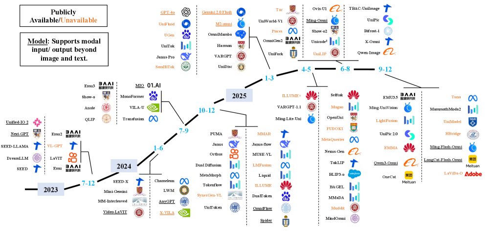
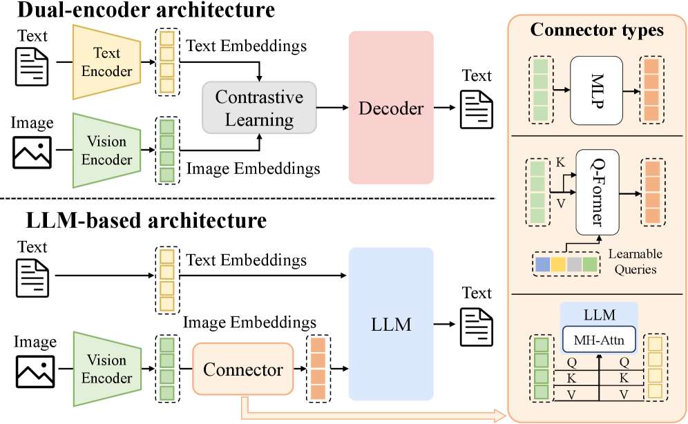
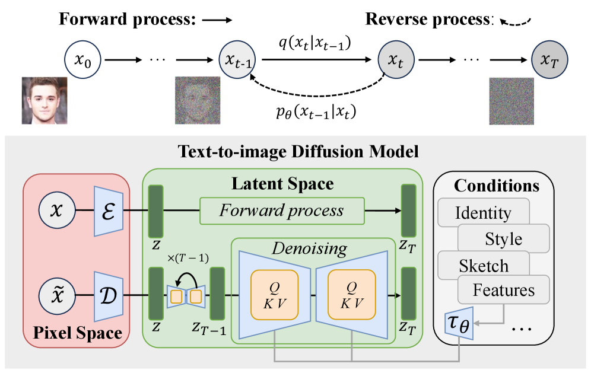
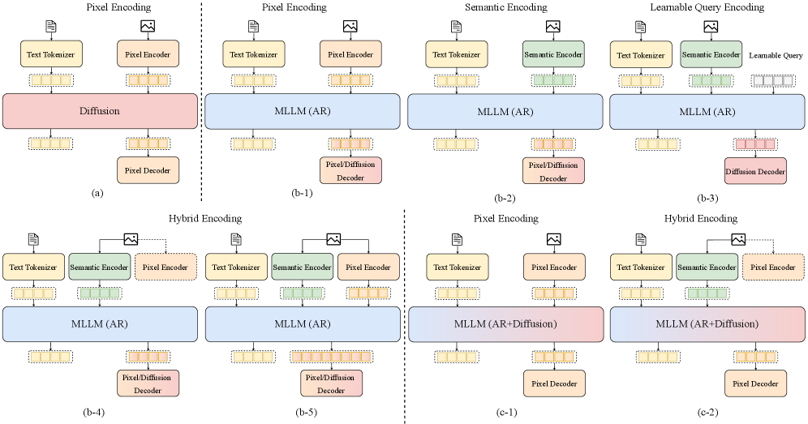
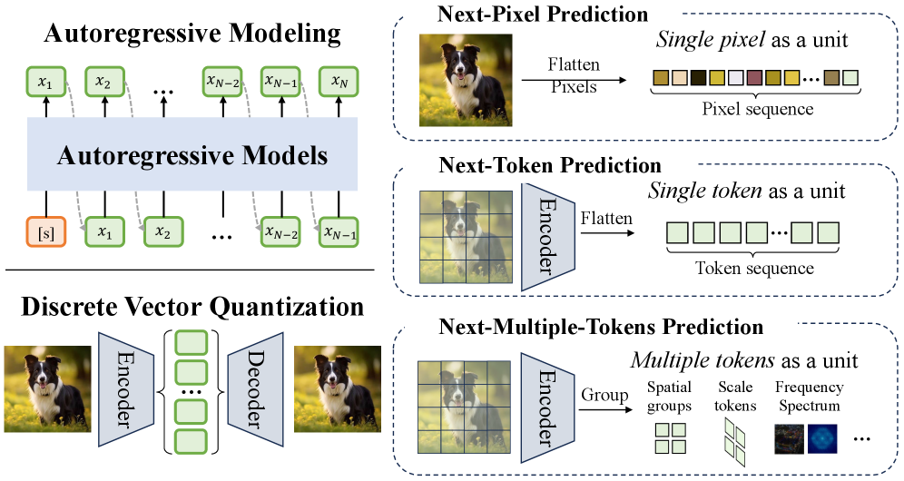

# 统一多模态理解与生成模型：进展、挑战与机遇（论文精读）

> [!info] 论文信息
> - **标题**: Unified Multimodal Understanding and Generation Models: Advances, Challenges, and Opportunities
> - **作者**: Shanshan Zhao, Xinjie Zhang, Jintao Guo 等（前三位共同一作；项目负责人 Qing-Guo Chen）
> - **机构**: 阿里巴巴 AIDC-AI（合作：港科大、南大、北大、清华）
> - **版本**: arXiv:2505.02567v6，2026-01-26 更新
> - **论文**: https://arxiv.org/abs/2505.02567
> - **配套资源**: https://github.com/AIDC-AI/Awesome-Unified-Multimodal-Models

> [!abstract] 一句话总结
> 首篇系统性综述"**多模态理解 + 图像生成**"统一模型的论文：按**扩散 / 自回归 / 自回归-扩散融合**三大架构范式（AR 内再按图像编码策略分四类）归类现有工作，并整理数据集、评测基准与开放挑战，为统一多模态模型研究提供全景参考。

## 1. 背景与动机

**两条独立演进的路线：**

- **多模态理解**：以 LLM（LLaMA、Qwen、GPT）扩展而来，代表 LLaVA、Qwen-VL、InternVL、Ovis、GPT-4 等，主流架构是 **decoder-only + next-token prediction**。
- **图像生成**：从 GAN 转向**扩散模型**（UNet → DiT），代表 SD 系列、FLUX，配套 CLIP/T5 文本编码器。虽然也有 LLM 式架构的探索（如 VAR），但目前扩散仍是图像质量 SOTA。

**统一动机**：GPT-4o（2025-03 发布的新能力）展示了"理解 + 生成"统一的潜力——复杂指令驱动生成、视觉推理、用生成结果可视化分析。但两大范式架构差异巨大，核心难点包括：

- **图像 tokenization 策略**：VAE/VQGAN 重建式编码 vs EVA-CLIP/OpenAI-CLIP 语义编码；离散 vs 连续表示。
- **架构设计**：纯 AR、纯扩散，还是 AR + 扩散混合。
- 与已有综述（LLM、多模态理解、图像生成）不同，本文聚焦**理解与生成的融合**这一交叉点。

## 2. 基础预备

### 2.1 多模态理解模型（VLU）

- **双编码器时代**：CLIP、ViLBERT、VisualBERT、UNITER——视觉文本分别编码再对齐，依赖区域级视觉预处理，扩展性差。
- **decoder-only + connector 时代**：
  - MiniGPT-4：单层线性投影；
  - BLIP-2：Q-Former 桥接冻结视觉编码器与冻结 LLM；
  - Flamingo：gated cross-attention。
- **近期进展**：GPT-4V（视觉推理）、Gemini（图文音视频）、Qwen-VL / Qwen2-VL（动态分辨率、M-RoPE）、LLaVA-1.5/Next、InternVL（统一预训练）、Ovis（可学习视觉 embedding 查表）、DeepSeek-VL2（MoE）。

### 2.2 文生图模型

**扩散模型数学**：前向过程逐步加噪 $q(x_t | x_{t-1}) = N(x_t; \sqrt{  (1−β_t)}·x_{t−1}, β_t·I)$，反向过程学习去噪 $p_θ(x_{t−1}|x_t)$，训练目标为最小化噪声预测误差（变分下界）$L = E[‖ε_θ(x_t,t) − ε*‖²]$。

- **U-Net 时代**：GLIDE（引入 classifier-free guidance）、Imagen（T5-XXL 文本编码器）；因像素级扩散开销大，催生 **LDM**（在预训练 VAE 潜空间扩散）：VQ-Diffusion、SD 2.0、SD XL、UPainting。
- **DiT 时代**：图像切 patch 过 Transformer；REPA（注入自监督表征）、SD 3.0（文本/图像双权重 MM-DiT）。
- **LLM 增强**：RPG 等用多模态 LLM 规划布局再交给扩散模型，提升文图对齐，但多模型多配置难统一管理。

## 3. 核心内容：统一模型的三大范式

统一模型可抽象为三件套：**模态编码器 → 模态融合主干（跨模态推理）→ 模态解码器**。综述按架构把现有工作分为扩散、自回归、融合三大类。

### 3.1 扩散范式（Diffusion）

利用扩散在图像质量上的优势，把理解也做成去噪过程。代表工作：

| 模型                         | 要点                                                                                    |
| -------------------------- | ------------------------------------------------------------------------------------- |
| Dual Diffusion             | T5 文本做离散扩散 + SD-VAE 图像做连续扩散，双分支去噪时互相 cross-attend，文本分支用对比 log-loss                    |
| UniDisc                    | 全离散扩散：LLaMA2 tokenizer + MAGVIT-v2，DiT 从头训练，双向掩码，文本图像 token 同步精化                      |
| FUDOKI                     | 离散 **flow matching**（kinetic-optimal 轨迹），支持连续自校正；在 Janus-1.5B 基础上把 causal mask 换成全注意力 |
| Mercury / Gemini Diffusion | 高速并行 token 生成的探索                                                                      |
| Muddit                     | Meissonic（MM-DiT 掩码生成）+ VQGAN tokenizer                                               |
| MMaDA                      | LLaDA-8B + MAGVIT-v2；**mixed CoT 微调**统一推理格式，配合 **UniGRPO**（统一策略梯度 RL，多奖励信号）做后训练       |
| Lavida-O                   | Elastic-MoT（弹性 MoE）+ 渐进上采样/Token 压缩 + 规划与自反思（用理解能力优化生成）                               |
| UniModel                   | 受 DeepSeek-OCR 启发：把**文字渲染成图像**，用扩散模型同时做理解和生成（Qwen-Image 的 MMDiT + Wan-2.1-VAE）        |

**挑战**（综述明确指出，值得细读）：

- **推理效率**：缺少 KV cache 支持、并行解码多 token 时质量下降，开源离散扩散模型推理速度仍落后 AR。
- **训练困难**：masked token 子集上的损失是稀疏监督，语料利用率低、方差高。
- **长度泛化**：无 EOS 停止机制，存在长度偏差。
- **架构/基建**：多复用 AR 设计而非为联合分布建模设计；缺成熟开源推理管线。

### 3.2 自回归范式（AR）

视觉与语言 token 序列化后由 LLM 主干统一预测。按**图像编码策略**分四类：

**① 像素级编码（b-1，重建监督的 VQ-VAE/VQGAN 类）**

- LWM：VQGAN + 世界模型式统一序列建模；
- Chameleon / ANOLE：VQ-IMG（更深编码器 + 残差预测），支持交错生成；
- Emu3 / SynerGen-VL / UGen：SBER-MoVQGAN（多尺度 token）；Emu3.5 用 Discrete Diffusion Adaptation 双向并行预测加速；
- Liquid：VQGAN token 下理解与生成互相促进；
- MMAR / Orthus / Harmon：**连续**图像 token + 轻量 diffusion head 解耦去噪；
- TokLIP：VQGAN 低层细节 + SigLIP 高层语义；Selftok：自一致性视觉 tokenizer；
- OneCat：patch embedding 连续 token + 多尺度 VAE，文本 next-token、图像 next-scale 混合生成。

优点：与文本统一为 token 序列、保留像素细节。缺点：缺高层语义、token 序列长（高分辨率下开销大）、重建目标带来纹理敏感等模态偏差。

**② 语义级编码（b-2，CLIP/SigLIP/EVA-CLIP/UNIT 类）**

- Emu（EVA-CLIP + LLM + diffusion decoder）、Emu2（37B 规模化）；
- LaVIT：动态 token 选择/合并（按内容复杂度自适应序列长度）；
- DreamLLM（线性投影）、VL-GPT（编码器后加因果 Transformer）、MM-Interleaved / PUMA（多粒度特征）；
- Mini-Gemini：CLIP-ViT 全局 + ConvNeXt 密集局部双编码；
- MetaMorph：LLM 各层插入模态适配器；ILLUME / VILA-U / UniTok：UNIT 式对齐-重建联合训练的 tokenizer；
- QLIP（二值球面量化消解重建/对齐冲突）、Tar（用 LLM 词表初始化 codebook + 尺度自适应池化，理解粗 token、生成细 token）；
- UniFork：浅层共享、深层任务分离；Qwen-Image：Qwen2.5-VL + MMDiT；Bifrost-1：双语义编码器 + 预测 CLIP latent 桥接扩散模型；
- 其余：OmniGen2、Ovis-U1、UniCode²、UniWorld、Pisces、Ming-UniVision、MammothModa2 等。

优点：文本对齐好、适合理解。缺点：易丢低层保真细节。

**③ 可学习查询编码（b-3）**

- SEED：BLIP-2 ViT + causal Q-Former，对比 + 重建联合训练，兼顾细节与语义；SEED-LLaMA / SEED-X 换更强 LLM 与 unCLIP-SD/SDXL；
- MetaQueries：冻结 SigLIP + 冻结 LLM，query 输出作为扩散解码器条件，轻量；
- Open-Uni：连接器可精简到 6 层 Transformer；Nexus-Gen：换 FLUX-1.dev 解码器；
- Ming-Lite-Uni：M2-omni 主干 + 多尺度可学习 token；TBAC-UniImage：多层 query；UniPic 2.0：SD3.5-Medium + 渐进双任务 RL。

优点：自适应、紧凑、语义丰富。缺点：query 数量带来额外开销、冻结骨干限制适配、小 query 集难覆盖复杂场景。

**④ 混合编码（b-4/b-5）**

- **伪混合（任务相关启用）**：Janus / Janus-Pro、OmniMamba、Unifluid、MindOmni、Skywork UniPic——理解走语义编码器、生成走像素编码器，训练联合但推理时只启用一个，未真正发挥混合优势；
- **联合混合（同时输入）**：MUSE-VL / UniToken（通道维拼接）、VARGPT 系列 / ILLUME+（序列维拼接）、Tokenflow（共享映射双码本）、SemHiTok（语义引导分层码本 SGHC）、Show-o2（3DVAE 分支 + 时空融合模块）。

缺点：伪混合浪费协同、联合混合存在模态失衡/冗余、双编码器内存开销大、像素与语义 token 对齐困难。

### 3.3 融合 AR + 扩散（Fused）

文本走 AR（保留推理与符号控制）、图像走多步去噪（保留质量与全局一致性）。分两类：

**① 像素级编码（c-1）**

- **Transfusion**：统一 backbone + 模态特定层，连续 SD-VAE latent，AR loss + diffusion loss，双向注意力；
- **MonoFormer**：共享 block + 任务相关 attention mask 的紧凑架构；
- **LMFusion**：冻结 LLM + 轻量视觉注入模块，只训视觉分支；
- **Show-o**：MAGVIT-v2 离散 token，文本 AR + 图像扩散双损失；TUNA：VAE + 语义编码器统一表示。

缺点：连续 latent 迭代采样开销大、SD-VAE 重建式 latent 与语言语义对齐弱、VQ 类方案有 codebook collapse 风险。

**② 混合编码（c-2）**

- Janus-flow / Mogao / **BAGEL**：双编码器解耦（SigLIP + SDXL-VAE），AR 语言模型 + rectified flow；
- LightFusion：用独立预训练的理解/生成模型初始化降低训练难度；
- EMMA：通道维拼接 + MoE 理解编码器；Omni-View：多视角 MVAR 范式；
- HBridge：仅中间层选择性 bridge 连接预训练 LLM 与扩散专家。

缺点：双编码器 + 双过程复杂度高、特征对齐难调、理解与生成目标相互权衡。

### 3.4 Any-to-Any 多模态模型

把统一扩展到音频、视频、语音、音乐等更多模态：

- **模块化设计**：OmniFlow（HiFiGen 音频 + SD-VAE 图像 + MMDiT 主干）；
- **共享嵌入空间**：Spider / X-VILA / Next-GPT 用 ImageBind（文本/图像/视频/音频/深度/热成像六模态对齐），再配各模态解码器；
- **序列到序列扩展**：AnyGPT（EnCodec + SpeechTokenizer + 模态前缀）、Unified-IO 2（encoder-decoder 支持 AST-to-text、语音转图、视频字幕）；
- **近期全能模型**：M2-omni（NaViT + SD-3 + paraformer-zh + CosyVoice）、Ming-Omni（集成 MoE + 多尺度可学习查询 + 双阶段训练）、BLIP3-o（双扩散：学 CLIP embedding + 以 CLIP 为条件生成，flow matching loss 优于 MSE）、Qwen3-Omni（Thinker-Talker MoE 解耦推理与流式语音）、LongCat-Flash-Omni（128K 长上下文 + 课程学习）。

挑战：**模态不平衡**（文本图像主导）、**扩展性**（多模态复杂度与延迟）、**跨模态语义一致性**。

## 4. 数据集

### 4.1 多模态理解（图文对/指令）

- 大规模预训练：RedCaps（12M）、Wukong（100M 中文）、LAION-5B（~6B，CLIP 过滤）、COYO（747M）、DataComp（1.4B）、CapsFusion-120M；
- 指令微调：ShareGPT4V（100K）、ALLaVA（1.4M 合成，GPT-4V 多阶段生成）、Cambrian-10M/7M、LLaVA-OneVision（3.2M 单图 + 1.6M 混合）、Infinity-MM（40M+）、Honey-Data-15M。

### 4.2 文生图

- 通用：CC-12M、LAION-Aesthetics、SAM（11M）、PixelProse（16M）、DenseFusion、Megalith（10M）、PD12M（12.4M CC0 免版权）、TextAtlas5M（密集文字）；
- 特定质量：JourneyDB（4M Midjourney 风格）、CosmicMan-HQ（6M 高分辨率人像）、DOCCI（15K 长人工描述）；
- 合成蒸馏：text-to-image-2M、SFHQ-T2I（122K 合成人脸）、EliGen、BLIP-3o 60K、ShareGPT-4o-Image（45K）、Echo-4o-Image（100K 长尾/超现实）。

### 4.3 指令图像编辑（源图 + 指令 + 目标图）

- 合成路线：InstructPix2Pix（313K，GPT-3 出指令 + SD 出图）、HIVE（1.1M 训练 + 3.6K 人工排序奖励）、EditWorld（世界动态编辑）、PromptFix（1.01M 低层任务：修复/去雾/超分/上色）；
- 大规模：HQ-Edit（197K）、SEED-Data-Edit（3.7M）、UltraEdit（4M）、AnyEdit（2.5M）、OmniEdit（1.2M）、X2Edit（3.7M，14 类任务平衡）、ByteMorph-6M（非刚体运动，图生视频取帧）、GPT-Image-Edit-1.5M（GPT-4o 统一精化三数据集）、ImgEdit（1.2M 多轮）、RefEdit（GPT-4o + FLUX + Grounded SAM 指代编辑）、ShareGPT-4o-Image Editing（46K）。

### 4.4 交错图文数据

- MMC4（101M 文档/571M 图）、OBELICS（141M 文档/353M 图/115B token，保留文档结构）、CoMM（227K 高一致性，WikiHow 等来源）、OmniCorpus（86 亿图/1.7 万亿 token/22 亿文档，含视频关键帧与音频转写）。

### 4.5 其他 Text+Image→Image

- 身份保持：LAION-Face（50M，InstantID 用）；
- 多控制：MultiGen-20M（UniControl 用：文本/边缘/深度/分割/草图统一格式）；
- 主体驱动：Subjects200K（LLM + FLUX 合成）、SynCD（95K，Objaverse 3D 资产多视角）、X2I-subject-driven（GRIT-Entity + Web-Images）、Graph200K（49 类标注、五元任务图结构）、Echo-4o-Image Multi-Reference（73K 多参考合成）。

## 5. 评测基准

### 5.1 理解

- **感知**：Flickr30k、COCO Captions、VQA/v2、VisDial、TextVQA、ChartQA、VSR；
- **元基准**：MMBench（3K 双语）、MMMU（11.5K 大学级六学科）、MM-Vet/v2、SEED-Bench（19K/12 维）、MMStar（6 技能 18 轴）、HaluEval（幻觉）、OwlEval（人工评分）、General-Bench（700+ 任务/32.6 万实例）；
- **推理**：CLEVR（程序化多跳）、GQA（场景图组合）、OK-VQA / A-OKVQA（外部知识）、VCR（答案 + 理由）、ChartQA、MathVista（视觉数学）。

### 5.2 生成

- **文生图**：早期 FID/CLIPScore；组合性：PaintSkills、DrawBench、PartiPrompts、GenEval（6 类细粒度任务）、GenAI-Bench（1.6K 人工 prompt）、T2I-CompBench/++、ConceptMix、DPG-Bench（密集 prompt）、VISOR（空间理解）、Commonsense-T2I、TIFA（VQA 式细粒度验证）；概念多样性：EvalMuse-40K、HEIM（12 维度）、MEMO-Bench（情感）；效率：FlashEval（评测集裁剪）；
- **编辑**：EditBench、MagicBrush、EditVal、Emu-Edit、Reason-Edit、I2EBench、HumanEdit、HQ-Edit、AnyEdit、KRIS-Bench（认知推理）、ByteMorph-Bench（非刚体）、RefEdit-Bench（指代）、ComplexBench-Edit（链式依赖）等；
- **其他**：DreamBench（30 主体）/ DreamBench++（150 主体 1350 prompt）、MultiGen-20M（多条件）、VTBench（视觉 tokenizer 评测：重建/细节/文字保持）。

### 5.3 交错生成

InterleavedBench（815 样本）、ISG（场景图 + 四层评估）、OpenING（5.4K/56 任务 + IntJudge 裁判）、OpenLEAF（30 开放域查询）、MMIE（20K/12 领域）、UniBench（81 细粒度标签）。

### 5.4 统一性评估（重点）

现有基准都孤立评估理解或生成，无法检验二者协同。**RealUnify**（1,000 条人工标注，10 类 32 子任务）提出两个核心维度：

- **UEG（理解增强生成）**：需常识/逻辑推理引导图像生成；
- **GEU（生成增强理解）**：需心智模拟/重建（如被打乱或变换的视觉输入）完成推理；

并采用端到端 + 分步诊断评估，定位瓶颈在"核心能力缺失"还是"能力整合失败"——这个方法论对评测统一模型非常有参考价值。

## 6. 挑战与机遇

1. **Tokenization/压缩**：高维视觉数据导致超长序列，需高效编码压缩且保真；
2. **跨模态注意力**：分辨率与上下文变长后成为瓶颈，可探索稀疏/分层注意力；
3. **数据质量**：图文对噪声与偏见，尤其复杂构图与交错数据，需过滤、去偏与合成；
4. **评估协议**：需要集成"理解+生成"的综合基准（编辑、交错生成等复杂任务）；
5. **CoT 与 RL**：把思维链与强化学习引入统一模型，优化事实一致性、用户满意度等长程目标（MMaDA 的 UniGRPO 即此方向）；
6. **社会偏见**：公平性感知训练，防止文化/性别/地域偏差放大；
7. **个性化知识驱动生成**：理解与生成共享概念嵌入（如 UniCTokens 的 `<bo>` 主体 token），支持组合式个性化提示；
8. **未探索能力**：多数模型只做理解 + 文生图，图像编辑靠后训练补，空间可控生成、主体驱动、交错生成在统一框架内仍待深耕。

## 7. 个人评价与思考

**值得学习的地方**

- 分类框架清晰：**架构范式 × 图像编码策略**双维度组织，覆盖到 2025 年底的主流工作（v6 版），并随 GitHub 仓库持续更新；
- 表格信息密度高（backbone / 模态编码器 / 解码器 / mask 类型 / 时间线），适合做领域地图；
- RealUnify 的 UEG/GEU 与分步诊断评估，是"统一"这件事上少见的体系化评测思路；
- 对离散扩散的短板（KV cache、稀疏监督、长度偏差）剖析具体，直击工程痛点。

**不足与盲点**

- 各方法描述偏架构罗列，缺少统一实验下的定量对比（无性能数字表），难以判断哪条路线实际更强；
- 对训练策略（阶段划分、损失配比、数据配比、缩放规律）分析较浅；
- 多模态理解部分聚焦 VLU，视频/音频理解与生成的统一着墨不多（Any-to-Any 一节较简略）；
- 未讨论推理系统侧问题（KV cache、批处理、投机解码、扩散采样的 serving），而这对落地很关键。

**对本团队推理工作的启发**

- AR 类统一模型（Chameleon、Emu3、Qwen-Image 等）天然复用 LLM 推理栈：KV cache、prefix caching、投机解码都适用，可作为理解+生成混合负载的基线；
- 融合/扩散范式需要**非顺序解码调度**：文本 AR 前缀 + 图像多步去噪的混合 batching、无 KV cache 下的并行 token 解码、长度未知（无 EOS）时的动态序列管理，都是 vLLM-omni 可切入的优化点；
- 图像 token 压缩率直接决定序列长度与吞吐，tokenizer 选择（VQGAN 离散 vs SD-VAE 连续 vs 语义编码）应纳入推理成本建模；
- 相关笔记：[[QWen-Image]]、[[QWen3-Omni]]、[[vllm-omni-models-survey]]、[[Bagel模型架构分析]]。

## 8. 关键结论

> [!tip] 核心要点
> - 统一模型三大范式各有取舍：**扩散**图像质量高但推理/训练基建不成熟；**AR** 与 LLM 栈无缝衔接但图像质量与 token 效率受限；**融合**兼顾二者但复杂度与对齐成本高。
> - 图像编码策略是 AR 路线的核心分歧点：像素级保细节、语义级保对齐、可学习查询求紧凑、混合想通吃但伪混合与 token 对齐问题未解。
> - 数据集与基准已初具规模，但**"统一性"本身仍缺乏公认评测**，RealUnify 是最值得借鉴的尝试。
> - 该领域仍处早期，tokenization、跨模态注意力、数据、评测、CoT/RL、个性化是六大突破口。
