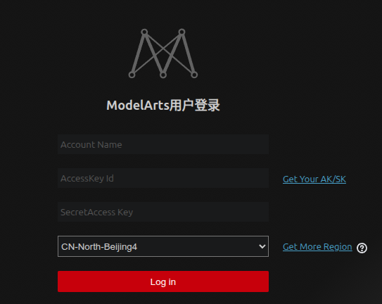

# 娄雨轩 Daily Report — 2026-05-07

## 华为云 ModelArts 远程开发环境配置

### 背景

需要在华为云 ModelArts 平台上申请开发环境，通过 VS Code Remote SSH 进行远程开发。

### 节点与镜像选择

最初计划使用华北-北京四、华北-乌兰察布一、华北三、华东-上海一、华南-广州等主流节点，但这些节点下均无满足需求的镜像。排查后发现合适的镜像仅存在于 **西南-贵阳-1** 节点，遂将开发环境部署在该区域。

### SSH 直连失败

按照华为云文档流程配置 SSH 远程连接，连接被拒绝：

```bash
ssh: connect to host dev-modelarts-cnnorth4.huaweicloud.com port 30300: Connection refused
```

### 切换至 VS Code ModelArts 插件

转而使用 VS Code 的 ModelArts 官方插件进行连接，但发现 **插件未提供西南-贵阳地区的节点选项**：

- 插件配置模板参考：<https://gitee.com/ModelArts/ModelArts-Lab/tree/master/tools/dev-tools/dev-config-template>



由于插件不支持贵阳节点，只能放弃该区域，**重新选择华南-广州节点**并重新创建开发环境。

### PublicKey 权限错误

切换到华南-广州节点后，使用remote SSH 连接仍然失败，报错为 `PublicKey Error`。查阅 VS Code 官方文档：
<https://code.visualstudio.com/docs/remote/troubleshooting#_local-ssh-file-and-folder-permissions>

问题定位为 **SSH 文件权限过宽**，操作系统会拒绝权限过于开放的密钥文件。需要分别在本地和远程执行权限修复：

**本地机器执行：**

```bash
chmod 700 ~/.ssh
chmod 600 ~/.ssh/config
chmod 600 ~/.ssh/id_ed25519.pub
chmod 600 /path/to/key/file
```

**远程服务器执行：**

```bash
chmod 700 ~/.ssh
chmod 600 ~/.ssh/authorized_keys
```

修复后 remote SSH 连接成功建立。

### VS Code Server 先决条件不满足

SSH 连接成功后，VS Code 尝试在远程主机上启动 Server，但报错：

> 远程主机不满足运行 VSCode 服务器的先决条件。

原因是当前使用的镜像 `pytorch_1.8.0-cuda_10.2-py_3.7-ubuntu_18.04` 基于 **Ubuntu 18.04**，系统库版本过低，无法满足新版 VS Code Server 的运行要求（如 glibc 版本等）。

### 升级镜像后容器启动失败

申请新镜像 `pytorch_2.1.0-cuda_12.1-py_3.10.6-ubuntu_22.04-x86_64-20250305173557-cb53968`，Ubuntu 版本升级到 22.04，但华为云平台无法启动该容器，报错：

```bash
UserImageErrorReason=The current Docker version is incompatible with the user's image.
Unable to start new threads inside the container.
Please verify that the image meets the requirements.
Current image kernel: "Ubuntu" "22.04"
```

**原因分析**：平台底层 Docker 版本与新镜像存在兼容性问题，可能是镜像内核要求与宿主机 Docker 运行时不匹配。

### 当前状态

正在尝试其他可用镜像，但华南-广州节点和贵阳节点的 GPU 硬件资源已被其他用户占用，暂时无法开启新的 Notebook 实例，处于等待资源释放的状态。
找机会重新在贵阳节点创建实例，然后远程连接
### 经验总结

| 问题                    | 解决方案                      |
| --------------------- | ------------------------- |
| 主流节点无合适镜像             | 扩大区域搜索范围，关注贵阳等非热门节点       |
| SSH 连接被拒绝             | 确认节点对应的主机地址和端口是否正确        |
| 插件不支持特定区域             | 优先选择插件已适配的区域节点            |
| PublicKey Error       | 修正本地和远程 SSH 文件权限为 600/700 |
| VS Code Server 先决条件不足 | 选择 Ubuntu 20.04+ 的镜像      |
| Docker 镜像不兼容          | 尝试平台推荐的基础镜像，避免自定义内核版本     |

## 文献阅读总结

### 阅读论文清单

- [x] **DistriFusion**: Distributed Parallel Inference for High-Resolution Diffusion Models (arxiv 2402.19481)
- [x] **PipeFusion**: Patch-level Pipeline Parallelism for Diffusion Transformers Inference (arxiv 2405.14430)
- [x] **Cache-DiT**: A PyTorch-native Inference Engine with Hybrid Cache Acceleration (github vipshop/cache-dit)
- [x] **LinFusion**: 1 GPU, 1 Minute, 16K Image (arxiv 2409.02097)
- [x] **ViDiT-Q**: Efficient and Accurate Quantization of Diffusion Transformers for Image and Video Generation (arxiv 2406.02540)
- [x] **VQ4DiT**: Efficient Post-Training Vector Quantization for Diffusion Transformers (arxiv 2408.17131)

---

### 当前系统架构概要

系统采用 Stage 分离 + 多实例并行架构部署 Qwen-Image 模型于华为昇腾 910B3 NPU：

- **Rank 0（共享服务）**：运行 Text Encoder（~6GB）+ VAE Decoder（~2GB），作为中央调度器
- **Rank 1~N-1（Diffusion 实例）**：每个实例独立运行完整 Transformer（~45GB），TP=1，星型拓扑，实例间无通信,整体设计退化为DP(Data Parallel)
- **核心发现**：TP=1 × 多实例 >> TP=8 × 单实例，AllReduce 通信开销是主要瓶颈

### 论文分析

#### 1. DistriFusion — 位移补丁并行

**核心思想**：将高分辨率图像分割为多个 patch，通过 displaced patch parallelism 将通信与计算重叠。每个 GPU 处理不同 patch 的去噪步骤，在计算当前 patch 的同时异步传输上一步的相邻 patch 特征，利用去噪过程的局部性（相邻 patch 特征变化缓慢）来容忍通信延迟。

- **高分辨率生成优化**：当前系统在 1024×1024 时激活值约 12GB，若要支持 2048×2048 或更高分辨率，单卡 64GB 可能不够。DistriFusion 的 patch 分割思路可以在**单个 Diffusion 实例内部**将高分辨率 latent 切分为多个 patch，分配到同一张卡的不同 NPU core 或多张卡上并行处理。
- **与当前多实例架构的关系**：当前系统已通过多实例实现吞吐量扩展，但单实例内部仍是串行处理完整 latent。DistriFusion 可以作为**单实例内部的纵向优化**，与多实例的横向扩展形成互补。
- **HCCL 通信重叠**：DistriFusion 的 displaced patch parallelism 核心是通信-计算重叠。当前系统中 Rank 0 → Rank i 的 prompt_embeds 传输（~2MB）和 latent 回传（~256MB）可以借鉴此思路，在 Diffusion 采样的计算步骤中提前启动下一批数据的传输。

#### 2. PipeFusion — 补丁级流水线并行

**核心思想**：针对 DiT（Diffusion Transformer）推理，将 patch 粒度的计算组织为流水线。不同 GPU 处理不同去噪步骤的不同 patch，通过流水线方式提高硬件利用率。关键优化包括 KV Cache 复用（相邻步骤的 attention KV 缓存可重用）和异步 patch 传输。

**对当前系统的启示**：

- **KV Cache 复用**：DiT 的去噪步骤之间，attention 的 KV 变化相对缓慢。PipeFusion 的 KV Cache 复用策略可以减少 Diffusion 采样过程中每步的计算量，对当前 28GB Transformer 权重 + 12GB 激活值的显存占用可能有 20-30% 的激活值压缩潜力。
- **补丁级粒度的调度**：PipeFusion 的 patch-level 粒度比当前系统的 request-level 粒度更细。如果未来需要在单个 Diffusion 实例内部做更细粒度的并行，可以参考这种设计。

#### 3. Cache-DiT — 混合缓存加速引擎

**核心思想**：基于 PyTorch 原生的 DiT 推理加速引擎，支持多种缓存策略（DBCache、TaylorSeer、SCM），结合上下文并行、张量并行和混合 2D/3D 并行。声称在组合缓存加速 + 上下文并行 + torch.compile 后可达 **9 倍加速**。兼容 HuggingFace Diffusers 中几乎所有 DiT 模型，支持 NVIDIA GPU、昇腾 NPU 和 AMD GPU。

**对当前系统的启示**：

- **缓存加速的直接适用性**：Cache-DiT 兼容昇腾 NPU，且与 vLLM-Omni 有集成。其 DBCache 策略可以在**不修改模型结构**的前提下，对当前 Diffusion 采样过程中的冗余计算进行缓存。DiT 的去噪步骤中，相邻步骤的中间特征有较强的相关性，缓存命中后可跳过部分 Transformer block 的计算。
- **上下文并行（Context Parallelism）**：Cache-DiT 支持在序列/上下文维度上并行化。当前系统每个 Diffusion 实例是 TP=1 的独立实例，如果单实例的序列长度较长（如高分辨率图像的 patch 序列），上下文并行可以在**不增加通信开销的前提下**利用同一张卡的多 NPU core。
- 在后端模型实现中已集成 Cache-DiT。

#### 4. ViDiT-Q — DiT 专用量化方案

**核心思想**：针对 Diffusion Transformer 的特性设计的训练后量化（Post-Training Quantization）方案。DiT 的权重和激活值分布与传统 Transformer 不同（如去噪步骤间的动态范围变化），ViDiT-Q 通过步骤感知的量化策略和混合精度方案，在保持生成质量的同时实现模型压缩。

**对当前系统的启示**：

- **显存优化的核心手段**：当前 Transformer 权重 FP16 占 ~28GB。若 INT8 量化成功，权重降至 ~14GB，释放 14GB 显存空间。这意味着：
  - 可以在单卡上同时加载两份 Diffusion 实例（14GB × 2 + 激活值），将单卡吞吐量翻倍
  - 或者将释放的显存用于更大分辨率的激活值缓存
- **DiT 特有的量化挑战**：ViDiT-Q 指出 DiT 的去噪步骤间激活值分布变化大，传统 PTQ 方法精度损失严重。对当前系统中的 Qwen-Image Transformer，需要验证量化后的生成质量是否满足要求。
- **与 Cache-DiT 的协同**：Cache-DiT 本身支持 SVDQuant（W4A4）量化，且提供了可配置的低秩分解参数。可以先尝试 Cache-DiT 内置的量化能力，再评估是否需要更精细的 ViDiT-Q 方案。

#### 5. VQ4DiT — 向量量化 DiT

**核心思想**：使用向量量化（Vector Quantization）替代标量量化来压缩 DiT 模型。向量量化通过码本（codebook）将权重向量映射到有限的码字集合，相比标量量化能更好地保持权重的结构信息，在相同压缩率下精度损失更小。

**对当前系统的启示**：

- **比标量量化更高的压缩率**：VQ4DiT 的向量量化在相同精度下可以实现比 INT8 标量量化更高的压缩率（如 4-bit 或更低）。如果 VQ4DiT 能在 Qwen-Image 上实现 4-bit 量化且精度可接受，Transformer 权重可从 28GB 降到 ~7GB，单卡可以容纳**多个 Diffusion 实例**，吞吐量可能提升 3-4 倍。
- **推理时的解码开销**：向量量化的解码需要查表操作，可能引入额外的推理延迟。需要在昇腾 NPU 上评估码本查找的效率。
- **与当前系统的整合优先级**：VQ4DiT 的压缩率最高但实现复杂度也最高，且需要在目标硬件上验证。建议作为**远期优化方向**，在 ViDiT-Q 验证可行后再进一步探索。

